# PerfWatch

Real-time system performance monitoring web application.

## Features

- **Real-time Metrics**: CPU, Memory, Disk, Network monitoring with 5-second updates
- **Interactive Charts**: Beautiful visualizations powered by ECharts
- **Process Monitoring**: Track individual process resource usage
- **WebSocket Updates**: Live data streaming to the browser
- **Dockerized**: Easy setup with Docker Compose

## Development Progress

> **14% Complete** (3/22 tasks) | Current: T004 - Auth Backend

```mermaid
flowchart TB
    subgraph P1["Phase 1: Foundation (60%)"]
        T001["✅ T001<br/>SDD Scaffold"]
        T002["✅ T002<br/>Docker Setup"]
        T003["✅ T003<br/>Database"]
        T004["⏳ T004<br/>Auth Backend"]
        T005["⬜ T005<br/>Vue Base"]
        T001 --> T002 --> T003 --> T004 --> T005
    end

    subgraph P2["Phase 2: Core Metrics (0%)"]
        T006["⬜ T006<br/>Collector Base"]
        T007["⬜ T007<br/>CPU"]
        T008["⬜ T008<br/>Memory"]
        T009["⬜ T009<br/>Network"]
        T010["⬜ T010<br/>Disk"]
        T011["⬜ T011<br/>WebSocket"]
        T012["⬜ T012<br/>Dashboard"]
        T006 --> T007 --> T008 --> T009 --> T010 --> T011 --> T012
    end

    subgraph P3["Phase 3: Advanced (0%)"]
        T013["⬜ T013<br/>Perf Events"]
        T014["⬜ T014<br/>Cache"]
        T015["⬜ T015<br/>CPU Perf"]
        T016["⬜ T016<br/>Mem BW"]
        T017["⬜ T017<br/>Adv Dashboard"]
        T013 --> T014 --> T015 --> T016 --> T017
    end

    subgraph P4["Phase 4: Polish (0%)"]
        T018["⬜ T018<br/>History"]
        T019["⬜ T019<br/>Compare"]
        T020["⬜ T020<br/>Retention"]
        T021["⬜ T021<br/>Settings"]
        T022["⬜ T022<br/>Polish"]
        T018 --> T019 --> T020 --> T021 --> T022
    end

    P1 --> P2 --> P3 --> P4

    %% Styles
    classDef done fill:#2ecc71,stroke:#27ae60,color:#fff
    classDef progress fill:#f39c12,stroke:#e67e22,color:#fff
    classDef todo fill:#95a5a6,stroke:#7f8c8d,color:#fff

    class T001,T002,T003 done
    class T004 progress
    class T005,T006,T007,T008,T009,T010,T011,T012,T013,T014,T015,T016,T017,T018,T019,T020,T021,T022 todo
```



| Phase | Status | Tasks |
|-------|--------|-------|
| Phase 1: Foundation | 60% | 3/5 |
| Phase 2: Core Metrics | 0% | 0/7 |
| Phase 3: Advanced | 0% | 0/5 |
| Phase 4: Polish | 0% | 0/5 |

> 📋 Detailed progress: [docs/sdd/PROGRESS.md](./docs/sdd/PROGRESS.md)

## Tech Stack

| Component | Technology |
|-----------|------------|
| Frontend | Vue.js 3 + ECharts |
| Backend | FastAPI + WebSocket |
| Database | PostgreSQL |
| Deployment | Docker Compose |

## Quick Start

### Prerequisites

- Docker & Docker Compose
- Git

### Setup

1. Clone the repository:
   ```bash
   git clone https://github.com/zhyndalf/perfwatch.git
   cd perfwatch
   ```

2. Copy environment file:
   ```bash
   cp .env.example .env
   ```

3. Start all services:
   ```bash
   docker-compose up -d
   ```

4. Access the application:
   - **Frontend**: http://localhost:3000
   - **Backend API**: http://localhost:8000
   - **API Docs**: http://localhost:8000/docs

### Verify Setup

```bash
# Check service status
docker-compose ps

# Check logs
docker-compose logs -f

# Test backend health
curl http://localhost:8000/health

# Stop all services
docker-compose down
```

## Development

### Project Structure

```
perfwatch/
├── backend/           # FastAPI backend
│   ├── app/           # Application code
│   ├── alembic/       # Database migrations
│   └── tests/         # Backend tests
├── frontend/          # Vue.js frontend
│   └── src/           # Source code
├── docs/              # Documentation
│   └── sdd/           # Specification Driven Development docs
├── scripts/           # Utility scripts
├── docker-compose.yml # Service orchestration
└── .env.example       # Environment template
```

### Running Locally (Development)

**Backend:**
```bash
cd backend
pip install -e ".[dev]"
uvicorn app.main:app --reload
```

**Frontend:**
```bash
cd frontend
npm install
npm run dev
```

## Documentation

See [docs/sdd/README.md](./docs/sdd/README.md) for detailed project documentation including:
- Architecture decisions
- API specifications
- Development roadmap
- Task tracking

## License

MIT License - see [LICENSE](./LICENSE) for details.
