# PerfWatch

Real-time system performance monitoring web application.

## Features

- **Real-time Metrics**: CPU, Memory, Disk, Network monitoring with 5-second updates
- **Historical Queries**: Query any time range with automatic downsampling
- **Dual-Mode Comparison**: Compare metrics using relative (yesterday/last week) or custom date ranges
- **Interactive Charts**: Beautiful visualizations powered by ECharts
- **WebSocket Updates**: Live data streaming to the browser
- **Data Retention**: Configurable retention policies with automatic cleanup
- **JWT Authentication**: Secure login with token-based auth
- **Dark Theme**: Modern dark UI with TailwindCSS
- **Dockerized**: Easy setup with Docker Compose

## Screenshots

### 🔐 Login Page
<details>
<summary>Click to view</summary>

**Login with default credentials (admin/admin123)**


*Simple authentication interface with JWT token-based security*

> 📝 **Note**: Screenshots pending. To add real screenshots, see [docs/screenshots/README.md](./docs/screenshots/README.md)

</details>

### 📊 Real-Time Dashboard
<details>
<summary>Click to view</summary>

**Live metrics updating every 5 seconds via WebSocket**


**Features:**
- 6 ECharts visualizations (CPU, Memory, Network, Disk, Perf Events, Memory Bandwidth)
- Real-time updates with connection status indicator
- Color-coded metrics for quick insights
- Live timestamps showing data freshness

> 📝 **Note**: Screenshots pending. To add real screenshots, see [docs/screenshots/README.md](./docs/screenshots/README.md)

</details>

### 📈 Historical Data View
<details>
<summary>Click to view</summary>

**Query metrics for any time range**


**Features:**
- Date/time range picker
- Interactive line charts with zoom and pan
- Downsampling for large time ranges
- Dual-mode time period comparison:
  - **Relative mode**: Compare hour/day/week vs yesterday/last week
  - **Custom range mode**: Compare any two custom date ranges


*Compare two time periods with overlay charts and percentage changes*

> 📝 **Note**: Screenshots pending. To add real screenshots, see [docs/screenshots/README.md](./docs/screenshots/README.md)

</details>

### ⚙️ Settings & Configuration
<details>
<summary>Click to view</summary>

**System information and retention policy management**


**Features:**
- System info (hostname, CPU count, total memory)
- Retention policy configuration (1-365 days)
- Manual cleanup trigger
- Password change

> 📝 **Note**: Screenshots pending. To add real screenshots, see [docs/screenshots/README.md](./docs/screenshots/README.md)

</details>

### 🔄 WebSocket Connection States
<details>
<summary>Click to view</summary>

**Connection status indicators**


**States:**
- 🟢 **Connected** - Live metrics streaming
- 🟡 **Connecting...** - Establishing connection
- 🟠 **Reconnecting...** - Auto-retry with exponential backoff
- 🔴 **Connection Failed** - Manual retry needed

> 📝 **Note**: Screenshots pending. To add real screenshots, see [docs/screenshots/README.md](./docs/screenshots/README.md)

</details>

---

**Want to contribute screenshots?** See [docs/screenshots/README.md](./docs/screenshots/README.md) for guidelines.

## Development Progress

> **100% Complete + Refactored** (22/22 tasks + code cleanup)

**Latest Update (2026-01-21)**: Code cleanup and maintainability improvements completed!
- ✅ All 238 backend tests passing
- ✅ Refactored code for better maintainability
- ✅ Enhanced documentation (CONTRIBUTING.md, DEVELOPMENT.md, Makefile)

```mermaid
flowchart TB
    subgraph P1["Phase 1: Foundation (100%) ✅"]
        T001["✅ T001<br/>SDD Scaffold"]
        T002["✅ T002<br/>Docker Setup"]
        T003["✅ T003<br/>Database"]
        T004["✅ T004<br/>Auth Backend"]
        T005["✅ T005<br/>Vue Base"]
        T001 --> T002 --> T003 --> T004 --> T005
    end

    subgraph P2["Phase 2: Core Metrics (100%) ✅"]
        T006["✅ T006<br/>Collector Base"]
        T007["✅ T007<br/>CPU"]
        T008["✅ T008<br/>Memory"]
        T009["✅ T009<br/>Network"]
        T010["✅ T010<br/>Disk"]
        T011["✅ T011<br/>WebSocket"]
        T012["✅ T012<br/>Dashboard"]
        T006 --> T007 --> T008 --> T009 --> T010 --> T011 --> T012
    end

    subgraph P3["Phase 3: Advanced (100%) ✅"]
        T013["✅ T013<br/>Perf Events"]
        T014["✅ T014<br/>Cache"]
        T015["✅ T015<br/>CPU Perf"]
        T016["✅ T016<br/>Mem BW"]
        T017["✅ T017<br/>Adv Dashboard"]
        T013 --> T014 --> T015 --> T016 --> T017
    end

    subgraph P4["Phase 4: Polish (100%) ✅"]
        T018["✅ T018<br/>History"]
        T019["✅ T019<br/>Compare"]
        T020["✅ T020<br/>Retention"]
        T021["✅ T021<br/>Settings"]
        T022["✅ T022<br/>Polish"]
        T018 --> T019 --> T020 --> T021 --> T022
    end

    subgraph P5["Phase 5: Cleanup (100%) ✅"]
        R001["✅ Refactor<br/>Code Cleanup"]
        R002["✅ Refactor<br/>Documentation"]
        R003["✅ Refactor<br/>DevEx Tools"]
        R001 --> R002 --> R003
    end

    P1 --> P2 --> P3 --> P4 --> P5

    %% Styles
    classDef done fill:#2ecc71,stroke:#27ae60,color:#fff
    classDef progress fill:#f39c12,stroke:#e67e22,color:#fff
    classDef todo fill:#95a5a6,stroke:#7f8c8d,color:#fff

    class T001,T002,T003,T004,T005,T006,T007,T008,T009,T010,T011,T012,T013,T014,T015,T016,T017,T018,T019,T020,T021,T022,R001,R002,R003 done
```



| Phase | Status | Tasks |
|-------|--------|-------|
| Phase 1: Foundation | ✅ 100% | 5/5 |
| Phase 2: Core Metrics | ✅ 100% | 7/7 |
| Phase 3: Advanced | ✅ 100% | 5/5 |
| Phase 4: Polish | ✅ 100% | 5/5 |
| Phase 5: Cleanup | ✅ 100% | Refactored |

> 📋 Detailed progress: [docs/sdd/PROGRESS.md](./docs/sdd/PROGRESS.md)

## Tech Stack

| Component | Technology |
|-----------|------------|
| Frontend | Vue.js 3 + Pinia + TailwindCSS + ECharts |
| Backend | FastAPI + WebSocket + SQLAlchemy 2.0 |
| Database | PostgreSQL 15 (JSONB) |
| Auth | JWT (python-jose) + bcrypt |
| Collectors | psutil (CPU, Memory, Network, Disk), perf_events (perf stat hardware counters) |
| Deployment | Docker Compose |

### Supported Architectures

| Architecture | Status | Notes |
|--------------|--------|-------|
| x86_64 (amd64) | ✅ Full Support | Intel/AMD 64-bit processors |
| ARM64 (aarch64) | ✅ Full Support | Raspberry Pi 4/5, AWS Graviton, Apple Silicon (Linux VMs), NVIDIA Jetson |
| ARM32 (armv7l) | ⚠️ Limited | Older Raspberry Pi, psutil works but PMU/perf support varies |

Multi-architecture Docker images are automatically built and published to GitHub Container Registry.

## Architecture Overview

> 📐 **[View All Diagrams →](./docs/diagrams/README.md)** (C4 models, sequences, database schema, user flows)

### System Architecture

```mermaid
graph TB
    User[👤 System Administrator]

    subgraph Docker["🐳 Docker Compose"]
        Frontend[🌐 Frontend<br/>Vue.js 3 + ECharts<br/>Port 3000]
        Backend[⚙️ Backend<br/>FastAPI + WebSocket<br/>Port 8000]
        Database[(💾 PostgreSQL 15<br/>JSONB Storage<br/>Port 5432)]

        subgraph Collectors["📊 Metrics Collectors"]
            CPU[CPU Collector<br/>psutil]
            Memory[Memory Collector<br/>psutil]
            Network[Network Collector<br/>psutil]
            Disk[Disk Collector<br/>psutil]
            Perf[Perf Events<br/>perf stat]
            Bandwidth[Memory BW<br/>/proc/vmstat]
        end
    end

    LinuxKernel[🐧 Linux Kernel<br/>Metrics Source]

    User -->|HTTP :3000| Frontend
    Frontend -->|REST API| Backend
    Frontend -->|WebSocket<br/>Real-time Stream| Backend
    Backend -->|SQL| Database
    Backend --> Collectors
    Collectors -->|Every 5s| LinuxKernel

    classDef userStyle fill:#4CAF50,stroke:#2E7D32,color:#fff
    classDef frontendStyle fill:#42A5F5,stroke:#1565C0,color:#fff
    classDef backendStyle fill:#66BB6A,stroke:#2E7D32,color:#fff
    classDef dbStyle fill:#FFA726,stroke:#E65100,color:#fff
    classDef collectorStyle fill:#AB47BC,stroke:#6A1B9A,color:#fff
    classDef kernelStyle fill:#78909C,stroke:#37474F,color:#fff

    class User userStyle
    class Frontend frontendStyle
    class Backend backendStyle
    class Database dbStyle
    class CPU,Memory,Network,Disk,Perf,Bandwidth collectorStyle
    class LinuxKernel kernelStyle
```



**Data Flow:**
```
Linux Kernel → Collectors (every 5s) → Aggregator → WebSocket (real-time) → Frontend
                                                  → Database (persist) → Historical Queries
```

**Key Features:**
- 🔴 **Real-time**: WebSocket streams metrics every 5 seconds
- 📈 **6 Collectors**: CPU, Memory, Network, Disk, Perf Events, Memory Bandwidth
- 💾 **JSONB Storage**: Flexible schema in PostgreSQL
- 🔒 **JWT Auth**: Secure token-based authentication
- 📊 **ECharts**: Interactive visualizations
- 🐳 **Docker**: One-command deployment

**Learn More:**
- [C4 Container Diagram](./docs/diagrams/architects/c4-container.md) - Detailed component view
- [WebSocket Flow](./docs/diagrams/developers/sequences/websocket.md) - Real-time metrics streaming
- [Database Schema](./docs/diagrams/developers/database-schema.md) - Tables and relationships
- [User Flows](./docs/diagrams/product-managers/user-flows.md) - User journey

## Quick Start

### Prerequisites

- Docker & Docker Compose
- Git

### Setup

#### Option 1: Using Makefile (Recommended)

```bash
# Complete setup with one command
make setup

# Access the application
# Frontend: http://localhost:3000 (admin/admin123)
# Backend: http://localhost:8000
# API Docs: http://localhost:8000/docs
```

#### Option 2: Manual Setup

1. Clone the repository:
   ```bash
   git clone https://github.com/zhyndalf/perfwatch.git
   cd perfwatch
   ```

2. Copy environment file:
   ```bash
   cp .env.example .env
   ```

3. Start all services:
   ```bash
   docker compose up -d
   # Or: make docker-up
   ```

4. Run database migrations:
   ```bash
   docker compose exec backend alembic upgrade head
   # Or: make db-upgrade
   ```

5. Access the application:
   - **Frontend**: http://localhost:3000
   - **Backend API**: http://localhost:8000
   - **API Docs**: http://localhost:8000/docs

### Default Credentials

- **Username**: `admin`
- **Password**: `admin123`

### Verify Setup

```bash
# Check all services health
make health

# Or manually:
curl http://localhost:8000/health
# Check service status
docker compose ps

# Check logs
docker compose logs -f

# Test backend health
curl http://localhost:8000/health

# Test login
curl -X POST http://localhost:8000/api/auth/login \
  -H "Content-Type: application/json" \
  -d '{"username":"admin","password":"admin123"}'

# Stop all services
docker compose down
```

### Common Commands

```bash
# Development
make dev              # Start all services (alias for docker-up)
make stop             # Stop all services
make restart          # Restart all services
make logs             # View all logs
make logs-backend     # View backend logs only
make logs-frontend    # View frontend logs only

# Testing
make test             # Run backend tests (238 tests)
make backend-test-coverage  # Run tests with coverage report

# Database
make db-upgrade       # Run migrations
make db-migrate MSG="description"  # Create new migration
make db-downgrade     # Rollback one migration
make db-shell         # PostgreSQL shell

# Health & Status
make health           # Check service health
make ps               # Show running containers

# Multi-Architecture Builds
make docker-buildx-setup    # Set up buildx for multi-arch builds
make docker-build-multiarch # Build for amd64 + arm64 locally
make docker-build-arm       # Build ARM64 images for local testing
make docker-push-multiarch  # Build and push to GHCR

# Cleanup
make clean            # Remove build artifacts
make docker-clean     # Remove containers and volumes
```

## Development

### Project Structure

```
perfwatch/
├── backend/           # FastAPI backend
│   ├── app/           # Application code
│   │   ├── api/       # API endpoints
│   │   ├── collectors/# Metrics collectors (CPU, Memory, Network, Disk)
│   │   ├── models/    # SQLAlchemy models
│   │   ├── schemas/   # Pydantic schemas
│   │   └── services/  # Business logic
│   ├── alembic/       # Database migrations
│   └── tests/         # Backend tests (238 tests)
├── frontend/          # Vue.js frontend
│   └── src/
│       ├── api/       # Axios client
│       ├── components/# Vue components
│       ├── router/    # Vue Router
│       ├── stores/    # Pinia stores
│       ├── styles/    # TailwindCSS
│       └── views/     # Page components
├── docs/              # Documentation
│   ├── diagrams/      # Visual documentation (C4, sequences, flows)
│   ├── screenshots/   # Application screenshots
│   └── sdd/           # Specification Driven Development docs
├── docker-compose.yml # Service orchestration
└── .env.example       # Environment template
```

### Running Tests

```bash
# Run backend tests (238 tests)
docker compose run --rm backend pytest tests/ -v

# Run with coverage
docker compose run --rm backend pytest tests/ --cov=app
```

### Running Locally (Development)

**Backend:**
```bash
cd backend
pip install -e ".[dev]"
uvicorn app.main:app --reload
```

**Frontend:**
```bash
cd frontend
npm install
npm run dev
```

## Collectors

PerfWatch includes 6 system metrics collectors:

| Collector | Metrics |
|-----------|---------|
| **CPU** | Usage %, per-core %, user/system/idle, frequency, load average, temperature |
| **Memory** | Total, available, used, swap, buffers, cached |
| **Network** | Bytes sent/recv per second, packets, errors, per-interface stats |
| **Disk** | Partition usage, I/O read/write rates, counts |
| **Perf Events** | perf stat counters (cpu-clock, context-switches, cpu-migrations, page-faults, cycles, instructions, branches, branch-misses, L1-dcache-loads, L1-dcache-load-misses, LLC-loads, LLC-load-misses, L1-icache-loads, dTLB-loads, dTLB-load-misses, iTLB-loads, iTLB-load-misses) |
| **Memory Bandwidth** | Page I/O rates, swap activity, page faults (via /proc/vmstat) |

Perf events require the `perf` binary, privileged container access, and PMU support (VMs must expose CPU performance counters). The collection core range and interval are configurable in Settings.

## API Endpoints

| Endpoint | Method | Description | Auth |
|----------|--------|-------------|------|
| `/api/auth/login` | POST | Get JWT token | No |
| `/api/auth/me` | GET | Current user info | Yes |
| `/api/auth/password` | PUT | Change password | Yes |
| `/api/ws/metrics` | WebSocket | Real-time metrics stream | Yes (JWT in query param) |
| `/api/history/metrics` | GET | Query historical data | Yes |
| `/api/history/metrics/types` | GET | List available metric types | Yes |
| `/api/history/compare` | GET | Compare time periods (dual-mode) | Yes |
| `/api/retention` | GET/PUT | Manage retention policy | Yes |
| `/api/retention/cleanup` | POST | Trigger manual cleanup | Yes |
| `/api/config` | GET | System configuration | Yes |
| `/health` | GET | Health check | No |

### History Comparison Modes

The `/api/history/compare` endpoint supports two comparison modes:

**Relative Mode:**
```bash
GET /api/history/compare?metric_type=cpu&period=hour&compare_to=yesterday
```

**Custom Range Mode:**
```bash
GET /api/history/compare?metric_type=cpu&start_time_1=2026-01-20T10:00:00Z&end_time_1=2026-01-20T12:00:00Z&start_time_2=2026-01-21T10:00:00Z&end_time_2=2026-01-21T12:00:00Z
```

## Deployment

### Production Deployment

For deploying PerfWatch to a production server, see the comprehensive deployment guide:

**[Deployment Guide](./docs/DEPLOYMENT.md)** - Complete step-by-step instructions for bare metal deployment

The guide covers:
- ✅ Docker & Docker Compose installation
- ✅ Environment configuration and security
- ✅ Database setup and migrations
- ✅ HTTPS with Nginx reverse proxy
- ✅ Let's Encrypt SSL certificates
- ✅ Firewall configuration
- ✅ Auto-startup configuration
- ✅ Backup and maintenance procedures
- ✅ Troubleshooting common issues
- ✅ **ARM64 deployment** (Raspberry Pi, AWS Graviton, etc.)

### ARM64 / Raspberry Pi Deployment

PerfWatch fully supports ARM64 Linux systems. Pre-built multi-arch images are available:

```bash
# Images auto-detect your architecture
docker pull ghcr.io/zhyndalf/perfwatch-backend:latest
docker pull ghcr.io/zhyndalf/perfwatch-frontend:latest

# Or just use docker compose (auto-detects architecture)
git clone https://github.com/zhyndalf/perfwatch.git
cd perfwatch
docker compose up -d
docker compose exec backend alembic upgrade head
```

See the [Deployment Guide ARM64 section](./docs/DEPLOYMENT.md#arm64-deployment-raspberry-pi-aws-graviton-etc) for detailed instructions.

**Quick deployment summary:**
```bash
# 1. Install Docker
# 2. Clone repository
git clone https://github.com/zhyndalf/perfwatch.git
cd perfwatch

# 3. Configure environment
cp .env.example .env
# Edit .env with strong passwords and secrets

# 4. Start services
docker compose up -d

# 5. Run migrations
docker compose exec backend alembic upgrade head

# 6. Access at http://your-server:3000
```

For production, it's **strongly recommended** to:
- Use HTTPS with a reverse proxy (Nginx/Apache)
- Change all default passwords
- Configure firewall rules
- Set up automated backups

## Documentation

### Getting Started
- **[Deployment Guide](./docs/DEPLOYMENT.md)** - Production deployment instructions
- **[Development Guide](./docs/DEVELOPMENT.md)** - Local development setup
- **[Contributing Guide](./docs/CONTRIBUTING.md)** - How to contribute

### Visual Documentation
See [docs/diagrams/README.md](./docs/diagrams/README.md) for comprehensive diagrams organized by audience:
- **Architects**: C4 diagrams, technology stack, high-level architecture
- **Developers**: Deployment, sequences, database schema, class diagrams
- **Product Managers**: User flows, state machines, feature workflows

### Project Specification
See [docs/sdd/README.md](./docs/sdd/README.md) for detailed project documentation including:
- Architecture decisions
- API specifications
- Development roadmap
- Task tracking

## License

MIT License - see [LICENSE](./LICENSE) for details.
