# C4 Component Diagram

> **Level 3: Component Diagram - Internal components within each container**

This diagram shows the major components inside the Frontend and Backend containers and how they interact.

---

## Backend Components

```mermaid
flowchart TB
    Main["🚀 main.py
    Application Entry"]

    AuthAPI["🔐 auth.py API"]
    WSAPI["🔌 websocket.py API"]
    HistoryAPI["📜 history.py API"]
    RetentionAPI["🗑️ retention.py API"]
    ConfigAPI["⚙️ config.py API"]

    Aggregator["🎯 MetricsAggregator
    Service"]
    RetentionSvc["🧹 RetentionService"]
    BatchWriter["📦 BatchMetricsWriter"]

    BaseCol["📊 BaseCollector
    Abstract"]
    CPUCol["💻 CPUCollector"]
    MemCol["🧠 MemoryCollector"]
    NetCol["🌐 NetworkCollector"]
    DiskCol["💾 DiskCollector"]
    PerfCol["⚡ PerfEventsCollector"]
    BandCol["📈 MemoryBandwidthCollector"]

    UserModel["👤 User Model"]
    MetricsModel["📊 MetricsSnapshot Model"]
    ConfigModel["⚙️ Config Model"]
    PolicyModel["📋 ArchivePolicy Model"]

    Database[("🗄️ PostgreSQL")]
    LinuxKernel["🐧 Linux Kernel"]

    Main --> AuthAPI
    Main --> WSAPI
    Main --> HistoryAPI
    Main --> RetentionAPI
    Main --> ConfigAPI

    WSAPI --> Aggregator
    HistoryAPI --> Database
    RetentionAPI --> RetentionSvc

    Aggregator --> BaseCol
    BaseCol --> CPUCol
    BaseCol --> MemCol
    BaseCol --> NetCol
    BaseCol --> DiskCol
    BaseCol --> PerfCol
    BaseCol --> BandCol

    CPUCol --> LinuxKernel
    MemCol --> LinuxKernel
    NetCol --> LinuxKernel
    DiskCol --> LinuxKernel
    PerfCol --> LinuxKernel
    BandCol --> LinuxKernel

    BatchWriter --> Database
    Aggregator --> BatchWriter
    RetentionSvc --> Database

    AuthAPI --> UserModel
    WSAPI --> MetricsModel
    HistoryAPI --> MetricsModel
    RetentionAPI --> PolicyModel
    ConfigAPI --> ConfigModel

    UserModel --> Database
    MetricsModel --> Database
    ConfigModel --> Database
    PolicyModel --> Database

    style Main fill:#FF6F00,stroke:#E65100,stroke-width:2px,color:#fff
    style AuthAPI fill:#42A5F5,stroke:#1565C0,stroke-width:2px,color:#fff
    style WSAPI fill:#42A5F5,stroke:#1565C0,stroke-width:2px,color:#fff
    style HistoryAPI fill:#42A5F5,stroke:#1565C0,stroke-width:2px,color:#fff
    style RetentionAPI fill:#42A5F5,stroke:#1565C0,stroke-width:2px,color:#fff
    style ConfigAPI fill:#42A5F5,stroke:#1565C0,stroke-width:2px,color:#fff
    style Aggregator fill:#66BB6A,stroke:#2E7D32,stroke-width:2px,color:#fff
    style RetentionSvc fill:#66BB6A,stroke:#2E7D32,stroke-width:2px,color:#fff
    style BatchWriter fill:#66BB6A,stroke:#2E7D32,stroke-width:2px,color:#fff
    style BaseCol fill:#AB47BC,stroke:#6A1B9A,stroke-width:2px,color:#fff
    style CPUCol fill:#AB47BC,stroke:#6A1B9A,stroke-width:2px,color:#fff
    style MemCol fill:#AB47BC,stroke:#6A1B9A,stroke-width:2px,color:#fff
    style NetCol fill:#AB47BC,stroke:#6A1B9A,stroke-width:2px,color:#fff
    style DiskCol fill:#AB47BC,stroke:#6A1B9A,stroke-width:2px,color:#fff
    style PerfCol fill:#AB47BC,stroke:#6A1B9A,stroke-width:2px,color:#fff
    style BandCol fill:#AB47BC,stroke:#6A1B9A,stroke-width:2px,color:#fff
    style UserModel fill:#FFA726,stroke:#E65100,stroke-width:2px,color:#fff
    style MetricsModel fill:#FFA726,stroke:#E65100,stroke-width:2px,color:#fff
    style ConfigModel fill:#FFA726,stroke:#E65100,stroke-width:2px,color:#fff
    style PolicyModel fill:#FFA726,stroke:#E65100,stroke-width:2px,color:#fff
    style Database fill:#78909C,stroke:#37474F,stroke-width:2px,color:#fff
    style LinuxKernel fill:#78909C,stroke:#37474F,stroke-width:2px,color:#fff
```



**Component Layers:**
- **Entry Point**: main.py (FastAPI app initialization)
- **API Layer**: 5 routers (auth, websocket, history, retention, config)
- **Service Layer**: Aggregator, RetentionService, BatchWriter
- **Collector Layer**: 6 metrics collectors + abstract base
- **Model Layer**: 4 SQLAlchemy models
- **Data Layer**: PostgreSQL + Linux Kernel

---

## Frontend Components

```mermaid
flowchart TB
    Router["🧭 Vue Router"]

    LoginView["🔐 Login.vue"]
    DashView["📊 Dashboard.vue"]
    HistView["📜 History.vue"]
    SettingsView["⚙️ Settings.vue"]

    AuthStore["🔐 authStore"]
    MetricsStore["📊 metricsStore"]
    HistoryStore["📜 historyStore"]
    RetentionStore["🗑️ retentionStore"]
    ConfigStore["⚙️ configStore"]

    Layout["📐 Layout.vue"]
    Header["📌 Header.vue"]

    APIClient["🌐 API Client
    Axios"]
    WSClient["🔌 WebSocket Client"]

    Backend["⚙️ FastAPI Backend"]

    Router --> LoginView
    Router --> DashView
    Router --> HistView
    Router --> SettingsView

    LoginView --> AuthStore
    DashView --> MetricsStore
    HistView --> HistoryStore
    SettingsView --> RetentionStore
    SettingsView --> ConfigStore

    LoginView --> Layout
    DashView --> Layout
    HistView --> Layout
    SettingsView --> Layout
    Layout --> Header

    AuthStore --> APIClient
    HistoryStore --> APIClient
    RetentionStore --> APIClient
    ConfigStore --> APIClient
    MetricsStore --> WSClient

    APIClient --> Backend
    WSClient --> Backend

    style Router fill:#FF6F00,stroke:#E65100,stroke-width:2px,color:#fff
    style LoginView fill:#42A5F5,stroke:#1565C0,stroke-width:2px,color:#fff
    style DashView fill:#42A5F5,stroke:#1565C0,stroke-width:2px,color:#fff
    style HistView fill:#42A5F5,stroke:#1565C0,stroke-width:2px,color:#fff
    style SettingsView fill:#42A5F5,stroke:#1565C0,stroke-width:2px,color:#fff
    style AuthStore fill:#66BB6A,stroke:#2E7D32,stroke-width:2px,color:#fff
    style MetricsStore fill:#66BB6A,stroke:#2E7D32,stroke-width:2px,color:#fff
    style HistoryStore fill:#66BB6A,stroke:#2E7D32,stroke-width:2px,color:#fff
    style RetentionStore fill:#66BB6A,stroke:#2E7D32,stroke-width:2px,color:#fff
    style ConfigStore fill:#66BB6A,stroke:#2E7D32,stroke-width:2px,color:#fff
    style Layout fill:#AB47BC,stroke:#6A1B9A,stroke-width:2px,color:#fff
    style Header fill:#AB47BC,stroke:#6A1B9A,stroke-width:2px,color:#fff
    style APIClient fill:#FFA726,stroke:#E65100,stroke-width:2px,color:#fff
    style WSClient fill:#FFA726,stroke:#E65100,stroke-width:2px,color:#fff
    style Backend fill:#78909C,stroke:#37474F,stroke-width:2px,color:#fff
```



**Component Layers:**
- **Router**: Vue Router with auth guards
- **Views**: 4 page components (Login, Dashboard, History, Settings)
- **Stores**: 5 Pinia stores for state management
- **Components**: Shared Layout and Header
- **Clients**: API client (Axios) and WebSocket client

---

## Component Responsibilities

### Backend Components

#### main.py (Application Entry)
**Type:** Application bootstrap
**Responsibilities:**
- Initialize FastAPI application
- Configure CORS for frontend access
- Register API routers
- Define lifespan events (startup/shutdown)
- Start background tasks (metrics collection, retention cleanup)

**Key Code:**
```python
@asynccontextmanager
async def lifespan(app: FastAPI):
    # Startup: initialize database, start background tasks
    yield
    # Shutdown: cleanup resources
```

---

#### API Routers

**auth.py:**
- `POST /api/auth/login` - Validate credentials, issue JWT
- `GET /api/auth/me` - Return current user info
- `POST /api/auth/password` - Change password (bcrypt)

**websocket.py:**
- `GET /api/ws/metrics` - WebSocket endpoint (JWT in query param)
- Manage active connections (connect, disconnect, broadcast)
- Background collection loop (every 5s)

**history.py:**
- `GET /api/history/metrics` - Query time range with downsampling
- `GET /api/history/compare` - Compare two time periods
- Aggregation logic for large datasets

**retention.py:**
- `GET /api/retention` - Get current policy
- `PUT /api/retention` - Update retention days
- `POST /api/retention/cleanup` - Trigger manual cleanup

**config.py:**
- `GET /api/config` - System information (hostname, CPU count, memory)
- Application settings

---

#### Services Layer

**MetricsAggregator:**
- Coordinates all 6 collectors
- Calls `safe_collect()` on each collector
- Combines results into single snapshot
- Handles collector failures gracefully

**RetentionService:**
- Applies retention policy (delete old snapshots)
- Runs in background task (every 1 hour)
- Logs cleanup statistics

**BatchMetricsWriter:**
- Queues metrics snapshots for batch insertion
- Reduces database write overhead
- Flushes queue every 5 seconds or when full

---

#### Collectors

**BaseCollector (Abstract):**
- Defines `collect()` interface
- Implements `safe_collect()` with error handling
- Provides `enabled` flag

**Concrete Collectors:**
- **CPUCollector:** psutil.cpu_percent(), cpu_freq(), sensors_temperatures()
- **MemoryCollector:** psutil.virtual_memory(), swap_memory()
- **NetworkCollector:** psutil.net_io_counters(), per_interface stats
- **DiskCollector:** psutil.disk_usage(), disk_io_counters()
- **PerfEventsCollector:** perf_event_open() for hardware counters
- **MemoryBandwidthCollector:** /proc/vmstat parsing

---

#### SQLAlchemy Models

**User:**
- Authentication table
- Bcrypt password hashing
- Last login tracking

**MetricsSnapshot:**
- Time-series data storage
- JSONB column for flexible schema
- Indexed by timestamp

**Config:**
- Key-value configuration store
- Updated_at timestamp

**ArchivePolicy:**
- Retention days setting
- Downsample interval (future use)

---

### Frontend Components

#### Vue Router
**Responsibilities:**
- Define routes: `/login`, `/`, `/history`, `/settings`
- Authentication guards: redirect to login if no JWT
- Navigation management

**Key Routes:**
```javascript
{
  path: '/',
  component: Dashboard,
  meta: { requiresAuth: true }
}
```

---

#### Views (Pages)

**Login.vue:**
- Username/password form
- Call authStore.login()
- Redirect to dashboard on success

**Dashboard.vue:**
- Display real-time metrics from metricsStore
- 6 ECharts (CPU, memory, network, disk, perf, bandwidth)
- Auto-updates every 5 seconds via WebSocket

**History.vue:**
- Date/time range picker
- Query button → historyStore.fetchMetrics()
- Comparison mode with two time periods
- ECharts line charts for historical trends

**Settings.vue:**
- Display system info from configStore
- Retention policy editor
- Save button → retentionStore.updatePolicy()

---

#### Pinia Stores

**authStore:**
- State: `user`, `token`, `isAuthenticated`
- Actions: `login()`, `logout()`, `fetchMe()`
- Persists JWT in localStorage

**metricsStore:**
- State: `currentMetrics`, `connectionState`
- Actions: `connect()`, `disconnect()`
- WebSocket message handler updates `currentMetrics`

**historyStore:**
- State: `metrics`, `comparisonMetrics`, `loading`
- Actions: `fetchMetrics()`, `fetchComparison()`
- Transforms API response for ECharts

**retentionStore:**
- State: `policy`, `loading`
- Actions: `fetchPolicy()`, `updatePolicy()`

**configStore:**
- State: `systemInfo`
- Actions: `fetchConfig()`

---

#### Shared Components

**Layout.vue:**
- App wrapper with sidebar navigation
- Logout button
- Slot for view content

**Header.vue:**
- Top navigation bar
- Current user display
- Navigation links

---

#### API Clients

**APIClient (Axios):**
- Base URL: `http://localhost:8000`
- JWT interceptor: adds `Authorization: Bearer <token>` header
- Error handling: logout on 401

**WSClient (WebSocket):**
- Connection URL: `ws://localhost:8000/api/ws/metrics?token=JWT`
- Auto-reconnect on disconnect
- Message parsing and store updates

---

## Component Interactions

### Real-time Metrics Flow
```
Background Task (5s) → MetricsAggregator → Collectors → Linux Kernel
                                        → BatchWriter → Database
                                        → WebSocket Broadcast
                                                     → WSClient (Frontend)
                                                     → metricsStore
                                                     → Dashboard.vue (ECharts)
```

### Authentication Flow
```
Login.vue → authStore.login() → APIClient → POST /api/auth/login → UserModel
                                                                  → JWT issued
         ← authStore (save token) ← Response
         → Router (redirect to /)
```

### Historical Query Flow
```
History.vue → historyStore.fetchMetrics() → APIClient → GET /api/history/metrics
                                                       → MetricsModel (database query)
                                          ← Response (JSON)
            ← historyStore (update state)
            → ECharts (render chart)
```

---

## Design Patterns

**Backend:**
- **Repository Pattern:** Models abstract database access
- **Service Layer:** Business logic separate from API routes
- **Dependency Injection:** FastAPI `Depends()` for database sessions
- **Background Tasks:** asyncio tasks for collection and cleanup
- **Strategy Pattern:** BaseCollector interface with multiple implementations

**Frontend:**
- **Composition API:** Vue 3 `<script setup>` pattern
- **Store Pattern:** Pinia for centralized state management
- **Observer Pattern:** WebSocket updates trigger reactive UI updates
- **Guard Pattern:** Router navigation guards for authentication
- **Interceptor Pattern:** Axios request/response interceptors for JWT

---

**Navigation:**
- [← Previous: Container Diagram](./c4-container.md)
- [Next: Technology Stack →](./tech-stack.md)
- [↑ Diagrams Index](../README.md)
