# C4 Container Diagram

> **Level 2: Container Diagram - Major application containers and their interactions**

This diagram shows the major containers (applications/data stores) that make up PerfWatch and how they communicate.

---

## Diagram

```mermaid
flowchart TB
    User["👤 System Administrator"]

    subgraph PerfWatch["⭐ PerfWatch System"]
        Frontend["🎨 Vue.js Frontend
        SPA Container
        Port 3000

        TailwindCSS, Pinia,
        ECharts, WebSocket client"]

        Backend["⚙️ FastAPI Backend
        API + WebSocket Server
        Port 8000

        Python 3.11, uvicorn,
        JWT auth, collectors"]

        Database["💾 PostgreSQL Database
        Metrics Storage
        Port 5432

        JSONB columns,
        time-series data"]

        Collectors["📊 Metrics Collectors
        Background Tasks

        psutil, perf_events,
        6 collector modules"]
    end

    LinuxKernel["🐧 Linux Kernel
    /proc, /sys, perf_events"]

    User -->|HTTPS/HTTP<br/>Views UI| Frontend
    Frontend -->|HTTP REST API<br/>JSON| Backend
    Frontend -->|WebSocket<br/>JWT auth<br/>Real-time metrics| Backend
    Backend -->|SQL Queries<br/>asyncpg| Database
    Backend -->|Coordinates| Collectors
    Collectors -->|Reads metrics| LinuxKernel
    Backend -->|Stores snapshots<br/>JSONB| Database

    style User fill:#4CAF50,stroke:#2E7D32,stroke-width:2px,color:#fff
    style Frontend fill:#42A5F5,stroke:#1565C0,stroke-width:2px,color:#fff
    style Backend fill:#66BB6A,stroke:#2E7D32,stroke-width:2px,color:#fff
    style Database fill:#FFA726,stroke:#E65100,stroke-width:2px,color:#fff
    style Collectors fill:#AB47BC,stroke:#6A1B9A,stroke-width:2px,color:#fff
    style LinuxKernel fill:#78909C,stroke:#37474F,stroke-width:2px,color:#fff
```



---

## Containers

### Frontend: Vue.js SPA
**Technology:** Vue.js 3, Vite, TailwindCSS, Pinia, ECharts
**Port:** 3000
**Responsibilities:**
- Render single-page application UI
- Handle user authentication (JWT storage)
- Establish WebSocket connection for real-time metrics
- Visualize metrics with ECharts line/gauge charts
- Query historical data via REST API
- Manage application state with Pinia stores

**Key Components:**
- **Views:** Login, Dashboard, History, Settings
- **Stores:** authStore, metricsStore, historyStore, retentionStore, configStore
- **Router:** Vue Router with authentication guards
- **API Client:** Axios with JWT interceptor

**Communication:**
- **→ Backend (HTTP):** Authentication, historical queries, configuration
- **→ Backend (WebSocket):** Real-time metrics streaming (5s interval)

---

### Backend: FastAPI API Server
**Technology:** Python 3.11, FastAPI, uvicorn, WebSocket, JWT
**Port:** 8000
**Responsibilities:**
- Provide REST API endpoints for auth, history, retention, config
- Manage WebSocket connections for real-time streaming
- Coordinate metrics collection via aggregator
- Persist metrics to PostgreSQL database
- Run background tasks (collection loop, retention cleanup)
- Handle JWT authentication and authorization

**Key Modules:**
- **API Routes:** `/api/auth`, `/api/ws/metrics`, `/api/history`, `/api/retention`, `/api/config`
- **Services:** MetricsAggregator, RetentionService, BatchMetricsWriter
- **Models:** User, MetricsSnapshot, Config, ArchivePolicy (SQLAlchemy 2.0)
- **Background Tasks:** Metrics collection (5s), retention cleanup (1h)

**Communication:**
- **← Frontend (HTTP):** REST API requests
- **← Frontend (WebSocket):** Persistent connection with JWT in query param
- **→ Database (SQL):** Async queries via asyncpg
- **→ Collectors:** Orchestrates collection via MetricsAggregator

---

### Database: PostgreSQL 15
**Technology:** PostgreSQL 15, JSONB, asyncpg driver
**Port:** 5432
**Responsibilities:**
- Store metrics snapshots in JSONB format
- Store user authentication data (bcrypt hashes)
- Store retention policies and configuration
- Index metrics by timestamp for efficient queries
- Support historical range queries with aggregation

**Schema:**
- **users:** Authentication (id, username, password_hash, last_login)
- **metrics_snapshots:** Time-series data (id, timestamp, metric_type, metric_data JSONB)
- **config:** Key-value store (key, value, updated_at)
- **archive_policies:** Retention settings (id, retention_days, downsample_interval)

**Indexes:**
- `idx_metrics_timestamp` on metrics_snapshots(timestamp) - historical queries
- `idx_metrics_type_timestamp` on metrics_snapshots(metric_type, timestamp) - filtered queries

**Communication:**
- **← Backend:** Async SQL queries via SQLAlchemy 2.0 + asyncpg

---

### Collectors: Metrics Collection Modules
**Technology:** Python, psutil, perf_events, asyncio
**Responsibilities:**
- Collect system metrics from Linux kernel
- Provide graceful degradation (return None if unavailable)
- Abstract collector implementations behind BaseCollector
- Run continuously in background task (5s interval)

**Collector Modules:**
1. **CPUCollector:** Usage %, per-core, frequency, temperature, load avg
2. **MemoryCollector:** RAM/swap usage, buffers, cached
3. **NetworkCollector:** Bytes/packets sent/recv, per-interface stats
4. **DiskCollector:** Partition usage, read/write I/O
5. **PerfEventsCollector:** IPC, cache misses, branch mispredictions (requires privileged)
6. **MemoryBandwidthCollector:** Page I/O, swap activity from /proc/vmstat

**Communication:**
- **→ Linux Kernel:** Read /proc, /sys, perf_events
- **← Backend (Aggregator):** Coordinated via `collect_all()` method

---

## Communication Protocols

### Frontend ↔ Backend

**HTTP REST API (JSON):**
- `POST /api/auth/login` - Authenticate and get JWT
- `GET /api/auth/me` - Get current user info
- `POST /api/auth/password` - Change password
- `GET /api/history/metrics` - Query historical data
- `GET /api/history/compare` - Compare time periods
- `GET /api/retention` - Get retention policy
- `PUT /api/retention` - Update retention policy
- `POST /api/retention/cleanup` - Trigger cleanup
- `GET /api/config` - Get system info

**WebSocket (Real-time):**
- `ws://localhost:8000/api/ws/metrics?token=JWT`
- Server → Client: Metrics snapshot every 5 seconds (JSON)
- Client → Server: Ping/pong for keepalive
- Automatic reconnection on disconnect

---

### Backend ↔ Database

**Protocol:** PostgreSQL wire protocol via asyncpg
**Connection:** Async connection pool (SQLAlchemy 2.0)
**Queries:**
- **Reads:** Historical queries with time ranges and downsampling
- **Writes:** Batch inserts of metrics snapshots (every 5s)
- **Deletes:** Retention cleanup (every 1 hour)

---

### Collectors ↔ Linux Kernel

**Protocol:** System calls via psutil and perf_events
**Access:**
- `/proc/stat`, `/proc/meminfo`, `/proc/vmstat` - Kernel statistics
- `/sys/class/thermal/` - CPU temperature
- `perf_event_open()` syscall - Hardware performance counters (requires CAP_PERFMON or privileged mode)

---

## Deployment Architecture

All containers run in Docker Compose:

```yaml
services:
  frontend:
    image: node:18
    ports: 3000:3000
    depends_on: backend

  backend:
    build: ./backend
    ports: 8000:8000
    privileged: true  # Required for perf_events
    depends_on: db

  db:
    image: postgres:15
    ports: 5432:5432
    volumes: postgres_data
```

**Key Configuration:**
- Backend requires `privileged: true` for perf_events access
- Frontend proxies API requests to backend in development
- Database persists data in Docker volume

---

## Data Flow Summary

```
Every 5 seconds:
  Linux Kernel → Collectors → Aggregator → Database (persist)
                                         → WebSocket → Frontend (display)

On user query:
  Frontend → Backend → Database → Backend → Frontend
```

---

**Navigation:**
- [← Previous: System Context](./c4-system-context.md)
- [Next: Component Diagram →](./c4-component.md)
- [↑ Diagrams Index](../README.md)
