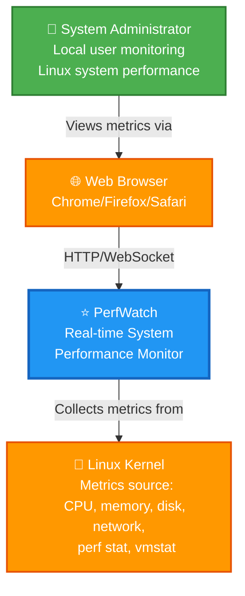

# C4 System Context Diagram

> **Level 1: System Context - PerfWatch in its environment**

This diagram shows PerfWatch as a black box, its users, and external systems it interacts with.

---

## Diagram



---

## Elements

### User: System Administrator
**Type:** Person
**Description:** Local user who monitors Linux system performance in real-time

**Responsibilities:**
- Views real-time metrics dashboard
- Queries historical performance data
- Configures retention policies
- Analyzes system performance trends

**Interactions:**
- Uses web browser to access PerfWatch
- Single admin user (username: `admin`)

---

### System: PerfWatch
**Type:** Software System
**Description:** Real-time system performance monitoring web application

**Capabilities:**
- Streams live metrics every 5 seconds via WebSocket
- Stores metrics in PostgreSQL with JSONB format
- Provides historical queries with downsampling
- Manages data retention automatically
- Collects CPU, memory, network, disk, and hardware counters

**Technology:**
- Frontend: Vue.js 3 SPA
- Backend: FastAPI + WebSocket
- Database: PostgreSQL 15
- Deployment: Docker Compose

---

### External System: Web Browser
**Type:** External Software
**Description:** Modern web browser (Chrome, Firefox, Safari)

**Role:**
- Renders Vue.js single-page application
- Establishes WebSocket connection for real-time streaming
- Stores JWT authentication token
- Visualizes metrics with ECharts library

**Requirements:**
- Modern browser with WebSocket support
- JavaScript enabled
- Localhost access (http://localhost:3000)

---

### External System: Linux Kernel
**Type:** Operating System
**Description:** Linux kernel providing system metrics

**Metrics Provided:**
- **CPU:** Usage, frequency, temperature, load average (via psutil)
- **Memory:** RAM/swap usage, buffers, cached (via psutil)
- **Network:** Bytes/packets sent/received, per-interface (via psutil)
- **Disk:** Partition usage, read/write I/O (via psutil)
- **Hardware Counters:** perf stat raw counters (cpu-clock, context-switches, cpu-migrations, page-faults, cycles, instructions, branches, branch-misses, L1-dcache-loads, L1-dcache-load-misses, LLC-loads, LLC-load-misses, L1-icache-loads, dTLB-loads, dTLB-load-misses, iTLB-loads, iTLB-load-misses)
- **Memory Bandwidth:** Page I/O, swap activity (via /proc/vmstat)

**Access Method:**
- psutil library for standard metrics
- perf stat (perf binary) for hardware counters (requires privileged mode or CAP_PERFMON and PMU access)
- /proc filesystem for kernel statistics

---

## System Boundary

**Inside PerfWatch:**
- Web frontend (user interface)
- API backend (data collection and serving)
- PostgreSQL database (metrics storage)
- Metrics collectors (psutil, perf stat)

**Outside PerfWatch:**
- User's web browser
- Linux kernel (metrics source)
- Docker host system

---

## Key Constraints

1. **Linux Only:** perf stat hardware counters require Linux kernel and PMU access
2. **Localhost Only:** No remote monitoring support
3. **Single User:** One admin account (no multi-user)
4. **Privileged Access:** Docker container needs privileged mode for perf stat access
5. **Real-time Focus:** 5-second sampling interval (perf events interval configurable)

---

## Data Flow Summary

```
Linux Kernel → psutil/perf stat → PerfWatch Backend → PostgreSQL
                                  → WebSocket → Browser → User
```

---

**Navigation:**
- [← Back to Architects](./README.md)
- [Next: Container Diagram →](./c4-container.md)
- [↑ Diagrams Index](../README.md)
