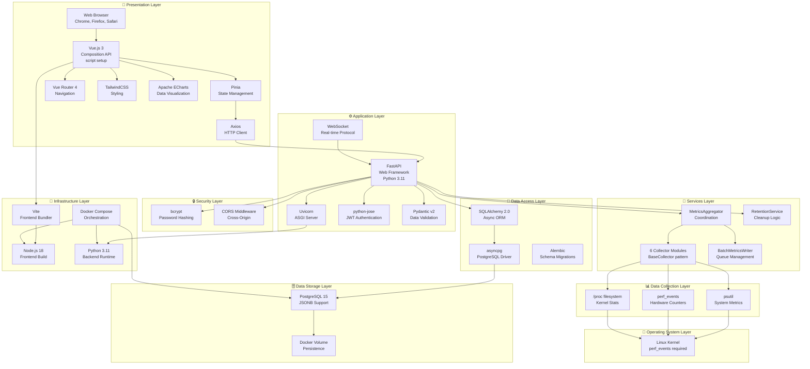

# Technology Stack Diagram

> **Technology choices across all layers of PerfWatch**

This diagram shows the complete technology stack organized by architectural layer.

---

## Stack Diagram



---

## Layer Details

### 🎨 Presentation Layer

| Technology | Version | Purpose | Why Chosen |
|------------|---------|---------|------------|
| **Vue.js** | 3.4+ | Frontend framework | Composition API, reactive, performant |
| **Pinia** | 2.1+ | State management | Vue 3 native, simpler than Vuex |
| **Vue Router** | 4.x | Client routing | Official Vue router, auth guards |
| **TailwindCSS** | 3.x | Utility-first CSS | Rapid UI development, consistency |
| **Apache ECharts** | 5.x | Data visualization | Rich charts, real-time updates, free |
| **Axios** | 1.x | HTTP client | Interceptors for JWT, wide adoption |
| **Vite** | 5.x | Build tool | Fast HMR, ESM-native, modern |

**Key Decisions:**
- ✅ Vue 3 Composition API for better TypeScript support and logic reuse
- ✅ Pinia over Vuex for simpler API and better DevTools
- ✅ TailwindCSS for rapid development without custom CSS
- ✅ ECharts over Chart.js for better real-time performance

---

### ⚙️ Application Layer

| Technology | Version | Purpose | Why Chosen |
|------------|---------|---------|------------|
| **FastAPI** | 0.100+ | Web framework | Async, auto-docs, validation, WebSocket |
| **Uvicorn** | 0.22+ | ASGI server | Fast, production-ready, async |
| **WebSocket** | Native | Real-time protocol | Required for 5s streaming |
| **python-jose** | 3.3+ | JWT library | RS256 support, standard compliance |
| **Pydantic** | 2.x | Data validation | Type safety, auto schema generation |

**Key Decisions:**
- ✅ FastAPI over Flask for native async and OpenAPI docs
- ✅ JWT in query param for WebSocket (browsers can't set WS headers)
- ✅ Pydantic v2 for 5-10x faster validation

---

### 🔧 Services Layer

| Component | Purpose | Pattern |
|-----------|---------|---------|
| **MetricsAggregator** | Coordinate 6 collectors | Facade pattern |
| **BaseCollector** | Abstract collector interface | Template pattern |
| **RetentionService** | Apply cleanup policy | Service pattern |
| **BatchMetricsWriter** | Queue DB writes | Queue pattern |

**Key Decisions:**
- ✅ BaseCollector abstract class for consistent collector interface
- ✅ safe_collect() wrapper for graceful degradation
- ✅ Batch writer to reduce database load (bulk inserts)

---

### 📊 Data Collection Layer

| Technology | Purpose | Availability |
|------------|---------|--------------|
| **psutil** | Cross-platform system metrics | Always available |
| **perf_events** | Hardware performance counters | Linux only, requires privileged |
| **/proc filesystem** | Kernel statistics (vmstat) | Linux only |

**Key Decisions:**
- ✅ psutil for standard metrics (CPU, memory, disk, network)
- ✅ perf_events for advanced metrics (IPC, cache misses)
- ✅ Graceful degradation if perf_events unavailable (permissions)

---

### 💾 Data Access Layer

| Technology | Version | Purpose | Why Chosen |
|------------|---------|---------|------------|
| **SQLAlchemy** | 2.0+ | ORM | Async support, type hints, migrations |
| **asyncpg** | 0.28+ | PostgreSQL driver | Fastest async driver for Postgres |
| **Alembic** | 1.11+ | Schema migrations | SQLAlchemy-native, autogenerate |

**Key Decisions:**
- ✅ SQLAlchemy 2.0 style (Mapped, mapped_column) for modern type hints
- ✅ asyncpg over psycopg3 for better performance
- ✅ Async sessions throughout (no sync fallback)

---

### 🗄️ Data Storage Layer

| Technology | Version | Purpose | Why Chosen |
|------------|---------|---------|------------|
| **PostgreSQL** | 15 | Relational database | JSONB support, performance, reliability |
| **Docker Volume** | - | Data persistence | Survives container restarts |

**Key Decisions:**
- ✅ PostgreSQL over SQLite for JSONB column type (flexible metrics schema)
- ✅ JSONB over separate columns for each metric (extensibility)
- ✅ Indexes on timestamp for efficient time-range queries

---

### 🔒 Security Layer

| Technology | Purpose | Why Chosen |
|------------|---------|------------|
| **bcrypt** | Password hashing | Industry standard, adaptive cost |
| **JWT** | Stateless auth | No server-side sessions needed |
| **CORS** | Cross-origin security | Frontend on :3000, backend on :8000 |

**Key Decisions:**
- ✅ bcrypt directly (NOT passlib) - Docker compatibility
- ✅ JWT with 24-hour expiry
- ✅ CORS configured for localhost:3000 origin

---

### 🐳 Infrastructure Layer

| Technology | Version | Purpose | Why Chosen |
|------------|---------|---------|------------|
| **Docker Compose** | 2.x | Orchestration | Multi-container coordination |
| **Python** | 3.11 | Backend runtime | Async/await, type hints, performance |
| **Node.js** | 18 LTS | Frontend build | Vite requirement, stable LTS |
| **Vite** | 5.x | Frontend bundler | Fast HMR, ESM-native |

**Key Decisions:**
- ✅ Docker Compose for simple multi-container setup
- ✅ Python 3.11 for performance improvements over 3.10
- ✅ Node 18 LTS for stability
- ✅ `privileged: true` for backend container (perf_events access)

---

### 🐧 Operating System Layer

| Technology | Requirement | Why |
|------------|-------------|-----|
| **Linux Kernel** | Required | perf_events system call (hardware counters) |

**Key Constraints:**
- ❌ Not supported on Windows or macOS
- ✅ Tested on Ubuntu 20.04+, Debian 11+, Fedora 35+
- ✅ Requires `CAP_PERFMON` capability or privileged mode

---

## Technology Decision Matrix

### Why FastAPI?
| Criteria | FastAPI | Flask | Django |
|----------|---------|-------|--------|
| Async Support | ✅ Native | ⚠️ Via extensions | ⚠️ Limited |
| WebSocket | ✅ Built-in | ❌ Requires plugin | ❌ Channels required |
| Auto Docs | ✅ OpenAPI | ❌ Manual | ⚠️ DRF only |
| Performance | ✅ Fast | ⚠️ Moderate | ⚠️ Moderate |
| Type Safety | ✅ Pydantic | ❌ Manual | ⚠️ Optional |

**Verdict:** FastAPI wins for async + WebSocket + auto-docs

---

### Why Vue.js 3?
| Criteria | Vue 3 | React | Angular |
|----------|-------|-------|---------|
| Learning Curve | ✅ Easy | ⚠️ Moderate | ❌ Steep |
| Real-time Updates | ✅ Reactive | ✅ Good | ✅ Good |
| Bundle Size | ✅ Small | ⚠️ Moderate | ❌ Large |
| State Management | ✅ Pinia | ⚠️ Redux/Zustand | ✅ NgRx |
| Template Syntax | ✅ Intuitive | ❌ JSX | ✅ Templates |

**Verdict:** Vue 3 wins for simplicity + reactivity + small bundle

---

### Why PostgreSQL?
| Criteria | PostgreSQL | MySQL | SQLite |
|----------|-----------|-------|---------|
| JSONB Support | ✅ Native | ⚠️ JSON only | ❌ None |
| Indexing | ✅ GIN/GIST | ⚠️ Limited | ⚠️ Basic |
| Performance | ✅ Excellent | ✅ Good | ❌ Not for concurrent writes |
| Docker Support | ✅ Official | ✅ Official | N/A (file-based) |

**Verdict:** PostgreSQL wins for JSONB + indexing + concurrency

---

## Dependency Graph

```
Frontend Build:
  Vite → Vue 3 → Pinia + Router + TailwindCSS + ECharts + Axios

Backend Runtime:
  Python 3.11 → FastAPI → Uvicorn + python-jose + bcrypt
              → SQLAlchemy 2.0 → asyncpg → PostgreSQL
              → psutil + perf_events → Linux Kernel

Infrastructure:
  Docker Compose → Frontend Container (Node 18)
                → Backend Container (Python 3.11, privileged)
                → Database Container (PostgreSQL 15)
```

---

## Version Constraints

**Critical Versions:**
- Python ≥ 3.11 (required for performance)
- PostgreSQL ≥ 15 (JSONB improvements)
- Vue.js ≥ 3.4 (Composition API stable)
- SQLAlchemy ≥ 2.0 (async rewrite)
- Pydantic ≥ 2.0 (performance improvements)

**Docker Images:**
- `python:3.11-slim` (backend)
- `node:18-alpine` (frontend)
- `postgres:15-alpine` (database)

---

## External Dependencies

**Python (backend/pyproject.toml):**
```toml
fastapi = "^0.100.0"
uvicorn = "^0.22.0"
sqlalchemy = "^2.0.0"
asyncpg = "^0.28.0"
alembic = "^1.11.0"
psutil = "^5.9.5"
python-jose = "^3.3.0"
bcrypt = "^4.0.1"
pydantic = "^2.0.0"
```

**JavaScript (frontend/package.json):**
```json
{
  "vue": "^3.4.0",
  "pinia": "^2.1.0",
  "vue-router": "^4.2.0",
  "axios": "^1.4.0",
  "echarts": "^5.4.0",
  "tailwindcss": "^3.3.0",
  "vite": "^5.0.0"
}
```

---

## Alternative Technologies Considered

**❌ Rejected:**
- **Passlib** for password hashing → Docker compatibility issues, use bcrypt directly
- **SQLite** for database → No JSONB support, use PostgreSQL
- **Sync SQLAlchemy** → Blocking I/O, use async throughout
- **Redis** for caching → Over-engineering for single-user app
- **Grafana** for visualization → Too heavy, use ECharts in Vue

**✅ Future Considerations:**
- **Prometheus** for metrics export (if monitoring PerfWatch itself)
- **Docker Swarm** or **Kubernetes** for multi-node deployment
- **Nginx** reverse proxy for production

---

**Navigation:**
- [← Previous: Component Diagram](./c4-component.md)
- [↑ Diagrams Index](../README.md)
