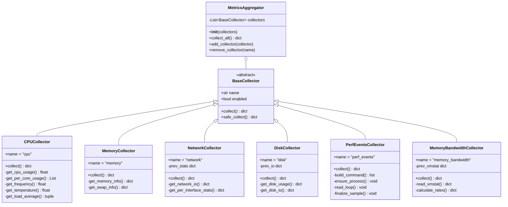

# Collector Classes Diagram

> **BaseCollector hierarchy and metrics collection architecture**

This diagram shows the collector class structure, inheritance relationships, and how metrics are collected from the Linux kernel.

---

## Class Hierarchy



---

## Class Details

### BaseCollector (Abstract Base Class)

**Purpose:** Define common interface and error handling for all collectors

**Attributes:**
- `name: str` - Unique identifier for collector
- `enabled: bool` - Whether collector is active (default: True)

**Methods:**
- `collect() -> dict[str, Any]` - **Abstract method**, must be implemented by subclasses
- `safe_collect() -> dict[str, Any]` - Wrapper with error handling

**Implementation:**
```python
# backend/app/collectors/base.py
from abc import ABC, abstractmethod
from typing import Dict, Any
import logging

logger = logging.getLogger(__name__)

class BaseCollector(ABC):
    name: str = "base"
    enabled: bool = True

    @abstractmethod
    async def collect(self) -> Dict[str, Any]:
        """Collect metrics. Must be implemented by subclasses."""
        pass

    async def safe_collect(self) -> Dict[str, Any]:
        """Wrapper that catches exceptions and returns None on failure."""
        if not self.enabled:
            return None

        try:
            return await self.collect()
        except Exception as e:
            logger.error(f"{self.name} collector failed: {e}")
            return None
```

**Key Design:**
- Template Method pattern: `safe_collect()` calls abstract `collect()`
- Graceful degradation: Errors return None instead of crashing
- Enable/disable: `enabled` flag allows runtime control

---

### MetricsAggregator

**Purpose:** Coordinate all collectors and combine results into single snapshot

**Attributes:**
- `collectors: List[BaseCollector]` - List of active collectors

**Methods:**
- `__init__(collectors: List[BaseCollector])` - Initialize with collector list
- `collect_all() -> dict` - Call all collectors and combine results
- `add_collector(collector)` - Add new collector at runtime
- `remove_collector(name: str)` - Remove collector by name

**Implementation:**
```python
# backend/app/collectors/aggregator.py
from typing import List, Dict, Any
from datetime import datetime

class MetricsAggregator:
    def __init__(self, collectors: List[BaseCollector]):
        self.collectors = collectors

    async def collect_all(self) -> Dict[str, Any]:
        """Collect from all collectors and combine results."""
        result = {"timestamp": datetime.utcnow().isoformat()}

        for collector in self.collectors:
            data = await collector.safe_collect()
            if data is not None:
                result[collector.name] = data

        return result

    def add_collector(self, collector: BaseCollector):
        self.collectors.append(collector)

    def remove_collector(self, name: str):
        self.collectors = [c for c in self.collectors if c.name != name]
```

**Usage:**
```python
from app.collectors import (
    MetricsAggregator,
    CPUCollector,
    MemoryCollector,
    NetworkCollector,
    DiskCollector,
    PerfEventsCollector,
    MemoryBandwidthCollector
)

aggregator = MetricsAggregator(collectors=[
    CPUCollector(),
    MemoryCollector(),
    NetworkCollector(),
    DiskCollector(),
    PerfEventsCollector(),
    MemoryBandwidthCollector()
])

snapshot = await aggregator.collect_all()
# Returns: {"timestamp": "...", "cpu": {...}, "memory": {...}, ...}
```

---

### CPUCollector

**Metrics Collected:**
- Usage percentage (overall and per-core)
- User/system/idle time percentages
- CPU frequency (current)
- Temperature (if available)
- Load average (1m, 5m, 15m)

**Data Source:** psutil library

**Return Format:**
```python
{
    "usage_percent": 45.2,
    "per_core": [40.1, 50.3, 42.8, 48.1],
    "user_percent": 30.5,
    "system_percent": 10.2,
    "idle_percent": 59.3,
    "frequency_mhz": 2400.0,
    "load_avg_1m": 1.5,
    "load_avg_5m": 1.3,
    "load_avg_15m": 1.2,
    "temperature_celsius": 65.0  # Or None if unavailable
}
```

**Key Implementation:**
```python
import psutil

class CPUCollector(BaseCollector):
    name = "cpu"

    async def collect(self):
        return {
            "usage_percent": psutil.cpu_percent(interval=1),
            "per_core": psutil.cpu_percent(percpu=True),
            "frequency_mhz": psutil.cpu_freq().current,
            "temperature_celsius": self._get_temperature(),
            "load_avg_1m": psutil.getloadavg()[0],
            # ...
        }

    def _get_temperature(self):
        try:
            temps = psutil.sensors_temperatures()
            return temps['coretemp'][0].current if 'coretemp' in temps else None
        except:
            return None
```

---

### MemoryCollector

**Metrics Collected:**
- Total, available, used memory
- Memory usage percentage
- Swap total, used, percentage
- Buffers and cached memory

**Data Source:** psutil.virtual_memory(), psutil.swap_memory()

**Return Format:**
```python
{
    "total_bytes": 17179869184,
    "available_bytes": 8053063680,
    "used_bytes": 9126805504,
    "percent": 53.1,
    "swap_total_bytes": 4294967296,
    "swap_used_bytes": 0,
    "swap_percent": 0.0,
    "buffers_bytes": 268435456,
    "cached_bytes": 4026531840
}
```

---

### NetworkCollector

**Metrics Collected:**
- Bytes sent/received (per second)
- Packets sent/received
- Errors and drops
- Per-interface statistics

**Data Source:** psutil.net_io_counters()

**State Management:**
- Stores previous counters to calculate rates
- `prev_stats: dict` - Previous reading for delta calculation

**Return Format:**
```python
{
    "bytes_sent": 1024000,
    "bytes_recv": 4096000,
    "packets_sent": 1000,
    "packets_recv": 2000,
    "errin": 0,
    "errout": 0,
    "dropin": 0,
    "dropout": 0,
    "bytes_sent_per_sec": 204800,  # Calculated from delta
    "bytes_recv_per_sec": 819200,
    "interfaces": {
        "eth0": {
            "bytes_sent": 1024000,
            "bytes_recv": 4096000
        }
    }
}
```

---

### DiskCollector

**Metrics Collected:**
- Partition usage (per mount point)
- Read/write bytes (per second)
- Read/write counts

**Data Source:** psutil.disk_usage(), psutil.disk_io_counters()

**State Management:**
- `prev_io: dict` - Previous I/O counters for rate calculation

**Return Format:**
```python
{
    "partitions": {
        "/": {
            "total_bytes": 107374182400,
            "used_bytes": 53687091200,
            "free_bytes": 53687091200,
            "percent": 50.0
        }
    },
    "read_bytes": 2048000,
    "write_bytes": 1024000,
    "read_count": 500,
    "write_count": 250,
    "read_bytes_per_sec": 409600,
    "write_bytes_per_sec": 204800
}
```

---

### PerfEventsCollector

**Metrics Collected:**
- perf stat raw counters (cpu-clock, context-switches, cpu-migrations, page-faults, cycles, instructions, branches, branch-misses, L1-dcache-loads, L1-dcache-load-misses, LLC-loads, LLC-load-misses, L1-icache-loads, dTLB-loads, dTLB-load-misses, iTLB-loads, iTLB-load-misses)

**Data Source:** perf stat (`perf stat -I` streaming)

**Availability:**
- ✅ Linux only
- ⚠️ Requires privileged mode or CAP_PERFMON capability and PMU access
- ✅ Returns `available: false` with error details if unavailable

**Return Format:**
```python
{
    "available": True,
    "cpu_cores": "all",
    "interval_ms": 1000,
    "sample_time": "1.000123",
    "events": {
        "cycles": {"value": 5000000000, "unit": None},
        "instructions": {"value": 9000000000, "unit": None},
        "cpu-clock": {"value": 1000.12, "unit": "msec"}
    }
}
```

**Notes:**
- If any events are missing or unsupported, `available` is false and lists appear under `missing_events` or `unsupported_events`.

**Key Implementation:**
```python
class PerfEventsCollector(BaseCollector):
    name = "perf_events"

    async def collect(self):
        await self._ensure_process(cpu_cores, interval_ms)
        return self._latest or {"available": True, "events": {}}

    def _build_command(self, cpu_cores, interval_ms):
        return [
            "perf", "stat", "-I", str(interval_ms),
            "-x", ",", "--no-big-num", "-a",
            "-e", ",".join(PERF_STAT_EVENTS),
        ]
```

---

### MemoryBandwidthCollector

**Metrics Collected:**
- Page in/out rates (KB/s)
- Swap in/out rates (KB/s)
- Page faults per second
- Major page faults per second

**Data Source:** /proc/vmstat

**State Management:**
- `prev_vmstat: dict` - Previous vmstat values for rate calculation

**Return Format:**
```python
{
    "pgpgin_per_sec": 100.0,      # Pages read from disk (KB/s)
    "pgpgout_per_sec": 50.0,       # Pages written to disk (KB/s)
    "pswpin_per_sec": 0.0,         # Swap pages read (KB/s)
    "pswpout_per_sec": 0.0,        # Swap pages written (KB/s)
    "pgfault_per_sec": 200.0,      # Minor page faults
    "pgmajfault_per_sec": 5.0      # Major page faults (disk I/O)
}
```

**Key Implementation:**
```python
class MemoryBandwidthCollector(BaseCollector):
    name = "memory_bandwidth"

    def __init__(self):
        self.prev_vmstat = None
        self.prev_time = None

    async def collect(self):
        current_vmstat = self._read_vmstat()
        current_time = time.time()

        if self.prev_vmstat is None:
            self.prev_vmstat = current_vmstat
            self.prev_time = current_time
            return None  # Need 2 samples for rate

        time_delta = current_time - self.prev_time
        rates = self._calculate_rates(current_vmstat, self.prev_vmstat, time_delta)

        self.prev_vmstat = current_vmstat
        self.prev_time = current_time

        return rates

    def _read_vmstat(self):
        with open('/proc/vmstat', 'r') as f:
            data = {}
            for line in f:
                key, value = line.strip().split()
                data[key] = int(value)
        return data

    def _calculate_rates(self, current, prev, time_delta):
        return {
            "pgpgin_per_sec": (current['pgpgin'] - prev['pgpgin']) / time_delta,
            # ...
        }
```

---

## Collector Registration

**Centralized Registration (main.py):**
```python
# backend/app/main.py
from app.collectors import (
    MetricsAggregator,
    CPUCollector,
    MemoryCollector,
    NetworkCollector,
    DiskCollector,
    PerfEventsCollector,
    MemoryBandwidthCollector
)

# Initialize aggregator with all collectors
aggregator = MetricsAggregator(collectors=[
    CPUCollector(),
    MemoryCollector(),
    NetworkCollector(),
    DiskCollector(),
    PerfEventsCollector(),
    MemoryBandwidthCollector()
])

# Used in WebSocket background task
async def metrics_collection_loop():
    while True:
        snapshot = await aggregator.collect_all()
        await manager.broadcast(snapshot)
        await save_to_database(snapshot)
        await asyncio.sleep(5)
```

---

## Design Patterns

**Template Method:**
- `BaseCollector.safe_collect()` defines algorithm
- Subclasses implement `collect()` method

**Facade Pattern:**
- `MetricsAggregator` provides simple interface to complex collector subsystem

**Strategy Pattern:**
- Each collector is interchangeable implementation of metric collection
- Can add/remove collectors at runtime

**Graceful Degradation:**
- Missing metrics return None instead of raising exceptions
- Frontend shows "N/A" for unavailable metrics

---

## Error Handling

### Collector Failures

**Scenario:** psutil.sensors_temperatures() raises exception (no thermal sensors)

**Behavior:**
```python
async def safe_collect(self):
    try:
        return await self.collect()
    except Exception as e:
        logger.error(f"{self.name} collector failed: {e}")
        return None  # Graceful degradation
```

**Result:**
- CPU collector returns None for temperature field
- Other CPU metrics still collected
- Frontend displays "N/A" for temperature

---

### Permission Errors

**Scenario:** PerfEventsCollector can't access perf stat (not privileged or PMU not exposed)

**Behavior:**
```python
# PerfEventsCollector.collect()
if not perf_available:
    return {"available": False, "error": "perf stat unavailable"}

# Aggregator
data = await collector.safe_collect()
result[collector.name] = data
```

**Result:**
- `perf_events.available` is false in the snapshot
- Frontend shows "Hardware Performance Counters Unavailable"
- No crash or error to user

---

## Testing Collectors

### Unit Tests

```python
# backend/tests/test_cpu_collector.py
import pytest
from app.collectors.cpu import CPUCollector

@pytest.mark.asyncio
async def test_cpu_collector():
    collector = CPUCollector()
    data = await collector.collect()

    assert "usage_percent" in data
    assert 0 <= data["usage_percent"] <= 100
    assert "per_core" in data
    assert isinstance(data["per_core"], list)

@pytest.mark.asyncio
async def test_cpu_collector_safe_collect():
    collector = CPUCollector()
    data = await collector.safe_collect()

    # Should not raise exception, even if psutil fails
    assert data is not None or data is None  # Either valid data or None
```

### Integration Tests

```python
# backend/tests/test_aggregator.py
@pytest.mark.asyncio
async def test_aggregator_collect_all():
    aggregator = MetricsAggregator(collectors=[
        CPUCollector(),
        MemoryCollector()
    ])

    snapshot = await aggregator.collect_all()

    assert "timestamp" in snapshot
    assert "cpu" in snapshot
    assert "memory" in snapshot
    assert snapshot["cpu"]["usage_percent"] >= 0
```

---

## Performance Considerations

### Collection Overhead

**Measurement:**
- Each collector takes 10-50ms to collect
- Total aggregator collection: ~100ms (parallel collectors)
- 5-second interval → 2% overhead

**Optimization:**
- ✅ Use async/await for non-blocking I/O
- ✅ Cache previous values for rate calculations
- ❌ Avoid collecting per-process data (too expensive)

---

### Memory Usage

**State Storage:**
- NetworkCollector: Stores previous net_io_counters (~1 KB)
- DiskCollector: Stores previous disk_io_counters (~1 KB)
- MemoryBandwidthCollector: Stores previous vmstat (~10 KB)

**Total Memory:** ~50 KB per aggregator instance (negligible)

---

**Navigation:**
- [← Previous: Database Schema](../database-schema.md)
- [Next: SQLAlchemy Models →](./models.md)
- [↑ Diagrams Index](../../README.md)
