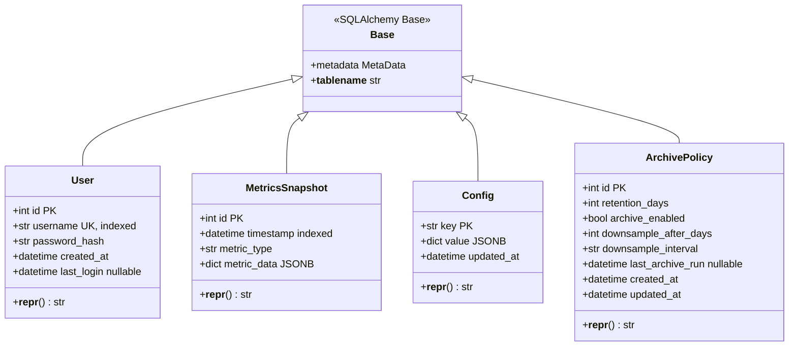

# SQLAlchemy Models Class Diagram

> **Database models with SQLAlchemy 2.0 style**

This diagram shows the SQLAlchemy ORM models and their relationships.

---

## Models Class Diagram



---

## SQLAlchemy 2.0 Patterns

### Type Hints with Mapped

**Old Style (Column):**
```python
class User(Base):
    __tablename__ = "users"
    id = Column(Integer, primary_key=True)
    username = Column(String(50), unique=True)
```

**New Style (Mapped + mapped_column):**
```python
class User(Base):
    __tablename__ = "users"
    id: Mapped[int] = mapped_column(primary_key=True)
    username: Mapped[str] = mapped_column(String(50), unique=True)
```

**Benefits:**
- ✅ Type hints for IDE autocomplete
- ✅ Runtime type checking with Pydantic
- ✅ Clearer intent (explicitly typed)

---

### Nullable Fields

**Required (NOT NULL):**
```python
username: Mapped[str] = mapped_column(String(50))
```

**Optional (NULLABLE):**
```python
last_login: Mapped[Optional[datetime]] = mapped_column(DateTime, nullable=True)
```

---

### Default Values

**Server-side default:**
```python
created_at: Mapped[datetime] = mapped_column(
    DateTime(timezone=True),
    server_default=func.now()  # PostgreSQL NOW()
)
```

**Client-side default:**
```python
retention_days: Mapped[int] = mapped_column(Integer, default=30)
```

**Auto-update:**
```python
updated_at: Mapped[datetime] = mapped_column(
    DateTime(timezone=True),
    server_default=func.now(),
    onupdate=func.now()  # Update on every UPDATE
)
```

---

## Model Usage Examples

### User Model

**Create User:**
```python
from app.models import User
import bcrypt

async with AsyncSessionLocal() as session:
    password_hash = bcrypt.hashpw(b"admin123", bcrypt.gensalt()).decode()
    user = User(
        username="admin",
        password_hash=password_hash
    )
    session.add(user)
    await session.commit()
```

**Query User:**
```python
from sqlalchemy import select

async with AsyncSessionLocal() as session:
    result = await session.execute(
        select(User).where(User.username == "admin")
    )
    user = result.scalar_one_or_none()
```

**Update Last Login:**
```python
from datetime import datetime

user.last_login = datetime.utcnow()
await session.commit()
```

---

### MetricsSnapshot Model

**Create Snapshot:**
```python
from app.models import MetricsSnapshot
from datetime import datetime

snapshot = MetricsSnapshot(
    timestamp=datetime.utcnow(),
    metric_type="aggregated",
    metric_data={
        "cpu": {"usage_percent": 45.2},
        "memory": {"used_bytes": 8589934592}
    }
)
session.add(snapshot)
await session.commit()
```

**Query by Time Range:**
```python
from sqlalchemy import and_

result = await session.execute(
    select(MetricsSnapshot)
    .where(
        and_(
            MetricsSnapshot.timestamp >= start_time,
            MetricsSnapshot.timestamp < end_time
        )
    )
    .order_by(MetricsSnapshot.timestamp)
)
snapshots = result.scalars().all()
```

**Extract JSONB Field:**
```python
from sqlalchemy import cast, Float

# Get CPU usage from JSONB
result = await session.execute(
    select(
        MetricsSnapshot.timestamp,
        cast(MetricsSnapshot.metric_data['cpu']['usage_percent'], Float).label('cpu_usage')
    )
    .where(MetricsSnapshot.timestamp >= start_time)
)
```

---

### Config Model

**Upsert Config:**
```python
from sqlalchemy.dialects.postgresql import insert

stmt = insert(Config).values(
    key="retention",
    value={"days": 30}
)
stmt = stmt.on_conflict_do_update(
    index_elements=['key'],
    set_={"value": stmt.excluded.value, "updated_at": func.now()}
)
await session.execute(stmt)
await session.commit()
```

**Get Config:**
```python
result = await session.execute(
    select(Config).where(Config.key == "retention")
)
config = result.scalar_one_or_none()
if config:
    retention_days = config.value["days"]
```

---

### ArchivePolicy Model

**Create Policy:**
```python
from app.models import ArchivePolicy

policy = ArchivePolicy(
    retention_days=30,
    archive_enabled=True
)
session.add(policy)
await session.commit()
```

**Get Active Policy:**
```python
result = await session.execute(
    select(ArchivePolicy).order_by(ArchivePolicy.id).limit(1)
)
policy = result.scalar_one_or_none()
```

**Update Policy:**
```python
policy.retention_days = 7
await session.commit()  # Auto-updates updated_at
```

---

## Async Session Management

### Session Factory

```python
# backend/app/database.py
from sqlalchemy.ext.asyncio import create_async_engine, async_sessionmaker, AsyncSession

engine = create_async_engine(DATABASE_URL, echo=True)
AsyncSessionLocal = async_sessionmaker(engine, class_=AsyncSession, expire_on_commit=False)
```

### Dependency Injection

```python
# backend/app/database.py
async def get_db() -> AsyncSession:
    async with AsyncSessionLocal() as session:
        yield session
```

**Usage in FastAPI:**
```python
from fastapi import Depends
from sqlalchemy.ext.asyncio import AsyncSession

@app.get("/api/users")
async def get_users(db: AsyncSession = Depends(get_db)):
    result = await db.execute(select(User))
    users = result.scalars().all()
    return users
```

---

## Model Validation

### With Pydantic

```python
# backend/app/schemas/user.py
from pydantic import BaseModel, ConfigDict
from datetime import datetime

class UserResponse(BaseModel):
    model_config = ConfigDict(from_attributes=True)

    id: int
    username: str
    created_at: datetime
    last_login: datetime | None

# Convert SQLAlchemy model to Pydantic
user_model = await session.execute(select(User).where(User.id == 1))
user = user_model.scalar_one()
user_response = UserResponse.model_validate(user)
```

---

## Testing Models

```python
# backend/tests/test_models.py
import pytest
from app.models import User, MetricsSnapshot

@pytest.mark.asyncio
async def test_create_user(db_session):
    user = User(username="test", password_hash="hash")
    db_session.add(user)
    await db_session.commit()

    assert user.id is not None
    assert user.username == "test"
    assert user.created_at is not None

@pytest.mark.asyncio
async def test_query_metrics(db_session):
    snapshot = MetricsSnapshot(
        timestamp=datetime.utcnow(),
        metric_type="cpu",
        metric_data={"usage": 50}
    )
    db_session.add(snapshot)
    await db_session.commit()

    result = await db_session.execute(select(MetricsSnapshot))
    snapshots = result.scalars().all()
    assert len(snapshots) == 1
```

---

**Navigation:**
- [← Previous: Collectors](./collectors.md)
- [Next: Pinia Stores →](./stores.md)
- [↑ Diagrams Index](../../README.md)
