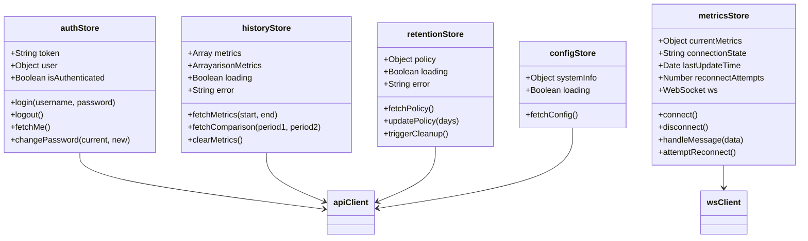

# Pinia Stores Class Diagram

> **Frontend state management with Pinia**

This diagram shows the Pinia stores architecture for managing application state in Vue.js.

---

## Stores Architecture



---

## Store Details

### authStore

**Purpose:** Manage authentication state and JWT tokens

**State:**
```javascript
state: () => ({
  token: localStorage.getItem('token'),
  user: null,
  isAuthenticated: false
})
```

**Actions:**
```javascript
async login(username, password) {
  const response = await apiClient.post('/api/auth/login', { username, password })
  this.token = response.data.access_token
  localStorage.setItem('token', this.token)
  this.isAuthenticated = true
  await this.fetchMe()
}

async logout() {
  this.token = null
  this.user = null
  this.isAuthenticated = false
  localStorage.removeItem('token')
  router.push('/login')
}

async fetchMe() {
  const response = await apiClient.get('/api/auth/me')
  this.user = response.data
}

async changePassword(currentPassword, newPassword) {
  await apiClient.post('/api/auth/password', {
    current_password: currentPassword,
    new_password: newPassword
  })
}
```

**Getters:**
```javascript
getters: {
  currentUser: (state) => state.user,
  isLoggedIn: (state) => state.isAuthenticated
}
```

**Usage:**
```javascript
<script setup>
import { useAuthStore } from '@/stores/auth'

const authStore = useAuthStore()

const handleLogin = async () => {
  await authStore.login(username.value, password.value)
  router.push('/')
}
</script>
```

---

### metricsStore

**Purpose:** Manage WebSocket connection and real-time metrics

**State:**
```javascript
state: () => ({
  ws: null,
  currentMetrics: null,
  connectionState: 'disconnected',  // disconnected, connecting, connected, error
  lastUpdateTime: null,
  reconnectAttempts: 0,
  maxReconnectAttempts: 10
})
```

**Actions:**
```javascript
connect() {
  const authStore = useAuthStore()
  this.connectionState = 'connecting'

  const wsUrl = `ws://localhost:8000/api/ws/metrics?token=${authStore.token}`
  this.ws = new WebSocket(wsUrl)

  this.ws.onopen = () => {
    this.connectionState = 'connected'
    this.reconnectAttempts = 0
  }

  this.ws.onmessage = (event) => {
    const data = JSON.parse(event.data)
    this.currentMetrics = data
    this.lastUpdateTime = new Date()
  }

  this.ws.onerror = () => {
    this.connectionState = 'error'
  }

  this.ws.onclose = () => {
    this.connectionState = 'disconnected'
    this.attemptReconnect()
  }
}

disconnect() {
  if (this.ws) {
    this.ws.close()
    this.ws = null
  }
  this.connectionState = 'disconnected'
}

attemptReconnect() {
  if (this.reconnectAttempts >= this.maxReconnectAttempts) {
    this.connectionState = 'error'
    return
  }

  this.reconnectAttempts++
  const delay = Math.min(1000 * Math.pow(2, this.reconnectAttempts), 30000)

  setTimeout(() => {
    this.connect()
  }, delay)
}
```

**Getters:**
```javascript
getters: {
  isConnected: (state) => state.connectionState === 'connected',
  cpuUsage: (state) => state.currentMetrics?.cpu?.usage_percent,
  memoryPercent: (state) => state.currentMetrics?.memory?.percent
}
```

**Usage:**
```javascript
<script setup>
import { useMetricsStore } from '@/stores/metrics'
import { onMounted, onBeforeUnmount } from 'vue'

const metricsStore = useMetricsStore()

onMounted(() => {
  metricsStore.connect()
})

onBeforeUnmount(() => {
  metricsStore.disconnect()
})
</script>

<template>
  <div>
    <p>CPU: {{ metricsStore.cpuUsage }}%</p>
    <p>Connection: {{ metricsStore.connectionState }}</p>
  </div>
</template>
```

---

### historyStore

**Purpose:** Manage historical metrics queries

**State:**
```javascript
state: () => ({
  metrics: null,
  comparisonMetrics: null,
  loading: false,
  error: null
})
```

**Actions:**
```javascript
async fetchMetrics(startTime, endTime) {
  this.loading = true
  this.error = null

  try {
    const response = await apiClient.get('/api/history/metrics', {
      params: {
        start_time: startTime.toISOString(),
        end_time: endTime.toISOString()
      }
    })
    this.metrics = response.data
  } catch (error) {
    this.error = error.message
  } finally {
    this.loading = false
  }
}

async fetchComparison(period1, period2) {
  this.loading = true
  this.error = null

  try {
    const response = await apiClient.get('/api/history/compare', {
      params: {
        start_time_1: period1.start.toISOString(),
        end_time_1: period1.end.toISOString(),
        start_time_2: period2.start.toISOString(),
        end_time_2: period2.end.toISOString()
      }
    })
    this.comparisonMetrics = response.data
  } catch (error) {
    this.error = error.message
  } finally {
    this.loading = false
  }
}

clearMetrics() {
  this.metrics = null
  this.comparisonMetrics = null
  this.error = null
}
```

**Getters:**
```javascript
getters: {
  hasMetrics: (state) => state.metrics !== null,
  cpuTimeseries: (state) => state.metrics?.cpu?.usage || [],
  timestamps: (state) => state.metrics?.timestamps || []
}
```

---

### retentionStore

**Purpose:** Manage retention policy configuration

**State:**
```javascript
state: () => ({
  policy: null,
  loading: false,
  error: null
})
```

**Actions:**
```javascript
async fetchPolicy() {
  this.loading = true
  try {
    const response = await apiClient.get('/api/retention')
    this.policy = response.data
  } catch (error) {
    this.error = error.message
  } finally {
    this.loading = false
  }
}

async updatePolicy(retentionDays) {
  this.loading = true
  try {
    const response = await apiClient.put('/api/retention', {
      retention_days: retentionDays
    })
    this.policy = response.data
  } catch (error) {
    this.error = error.message
  } finally {
    this.loading = false
  }
}

async triggerCleanup() {
  this.loading = true
  try {
    await apiClient.post('/api/retention/cleanup')
  } catch (error) {
    this.error = error.message
  } finally {
    this.loading = false
  }
}
```

---

### configStore

**Purpose:** Manage system configuration and info

**State:**
```javascript
state: () => ({
  systemInfo: null,
  loading: false
})
```

**Actions:**
```javascript
async fetchConfig() {
  this.loading = true
  try {
    const response = await apiClient.get('/api/config')
    this.systemInfo = response.data
  } catch (error) {
    console.error('Failed to fetch config:', error)
  } finally {
    this.loading = false
  }
}
```

**Getters:**
```javascript
getters: {
  hostname: (state) => state.systemInfo?.hostname,
  cpuCount: (state) => state.systemInfo?.cpu_count,
  totalMemory: (state) => state.systemInfo?.total_memory_gb
}
```

---

## Store Composition Pattern

### Using Multiple Stores

```javascript
<script setup>
import { useAuthStore } from '@/stores/auth'
import { useMetricsStore } from '@/stores/metrics'
import { useConfigStore } from '@/stores/config'
import { onMounted } from 'vue'

const authStore = useAuthStore()
const metricsStore = useMetricsStore()
const configStore = useConfigStore()

onMounted(async () => {
  // Fetch config on app load
  await configStore.fetchConfig()

  // Connect to metrics WebSocket if authenticated
  if (authStore.isAuthenticated) {
    metricsStore.connect()
  }
})
</script>
```

---

### Store Dependencies

**authStore → metricsStore:**
```javascript
// metricsStore needs auth token for WebSocket
connect() {
  const authStore = useAuthStore()
  const wsUrl = `ws://localhost:8000/api/ws/metrics?token=${authStore.token}`
  // ...
}
```

**On Logout:**
```javascript
// authStore.logout() should disconnect WebSocket
async logout() {
  const metricsStore = useMetricsStore()
  metricsStore.disconnect()

  this.token = null
  this.user = null
  this.isAuthenticated = false
  localStorage.removeItem('token')
  router.push('/login')
}
```

---

## Persistence

### LocalStorage Integration

**authStore (persisted):**
```javascript
state: () => ({
  token: localStorage.getItem('token'),  // Load from localStorage
  // ...
})

actions: {
  login(username, password) {
    // ...
    localStorage.setItem('token', this.token)  // Persist
  },

  logout() {
    localStorage.removeItem('token')  // Clear
  }
}
```

**metricsStore (NOT persisted):**
- Real-time data doesn't need persistence
- Reconnects on page load if authenticated

---

## Testing Stores

```javascript
// frontend/tests/stores/auth.spec.js
import { setActivePinia, createPinia } from 'pinia'
import { useAuthStore } from '@/stores/auth'

describe('authStore', () => {
  beforeEach(() => {
    setActivePinia(createPinia())
  })

  it('logs in successfully', async () => {
    const authStore = useAuthStore()

    await authStore.login('admin', 'admin123')

    expect(authStore.isAuthenticated).toBe(true)
    expect(authStore.token).toBeDefined()
  })

  it('logs out and clears state', () => {
    const authStore = useAuthStore()
    authStore.token = 'test-token'
    authStore.isAuthenticated = true

    authStore.logout()

    expect(authStore.isAuthenticated).toBe(false)
    expect(authStore.token).toBeNull()
  })
})
```

---

**Navigation:**
- [← Previous: Models](./models.md)
- [↑ Back to Developers](../README.md)
- [↑ Diagrams Index](../../README.md)
