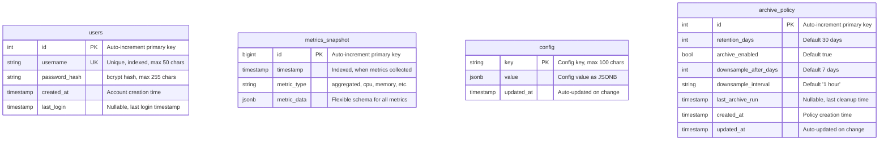

# Database Schema (ER Diagram)

> **PostgreSQL database schema with relationships and indexes**

This diagram shows all tables, columns, data types, constraints, and indexes in the PerfWatch database.

---

## Entity-Relationship Diagram



---

## Table Details

### users

**Purpose:** Store user authentication data

**Columns:**

| Column | Type | Constraints | Description |
|--------|------|-------------|-------------|
| `id` | INTEGER | PRIMARY KEY, AUTO INCREMENT | User ID |
| `username` | VARCHAR(50) | UNIQUE, NOT NULL, INDEX | Login username |
| `password_hash` | VARCHAR(255) | NOT NULL | bcrypt hashed password |
| `created_at` | TIMESTAMP WITH TIME ZONE | NOT NULL, DEFAULT NOW() | Account creation |
| `last_login` | TIMESTAMP WITH TIME ZONE | NULLABLE | Last successful login |

**Indexes:**
- `PRIMARY KEY (id)` - Auto-created
- `UNIQUE INDEX users_username_key (username)` - Unique constraint
- `INDEX ix_users_id (id)` - Explicit index
- `INDEX ix_users_username (username)` - Lookup optimization

**Sample Data:**
```sql
INSERT INTO users (username, password_hash, created_at)
VALUES ('admin', '$2b$12$...', NOW());
```

**SQLAlchemy Model:**
```python
class User(Base):
    __tablename__ = "users"
    id: Mapped[int] = mapped_column(primary_key=True, index=True)
    username: Mapped[str] = mapped_column(String(50), unique=True, index=True)
    password_hash: Mapped[str] = mapped_column(String(255))
    created_at: Mapped[datetime] = mapped_column(DateTime(timezone=True), server_default=func.now())
    last_login: Mapped[Optional[datetime]] = mapped_column(DateTime(timezone=True), nullable=True)
```

---

### metrics_snapshot

**Purpose:** Store time-series metrics data in JSONB format

**Columns:**

| Column | Type | Constraints | Description |
|--------|------|-------------|-------------|
| `id` | BIGINT | PRIMARY KEY, AUTO INCREMENT | Snapshot ID |
| `timestamp` | TIMESTAMP WITH TIME ZONE | NOT NULL, INDEX | When metrics were collected |
| `metric_type` | VARCHAR(50) | NOT NULL | Type: "aggregated", "cpu", etc. |
| `metric_data` | JSONB | NOT NULL | All metrics in flexible schema |

**Indexes:**
- `PRIMARY KEY (id)` - Auto-created
- `INDEX ix_metrics_snapshot_id (id)` - Explicit index
- `INDEX ix_metrics_snapshot_timestamp (timestamp)` - Time-range queries
- `INDEX idx_metrics_type_timestamp (metric_type, timestamp)` - Composite index

**JSONB Structure (metric_data):**
```json
{
  "cpu": {
    "usage_percent": 45.2,
    "per_core": [40.1, 50.3, 42.8, 48.1],
    "user_percent": 30.5,
    "system_percent": 10.2,
    "idle_percent": 59.3,
    "frequency_mhz": 2400,
    "load_avg_1m": 1.5,
    "load_avg_5m": 1.3,
    "load_avg_15m": 1.2,
    "temperature_celsius": 65.0
  },
  "memory": {
    "total_bytes": 17179869184,
    "available_bytes": 8053063680,
    "used_bytes": 9126805504,
    "percent": 53.1,
    "swap_total_bytes": 4294967296,
    "swap_used_bytes": 0,
    "swap_percent": 0.0,
    "buffers_bytes": 268435456,
    "cached_bytes": 4026531840
  },
  "network": {
    "bytes_sent": 1024000,
    "bytes_recv": 4096000,
    "packets_sent": 1000,
    "packets_recv": 2000,
    "errin": 0,
    "errout": 0,
    "dropin": 0,
    "dropout": 0,
    "interfaces": {
      "eth0": {
        "bytes_sent": 1024000,
        "bytes_recv": 4096000
      }
    }
  },
  "disk": {
    "partitions": {
      "/": {
        "total_bytes": 107374182400,
        "used_bytes": 53687091200,
        "free_bytes": 53687091200,
        "percent": 50.0
      }
    },
    "read_bytes": 2048000,
    "write_bytes": 1024000,
    "read_count": 500,
    "write_count": 250
  },
  "perf_events": {
    "cycles": 5000000000,
    "instructions": 9000000000,
    "ipc": 1.8,
    "cache_references": 100000,
    "cache_misses": 5000,
    "cache_miss_percent": 5.0,
    "branch_instructions": 2000000,
    "branch_misses": 100000,
    "branch_miss_percent": 5.0,
    "dtlb_load_misses": 50000
  },
  "memory_bandwidth": {
    "pgpgin_per_sec": 100.0,
    "pgpgout_per_sec": 50.0,
    "pswpin_per_sec": 0.0,
    "pswpout_per_sec": 0.0,
    "pgfault_per_sec": 200.0,
    "pgmajfault_per_sec": 5.0
  },
  "timestamp": "2026-01-21T10:30:00Z"
}
```

**Sample Query:**
```sql
-- Get CPU usage over last hour
SELECT
  timestamp,
  (metric_data->'cpu'->>'usage_percent')::float AS cpu_usage
FROM metrics_snapshot
WHERE timestamp >= NOW() - INTERVAL '1 hour'
ORDER BY timestamp;
```

**SQLAlchemy Model:**
```python
class MetricsSnapshot(Base):
    __tablename__ = "metrics_snapshot"
    id: Mapped[int] = mapped_column(BigInteger, primary_key=True, index=True)
    timestamp: Mapped[datetime] = mapped_column(DateTime(timezone=True), index=True)
    metric_type: Mapped[str] = mapped_column(String(50))
    metric_data: Mapped[dict[str, Any]] = mapped_column(JSONB)
    __table_args__ = (Index("idx_metrics_type_timestamp", "metric_type", "timestamp"),)
```

---

### config

**Purpose:** Key-value store for application configuration

**Columns:**

| Column | Type | Constraints | Description |
|--------|------|-------------|-------------|
| `key` | VARCHAR(100) | PRIMARY KEY | Configuration key |
| `value` | JSONB | NOT NULL | Configuration value |
| `updated_at` | TIMESTAMP WITH TIME ZONE | NOT NULL, AUTO UPDATE | Last modification time |

**Indexes:**
- `PRIMARY KEY (key)` - Auto-created

**Sample Data:**
```sql
INSERT INTO config (key, value)
VALUES
  ('sampling', '{"interval_seconds": 5}'),
  ('retention', '{"days": 30, "archive_enabled": true}'),
  ('features', '{"perf_events_enabled": true}');
```

**Common Keys:**
- `sampling`: Sampling interval configuration
- `retention`: Retention policy settings
- `features`: Feature flags (perf_events, etc.)
- `system_info`: System information (hostname, CPU count, memory)

**SQLAlchemy Model:**
```python
class Config(Base):
    __tablename__ = "config"
    key: Mapped[str] = mapped_column(String(100), primary_key=True)
    value: Mapped[dict[str, Any]] = mapped_column(JSONB)
    updated_at: Mapped[datetime] = mapped_column(
        DateTime(timezone=True),
        server_default=func.now(),
        onupdate=func.now()
    )
```

---

### archive_policy

**Purpose:** Data retention and archiving policy

**Columns:**

| Column | Type | Constraints | Description |
|--------|------|-------------|-------------|
| `id` | INTEGER | PRIMARY KEY, AUTO INCREMENT | Policy ID |
| `retention_days` | INTEGER | NOT NULL, DEFAULT 30 | How long to keep data |
| `archive_enabled` | BOOLEAN | NOT NULL, DEFAULT TRUE | Enable automatic cleanup |
| `downsample_after_days` | INTEGER | NOT NULL, DEFAULT 7 | When to downsample (future) |
| `downsample_interval` | VARCHAR(20) | NOT NULL, DEFAULT '1 hour' | Downsample rate (future) |
| `last_archive_run` | TIMESTAMP WITH TIME ZONE | NULLABLE | Last cleanup execution |
| `created_at` | TIMESTAMP WITH TIME ZONE | NOT NULL, DEFAULT NOW() | Policy creation |
| `updated_at` | TIMESTAMP WITH TIME ZONE | NOT NULL, AUTO UPDATE | Last modification |

**Indexes:**
- `PRIMARY KEY (id)` - Auto-created

**Sample Data:**
```sql
INSERT INTO archive_policy (retention_days, archive_enabled)
VALUES (30, true);
```

**Usage:**
- Typically only 1 row (single policy)
- Updated via Settings page
- Read by retention cleanup background task

**SQLAlchemy Model:**
```python
class ArchivePolicy(Base):
    __tablename__ = "archive_policy"
    id: Mapped[int] = mapped_column(primary_key=True)
    retention_days: Mapped[int] = mapped_column(Integer, default=30)
    archive_enabled: Mapped[bool] = mapped_column(Boolean, default=True)
    downsample_after_days: Mapped[int] = mapped_column(Integer, default=7)
    downsample_interval: Mapped[str] = mapped_column(String(20), default="1 hour")
    last_archive_run: Mapped[Optional[datetime]] = mapped_column(DateTime(timezone=True), nullable=True)
    created_at: Mapped[datetime] = mapped_column(DateTime(timezone=True), server_default=func.now())
    updated_at: Mapped[datetime] = mapped_column(DateTime(timezone=True), onupdate=func.now())
```

---

## Relationships

**No Foreign Keys:**
- PerfWatch uses a simple schema without foreign key relationships
- Each table is independent
- User table has no relationship to metrics (single-user design)

**Future Enhancements (Multi-User):**
```sql
-- Add user_id to metrics_snapshot for multi-user support
ALTER TABLE metrics_snapshot
ADD COLUMN user_id INTEGER REFERENCES users(id);
```

---

## Indexes Strategy

### Primary Purpose

| Index | Table | Purpose | Query Pattern |
|-------|-------|---------|---------------|
| `ix_users_username` | users | Login lookup | `WHERE username = ?` |
| `ix_metrics_snapshot_timestamp` | metrics_snapshot | Time-range queries | `WHERE timestamp BETWEEN ? AND ?` |
| `idx_metrics_type_timestamp` | metrics_snapshot | Filtered time queries | `WHERE metric_type = ? AND timestamp > ?` |

---

### Index Usage Examples

**Login Query:**
```sql
-- Uses: ix_users_username
SELECT * FROM users WHERE username = 'admin';
```

**Historical Query:**
```sql
-- Uses: ix_metrics_snapshot_timestamp
SELECT * FROM metrics_snapshot
WHERE timestamp >= '2026-01-21 00:00:00'
  AND timestamp < '2026-01-21 23:59:59';
```

**Filtered Historical Query:**
```sql
-- Uses: idx_metrics_type_timestamp
SELECT * FROM metrics_snapshot
WHERE metric_type = 'cpu'
  AND timestamp >= '2026-01-21 00:00:00';
```

---

## Database Constraints

### NOT NULL Constraints

- `users.username` - Required for login
- `users.password_hash` - Required for authentication
- `metrics_snapshot.timestamp` - Required for time-series
- `metrics_snapshot.metric_data` - Required for data integrity
- `config.value` - Required for configuration
- `archive_policy.retention_days` - Required for cleanup logic

### UNIQUE Constraints

- `users.username` - Prevent duplicate usernames

### DEFAULT Values

- `users.created_at` - Auto-set on insert
- `config.updated_at` - Auto-update on modify
- `archive_policy.retention_days` - 30 days default
- `archive_policy.archive_enabled` - True by default
- `archive_policy.downsample_after_days` - 7 days default

---

## Database Size Estimates

### Empty Database
```
users: ~8 KB (system tables + 1 admin user)
metrics_snapshot: ~8 KB (empty)
config: ~8 KB (3-5 config keys)
archive_policy: ~8 KB (1 policy row)
Total: ~32 KB
```

### After 1 Day
```
users: ~8 KB
metrics_snapshot: ~173 MB (17,280 snapshots × 10 KB)
config: ~8 KB
archive_policy: ~8 KB
Total: ~173 MB
```

### At 30-Day Retention (Steady State)
```
users: ~8 KB
metrics_snapshot: ~5 GB (518,400 snapshots × 10 KB)
config: ~8 KB
archive_policy: ~8 KB
Total: ~5 GB
```

---

## Migration Management

### Alembic Migrations

**Current Migrations:**
```bash
backend/alembic/versions/
├── 001_initial_schema.py          # Create all tables
├── 002_add_indexes.py              # Add performance indexes
└── 003_archive_policy_fields.py    # Add downsample fields
```

**Apply Migrations:**
```bash
docker compose exec backend alembic upgrade head
```

**Create New Migration:**
```bash
docker compose exec backend alembic revision --autogenerate -m "description"
```

**Rollback Migration:**
```bash
docker compose exec backend alembic downgrade -1
```

---

## Database Maintenance

### Recommended Tasks

**Daily:**
```sql
-- Vacuum to reclaim space after retention cleanup
VACUUM ANALYZE metrics_snapshot;
```

**Weekly:**
```sql
-- Reindex to optimize query performance
REINDEX TABLE metrics_snapshot;
```

**Monthly:**
```sql
-- Full vacuum to compact database file
VACUUM FULL metrics_snapshot;
```

**Backup:**
```bash
# Backup database
docker compose exec db pg_dump -U perfwatch > backup_$(date +%Y%m%d).sql

# Restore database
cat backup_20260121.sql | docker compose exec -T db psql -U perfwatch
```

---

## Performance Tuning

### PostgreSQL Configuration

**Recommended Settings (postgresql.conf):**
```ini
shared_buffers = 256MB          # 25% of RAM for small systems
effective_cache_size = 1GB      # 50-75% of RAM
maintenance_work_mem = 64MB     # For VACUUM and CREATE INDEX
checkpoint_completion_target = 0.9
wal_buffers = 16MB
default_statistics_target = 100
random_page_cost = 1.1          # SSD storage
effective_io_concurrency = 200  # SSD storage
```

### Query Optimization

**Slow Query Log:**
```sql
-- Enable slow query logging
SET log_min_duration_statement = 1000;  -- Log queries > 1s
```

**Common Slow Queries:**
- Historical queries without index on timestamp
- JSONB field extraction without GIN index (future optimization)
- Large time-range aggregations without downsampling

---

## Security Considerations

### Database Access

**Production Checklist:**
- ✅ Change default password (`POSTGRES_PASSWORD` in `.env`)
- ✅ Don't expose PostgreSQL port (remove `ports: 5432:5432` in production)
- ✅ Use SSL/TLS for database connections
- ✅ Limit database user permissions (no SUPERUSER needed)

**User Permissions:**
```sql
-- Minimal permissions for perfwatch user
GRANT SELECT, INSERT, UPDATE, DELETE ON ALL TABLES IN SCHEMA public TO perfwatch;
GRANT USAGE, SELECT ON ALL SEQUENCES IN SCHEMA public TO perfwatch;
```

### Password Storage

**bcrypt Hashing:**
```python
import bcrypt

# Hash password (cost factor 12)
password_hash = bcrypt.hashpw(b"admin123", bcrypt.gensalt()).decode()

# Verify password
bcrypt.checkpw(b"admin123", password_hash.encode())  # Returns True
```

**Never:**
- ❌ Store plaintext passwords
- ❌ Use weak hashing (MD5, SHA1)
- ❌ Use low bcrypt cost factor (< 10)

---

**Navigation:**
- [← Back to Developers](./README.md)
- [Next: Collector Classes →](./classes/collectors.md)
- [↑ Diagrams Index](../README.md)
