# Docker Deployment Architecture

> **Container orchestration for PerfWatch**

This diagram shows how PerfWatch services are deployed using Docker Compose, including containers, networks, volumes, and port mappings.

---

## Deployment Diagram

```mermaid
graph TB
    subgraph Host["🖥️ Docker Host (Linux)"]
        subgraph Network["Docker Bridge Network (perfwatch_default)"]
            Frontend[🌐 Frontend Container<br/>node:18-alpine<br/>Port: 3000→80<br/>Nginx serving static files]
            Backend[⚙️ Backend Container<br/>python:3.11-slim<br/>Port: 8000→8000<br/>privileged: true<br/>Uvicorn ASGI server]
            Database[💾 Database Container<br/>postgres:15<br/>Port: 5432→5432<br/>Health checks enabled]
        end

        Volume[(📦 postgres_data<br/>Docker Volume<br/>Persistent storage)]

        HostFS[📁 Host Filesystem<br/>./backend → /app<br/>./frontend → /app<br/>Development bind mounts]
    end

    User[👤 User<br/>Web Browser]
    LinuxKernel[🐧 Linux Kernel<br/>perf_events, /proc, /sys]

    User -->|HTTP :3000| Frontend
    Frontend -->|HTTP API<br/>proxy to :8000| Backend
    Frontend -->|WebSocket<br/>proxy to :8000| Backend
    Backend -->|PostgreSQL protocol<br/>:5432| Database
    Database -->|Persist data| Volume
    Backend -->|Read/Write code<br/>hot reload| HostFS
    Frontend -->|Read/Write code<br/>hot reload| HostFS
    Backend -->|Collect metrics<br/>privileged access| LinuxKernel

    classDef containerStyle fill:#42A5F5,stroke:#1565C0,color:#fff
    classDef storageStyle fill:#FFA726,stroke:#E65100,color:#fff
    classDef externalStyle fill:#66BB6A,stroke:#2E7D32,color:#fff
    classDef kernelStyle fill:#78909C,stroke:#37474F,color:#fff

    class Frontend,Backend,Database containerStyle
    class Volume,HostFS storageStyle
    class User externalStyle
    class LinuxKernel kernelStyle
```



---

## Container Details

### Frontend Container

**Image:** `node:18-alpine`
**Build Context:** `./frontend`
**Dockerfile:** Multi-stage build (Node + Nginx)

**Port Mapping:**
- Host `:3000` → Container `:80`

**Purpose:**
- Serve Vue.js SPA (built static files)
- Nginx reverse proxy for production
- Vite dev server in development mode

**Dependencies:**
- Depends on `backend` container being healthy

**Build Command:**
```bash
docker compose build frontend
```

**Environment:**
- `VITE_API_BASE_URL=http://localhost:8000` (injected at build time)

**Key Files:**
- `frontend/Dockerfile` - Multi-stage build
- `frontend/nginx.conf` - Nginx configuration
- `frontend/vite.config.js` - Proxy API to backend

---

### Backend Container

**Image:** `python:3.11-slim` (custom build)
**Build Context:** `./backend`
**Dockerfile:** `backend/Dockerfile`

**Port Mapping:**
- Host `:8000` → Container `:8000`

**Privileged Mode:** ✅ **REQUIRED**
```yaml
privileged: true  # Required for perf_events access
```

**Why Privileged?**
- Access to perf_event_open() system call
- Required for hardware performance counter collection
- Without it, PerfEventsCollector gracefully degrades

**Environment Variables:**
```yaml
DATABASE_URL: postgresql+asyncpg://perfwatch:perfwatch@db:5432/perfwatch
JWT_SECRET: change-this-in-production
ADMIN_USERNAME: admin
ADMIN_PASSWORD: admin123
BACKGROUND_COLLECTION_ENABLED: true
RETENTION_CLEANUP_ENABLED: true
```

**Dependencies:**
- Waits for `db` container health check to pass

**Volumes:**
- `./backend:/app` - Bind mount for hot reload
- Source code changes trigger uvicorn reload

**Healthcheck:**
```bash
curl http://localhost:8000/health
```

**Build Command:**
```bash
docker compose build backend
```

**Key Files:**
- `backend/Dockerfile` - Python image with dependencies
- `backend/pyproject.toml` - Python dependencies
- `backend/app/main.py` - Application entry point

---

### Database Container

**Image:** `postgres:15` (official)
**No custom build** - uses official image directly

**Port Mapping:**
- Host `:5432` → Container `:5432`

**Environment Variables:**
```yaml
POSTGRES_USER: perfwatch
POSTGRES_PASSWORD: perfwatch
POSTGRES_DB: perfwatch
```

**Volumes:**
- `postgres_data:/var/lib/postgresql/data` - Named volume for persistence

**Healthcheck:**
```bash
pg_isready -U perfwatch
```
- Interval: 5 seconds
- Timeout: 5 seconds
- Retries: 5

**Purpose:**
- Store metrics snapshots (JSONB format)
- Store user authentication data
- Store configuration and retention policies

**Persistence:**
- Data survives container restarts
- `docker compose down` preserves data
- `docker compose down -v` deletes data

**Access from Host:**
```bash
docker compose exec db psql -U perfwatch
```

---

## Networking

### Docker Bridge Network

**Name:** `perfwatch_default` (auto-created)
**Type:** Bridge network
**Subnet:** Auto-assigned (typically 172.x.x.x)

**DNS Resolution:**
- Containers can reach each other by service name
- `backend` connects to `db:5432` (not `localhost:5432`)
- Frontend proxies to `backend:8000` internally

**Port Exposure:**
- `:3000` - Frontend (public)
- `:8000` - Backend API (public)
- `:5432` - PostgreSQL (public, development only)

**Production Note:**
- In production, only `:3000` and `:8000` should be exposed
- PostgreSQL should NOT be publicly accessible

---

## Volumes

### Named Volume: postgres_data

**Type:** Docker named volume
**Mount Point:** `/var/lib/postgresql/data` (in database container)
**Lifecycle:** Independent of containers

**Purpose:**
- Persist PostgreSQL data files
- Survives `docker compose down`
- Deleted with `docker compose down -v`

**Inspection:**
```bash
docker volume inspect perfwatch_postgres_data
```

**Backup:**
```bash
docker compose exec db pg_dump -U perfwatch > backup.sql
```

**Restore:**
```bash
cat backup.sql | docker compose exec -T db psql -U perfwatch
```

---

### Bind Mounts (Development)

**Backend:** `./backend:/app`
- Source code changes → uvicorn auto-reload
- No rebuild required for Python code changes
- `pyproject.toml` changes require rebuild

**Frontend:** `./frontend:/app` (dev mode only)
- Vite hot module replacement (HMR)
- Instant updates in browser
- Production build uses static files only

---

## Startup Sequence


**Startup Commands:**
```bash
# Start all services
docker compose up -d

# View startup logs
docker compose logs -f

# Check service status
docker compose ps
```

---

## Resource Requirements

### Container Resources

| Container | CPU | Memory | Disk |
|-----------|-----|--------|------|
| Frontend | 0.5 core | 256 MB | 100 MB (static files) |
| Backend | 1-2 cores | 512 MB | 200 MB (Python + deps) |
| Database | 0.5 core | 512 MB | Grows with metrics data |

**Total Minimum:**
- **CPU:** 2 cores
- **Memory:** 1.5 GB
- **Disk:** 1 GB + metrics storage

**Storage Growth:**
- ~10 KB per metrics snapshot (JSONB)
- 5-second interval = 720 snapshots/hour
- ~7 MB/hour = ~5 GB/month
- Retention policy (30 days default) = ~150 GB max

---

## Network Ports

| Port | Service | Protocol | Purpose |
|------|---------|----------|---------|
| **3000** | Frontend | HTTP | Web UI access |
| **8000** | Backend | HTTP/WS | REST API + WebSocket |
| **5432** | Database | PostgreSQL | Database access (dev only) |

**Firewall Rules (Production):**
```bash
# Allow HTTP to frontend
ufw allow 3000/tcp

# Allow API access to backend
ufw allow 8000/tcp

# Block direct database access
ufw deny 5432/tcp
```

---

## Development vs Production

### Development Mode

```yaml
# docker-compose.yml (development)
backend:
  volumes:
    - ./backend:/app  # Hot reload
  environment:
    - DEBUG=true
  command: uvicorn app.main:app --reload --host 0.0.0.0

frontend:
  command: npm run dev  # Vite dev server
  volumes:
    - ./frontend:/app  # HMR enabled
```

**Characteristics:**
- Hot reload enabled
- Source code bind mounts
- Debug logging
- CORS allows `localhost:3000`

---

### Production Mode

```yaml
# docker-compose.prod.yml (production)
backend:
  volumes: []  # No bind mounts
  environment:
    - DEBUG=false
  command: uvicorn app.main:app --host 0.0.0.0 --workers 4

frontend:
  # Multi-stage build, Nginx serves static files
  volumes: []
```

**Characteristics:**
- No hot reload
- Static file serving (Nginx)
- Multiple workers
- Production logging
- Smaller attack surface

---

## Security Considerations

### Container Security

**Backend Privileged Mode:**
- ⚠️ Required for perf_events, but increases attack surface
- 🔒 Mitigated by running in isolated Docker network
- ✅ Alternative: Add `CAP_PERFMON` capability instead of full privileged

```yaml
# More secure alternative (Linux 5.8+)
backend:
  cap_add:
    - CAP_PERFMON
    - CAP_SYS_ADMIN  # For some perf_events
```

**Database Access:**
- ✅ Not exposed to public in production
- ✅ Strong password in `.env`
- ✅ Database user has limited permissions

**Secrets Management:**
- ⚠️ JWT_SECRET in environment variable
- 🔒 Better: Use Docker secrets in production
- ✅ `.env` not committed to git (`.env.example` instead)

---

## Common Operations

### Start Services
```bash
docker compose up -d
```

### Stop Services
```bash
docker compose down
```

### Rebuild After Code Changes
```bash
docker compose build backend
docker compose up -d backend
```

### View Logs
```bash
docker compose logs -f backend
docker compose logs -f frontend
docker compose logs -f db
```

### Execute Commands in Containers
```bash
# Run Alembic migrations
docker compose exec backend alembic upgrade head

# Access PostgreSQL
docker compose exec db psql -U perfwatch

# Run tests
docker compose run --rm backend pytest tests/ -v
```

### Clean Restart
```bash
# Stop and remove containers + volumes
docker compose down -v

# Rebuild and start
docker compose build
docker compose up -d
```

---

## Troubleshooting

### Container Won't Start

**Check logs:**
```bash
docker compose logs backend
```

**Common issues:**
- Database not healthy → Wait for health check
- Missing environment variables → Check `.env`
- Port already in use → Change port mapping

---

### Backend Can't Connect to Database

**Verify database is running:**
```bash
docker compose ps db
```

**Check DATABASE_URL:**
```bash
docker compose exec backend env | grep DATABASE_URL
```

**Should be:** `postgresql+asyncpg://perfwatch:perfwatch@db:5432/perfwatch`
(Note: `@db`, NOT `@localhost`)

---

### perf_events Not Working

**Check privileged mode:**
```bash
docker compose config | grep privileged
```

**Should show:** `privileged: true`

**Test manually:**
```bash
docker compose exec backend python -c "from app.collectors.perf_events import PerfEventsCollector; import asyncio; print(asyncio.run(PerfEventsCollector().collect()))"
```

---

### Frontend Can't Reach Backend

**Check Vite proxy config:**
```javascript
// frontend/vite.config.js
proxy: {
  '/api': {
    target: 'http://backend:8000',  // In Docker
    // OR
    target: 'http://localhost:8000',  // On host
  }
}
```

**Check CORS settings in backend:**
```python
# backend/app/main.py
app.add_middleware(
    CORSMiddleware,
    allow_origins=["http://localhost:3000"],
)
```

---

**Navigation:**
- [← Back to Developers](./README.md)
- [Next: Authentication Sequence →](./sequences/authentication.md)
- [↑ Diagrams Index](../README.md)
