# Authentication Flow Sequence Diagram

> **User login, JWT lifecycle, and navigation guards**

This diagram shows the complete authentication flow from user login to protected route access.

---

## Login Flow


---

## Protected Route Access Flow

```mermaid
sequenceDiagram
    actor User
    participant Browser as Browser
    participant Router as Vue Router
    participant AuthStore as authStore
    participant DashView as Dashboard.vue
    participant MetricsStore as metricsStore
    participant APIClient as API Client
    participant Backend as FastAPI

    User->>Browser: Navigate to /dashboard
    activate Browser

    Browser->>Router: Route change
    activate Router

    Router->>Router: beforeEach navigation guard
    Note over Router: Check route.meta.requiresAuth

    Router->>AuthStore: Get isAuthenticated
    activate AuthStore

    AuthStore->>AuthStore: Check token in localStorage
    AuthStore-->>Router: isAuthenticated status
    deactivate AuthStore

    alt Not authenticated
        Router->>Router: next('/login')
        Router-->>Browser: Redirect to Login
        deactivate Router
        Browser-->>User: Show Login page
    else Authenticated
        Router->>Router: next() - Allow navigation
        Router->>DashView: Mount component
        deactivate Router
        activate DashView

        DashView->>MetricsStore: Connect to WebSocket
        activate MetricsStore

        MetricsStore->>APIClient: Get JWT token
        APIClient-->>MetricsStore: token

        MetricsStore->>Backend: ws://localhost:8000/api/ws/metrics?token=JWT
        activate Backend

        Backend->>Backend: Validate JWT token
        Backend-->>MetricsStore: WebSocket connected ✅
        deactivate Backend

        MetricsStore-->>DashView: Connection established
        deactivate MetricsStore

        DashView-->>User: Display Dashboard
        deactivate DashView
        deactivate Browser
    end
```

---

## Token Refresh / /me Endpoint Flow

```mermaid
sequenceDiagram
    participant App as App.vue (mounted)
    participant AuthStore as authStore
    participant APIClient as API Client
    participant Backend as FastAPI
    participant AuthAPI as auth.py
    participant DB as PostgreSQL

    App->>AuthStore: Check authentication on mount
    activate AuthStore

    AuthStore->>AuthStore: token = localStorage.getItem('token')

    alt Token exists
        AuthStore->>APIClient: GET /api/auth/me
        activate APIClient
        Note over APIClient: Authorization: Bearer <token>

        APIClient->>Backend: HTTP GET /api/auth/me
        activate Backend

        Backend->>AuthAPI: get_current_user(token)
        activate AuthAPI

        AuthAPI->>AuthAPI: decode_jwt(token)

        alt JWT expired
            AuthAPI-->>Backend: 401 Unauthorized
            Backend-->>APIClient: 401 Unauthorized
            APIClient-->>AuthStore: Error response
            AuthStore->>AuthStore: Clear token from localStorage
            AuthStore->>AuthStore: isAuthenticated = false
            AuthStore-->>App: Not authenticated
            App->>App: router.push('/login')
        else JWT valid
            AuthAPI->>DB: SELECT * FROM users WHERE id = ?
            DB-->>AuthAPI: User record
            AuthAPI-->>Backend: User object
            deactivate AuthAPI
            Backend-->>APIClient: 200 OK + user data
            deactivate Backend
            APIClient-->>AuthStore: User object
            deactivate APIClient

            AuthStore->>AuthStore: Set user state
            AuthStore->>AuthStore: isAuthenticated = true
            AuthStore-->>App: Authenticated ✅
            deactivate AuthStore
        end
    else No token
        AuthStore->>AuthStore: isAuthenticated = false
        AuthStore-->>App: Not authenticated
        App->>App: router.push('/login')
    end
```



---

## Logout Flow


---

## Password Change Flow


---

## JWT Token Structure

### Token Creation (Backend)

```python
# backend/app/api/auth.py
from jose import jwt
from datetime import datetime, timedelta

def create_access_token(user_id: int) -> str:
    expire = datetime.utcnow() + timedelta(hours=24)
    payload = {
        "sub": str(user_id),  # Subject (user ID)
        "exp": expire,         # Expiration time
        "iat": datetime.utcnow()  # Issued at
    }
    token = jwt.encode(payload, JWT_SECRET, algorithm="HS256")
    return token
```

**Token Payload:**
```json
{
  "sub": "1",                    // User ID
  "exp": 1706745600,             // Expiry (24h from issue)
  "iat": 1706659200              // Issued at timestamp
}
```

---

### Token Validation (Backend)

```python
# backend/app/api/deps.py
from jose import jwt, JWTError
from fastapi import HTTPException, Depends
from fastapi.security import HTTPBearer

security = HTTPBearer()

async def get_current_user(token: str = Depends(security)) -> User:
    try:
        payload = jwt.decode(token, JWT_SECRET, algorithms=["HS256"])
        user_id = int(payload.get("sub"))
        # Query database for user
        user = await get_user_by_id(user_id)
        if not user:
            raise HTTPException(status_code=401)
        return user
    except JWTError:
        raise HTTPException(status_code=401)
```

---

### Token Storage (Frontend)

```javascript
// frontend/src/stores/auth.js
import { defineStore } from 'pinia'

export const useAuthStore = defineStore('auth', {
  state: () => ({
    token: localStorage.getItem('token'),
    user: null,
    isAuthenticated: false
  }),

  actions: {
    async login(username, password) {
      const response = await apiClient.post('/api/auth/login', {
        username,
        password
      })
      this.token = response.data.access_token
      localStorage.setItem('token', this.token)  // Persist token
      this.isAuthenticated = true
    },

    logout() {
      this.token = null
      this.user = null
      this.isAuthenticated = false
      localStorage.removeItem('token')  // Clear persisted token
    }
  }
})
```

---

## Axios Interceptor (Automatic Token Injection)

```javascript
// frontend/src/api/client.js
import axios from 'axios'
import { useAuthStore } from '@/stores/auth'

const apiClient = axios.create({
  baseURL: 'http://localhost:8000'
})

// Request interceptor: Add JWT to all requests
apiClient.interceptors.request.use(config => {
  const authStore = useAuthStore()
  if (authStore.token) {
    config.headers.Authorization = `Bearer ${authStore.token}`
  }
  return config
})

// Response interceptor: Handle 401 errors
apiClient.interceptors.response.use(
  response => response,
  error => {
    if (error.response?.status === 401) {
      const authStore = useAuthStore()
      authStore.logout()  // Clear token
      router.push('/login')  // Redirect to login
    }
    return Promise.reject(error)
  }
)
```

---

## Navigation Guards (Vue Router)

```javascript
// frontend/src/router/index.js
import { createRouter } from 'vue-router'
import { useAuthStore } from '@/stores/auth'

const router = createRouter({
  routes: [
    {
      path: '/login',
      component: Login,
      meta: { requiresAuth: false }
    },
    {
      path: '/',
      component: Dashboard,
      meta: { requiresAuth: true }  // Protected route
    },
    {
      path: '/history',
      component: History,
      meta: { requiresAuth: true }  // Protected route
    }
  ]
})

// Global navigation guard
router.beforeEach((to, from, next) => {
  const authStore = useAuthStore()

  if (to.meta.requiresAuth && !authStore.isAuthenticated) {
    next('/login')  // Redirect to login if not authenticated
  } else if (to.path === '/login' && authStore.isAuthenticated) {
    next('/')  // Redirect to dashboard if already logged in
  } else {
    next()  // Allow navigation
  }
})
```

---

## Security Considerations

### Backend

**bcrypt Password Hashing:**
- ✅ Uses bcrypt with automatic salt generation
- ✅ Cost factor 12 (default) - secure against brute force
- ❌ NOT using passlib (Docker compatibility issues)

**JWT Secret:**
- ⚠️ Default is `change-this-in-production`
- 🔒 Must set strong secret in `.env` for production
- ✅ HS256 algorithm (symmetric signing)

**Token Expiry:**
- ✅ 24-hour expiration (configurable)
- ⚠️ No refresh token mechanism (single-user app)
- ✅ No blacklist needed (single admin user)

---

### Frontend

**Token Storage:**
- ⚠️ localStorage (persistent across sessions)
- ✅ Alternative: sessionStorage (cleared on tab close)
- ❌ NOT cookies (CSRF risk without additional protection)

**XSS Protection:**
- ✅ Vue.js auto-escapes template variables
- ⚠️ Ensure no `v-html` with user input
- ✅ CSP headers recommended in production

**HTTPS Required:**
- ⚠️ Development uses HTTP (localhost only)
- 🔒 Production MUST use HTTPS (JWT transmitted in headers)

---

## Error Handling

### 401 Unauthorized
**Trigger:** Invalid credentials, expired token, missing token
**Response:** Redirect to `/login`, clear stored token

### 403 Forbidden
**Trigger:** Valid token but insufficient permissions (future multi-user)
**Response:** Show error message, stay on current page

### Network Errors
**Trigger:** Backend unreachable
**Response:** Show "Unable to connect" message, retry logic

---

## Testing Authentication Flow

### Manual Testing

**1. Login:**
```bash
curl -X POST http://localhost:8000/api/auth/login \
  -H "Content-Type: application/json" \
  -d '{"username":"admin","password":"admin123"}'
```

**Expected Response:**
```json
{
  "access_token": "eyJhbGciOiJIUzI1NiIsInR5cCI6IkpXVCJ9...",
  "token_type": "bearer"
}
```

**2. Access Protected Endpoint:**
```bash
curl http://localhost:8000/api/auth/me \
  -H "Authorization: Bearer <token>"
```

**Expected Response:**
```json
{
  "id": 1,
  "username": "admin",
  "last_login": "2026-01-21T10:30:00Z"
}
```

**3. Invalid Token:**
```bash
curl http://localhost:8000/api/auth/me \
  -H "Authorization: Bearer invalid_token"
```

**Expected Response:** `401 Unauthorized`

---

### Automated Tests

```python
# backend/tests/test_auth.py
async def test_login_success(client, db_session):
    response = await client.post("/api/auth/login", json={
        "username": "admin",
        "password": "admin123"
    })
    assert response.status_code == 200
    assert "access_token" in response.json()

async def test_login_invalid_password(client):
    response = await client.post("/api/auth/login", json={
        "username": "admin",
        "password": "wrong"
    })
    assert response.status_code == 401

async def test_get_me_valid_token(client, auth_headers):
    response = await client.get("/api/auth/me", headers=auth_headers)
    assert response.status_code == 200
    assert response.json()["username"] == "admin"
```

---

**Navigation:**
- [← Previous: Deployment](../deployment.md)
- [Next: WebSocket Sequence →](./websocket.md)
- [↑ Diagrams Index](../../README.md)
