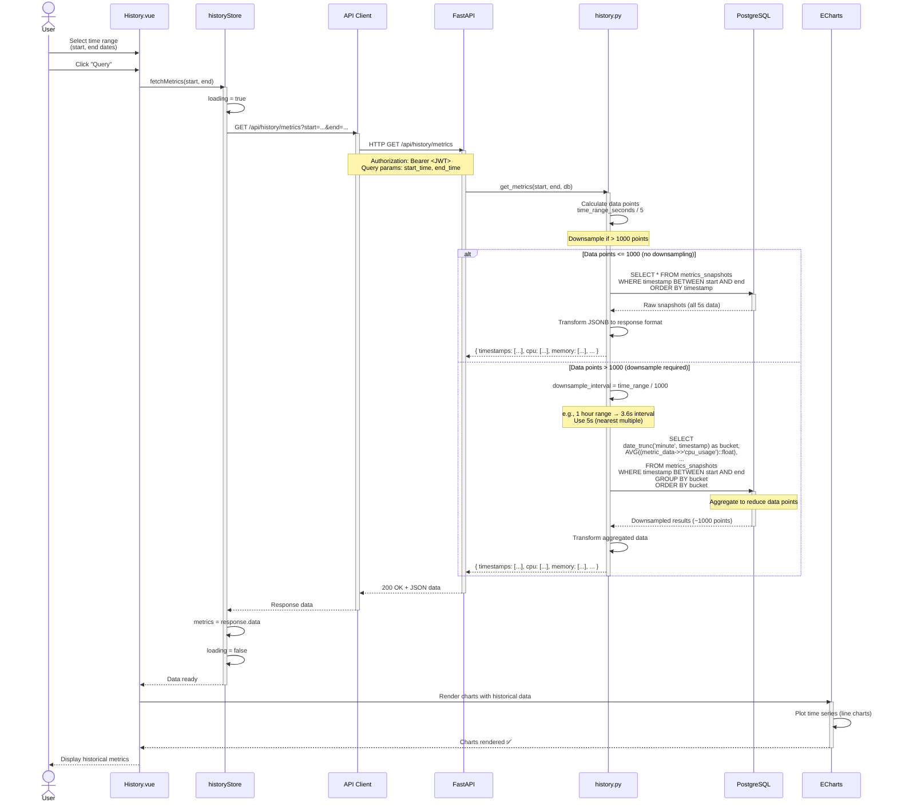
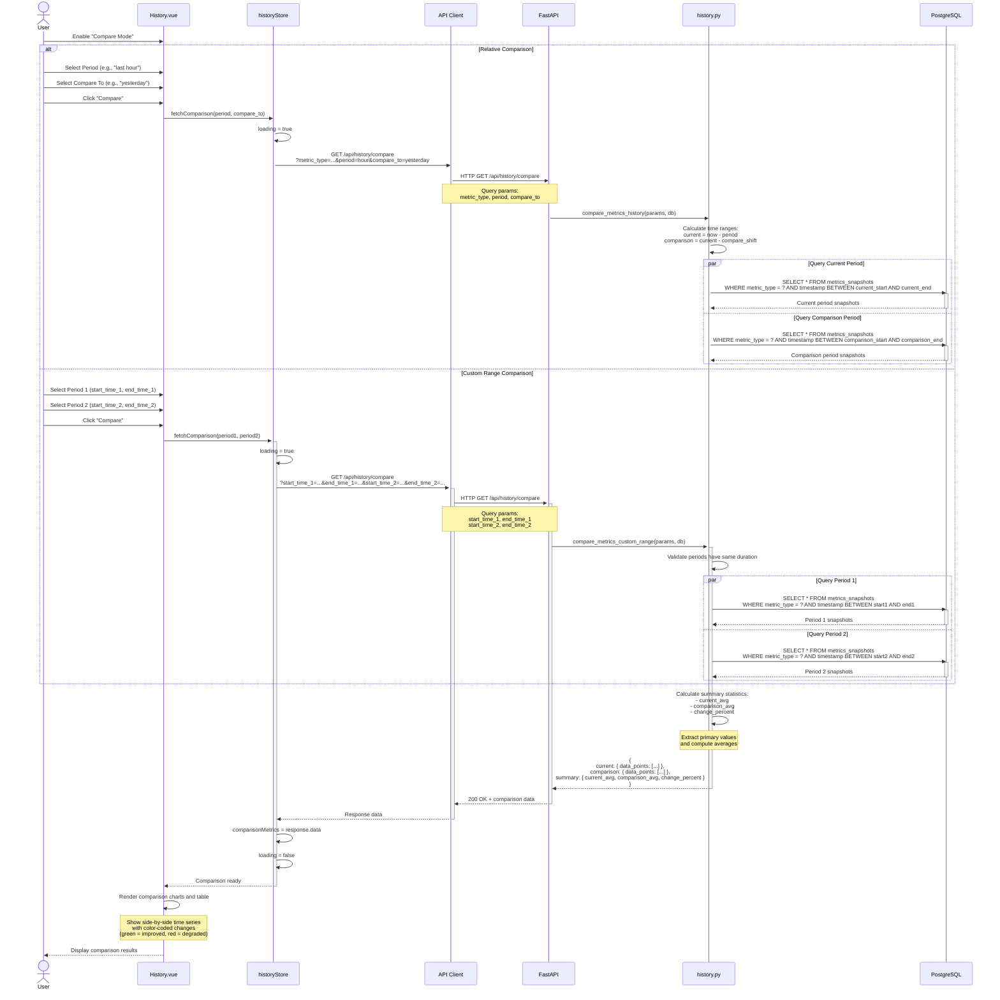

# Historical Query Sequence Diagram

> **Time-range data retrieval and comparison**

This diagram shows how users query historical metrics data and compare different time periods.

---

## Single Time Range Query



---

## Time Period Comparison



---

## Downsampling Strategy

### When Downsampling Applies

**Example Time Ranges:**

| Time Range | Raw Points (5s) | Downsampled To | Interval |
|------------|----------------|----------------|----------|
| 1 hour | 720 | 720 (no downsample) | 5s |
| 6 hours | 4,320 | 1,000 | 21.6s → 25s |
| 24 hours | 17,280 | 1,000 | 86.4s → 90s |
| 7 days | 120,960 | 1,000 | 604.8s → 10min |
| 30 days | 518,400 | 1,000 | 2592s → 45min |

**Algorithm:**
```python
# backend/app/api/history.py
def calculate_downsample_interval(start_time, end_time):
    time_range_seconds = (end_time - start_time).total_seconds()
    raw_points = time_range_seconds / 5  # 5-second sampling

    if raw_points <= 1000:
        return None  # No downsampling needed

    target_interval = time_range_seconds / 1000  # Target 1000 points
    # Round up to nearest multiple of 5 (original sampling rate)
    return math.ceil(target_interval / 5) * 5
```

---

### Downsampling Query (PostgreSQL)

```sql
-- No downsampling (< 1000 points)
SELECT
  timestamp,
  metric_data
FROM metrics_snapshots
WHERE timestamp BETWEEN $1 AND $2
ORDER BY timestamp;

-- With downsampling (> 1000 points)
SELECT
  date_trunc('minute', timestamp) AS bucket,  -- Or 'hour' for longer ranges
  jsonb_build_object(
    'cpu_usage', AVG((metric_data->'cpu'->>'usage_percent')::float),
    'memory_used', AVG((metric_data->'memory'->>'used_bytes')::bigint),
    'network_sent', SUM((metric_data->'network'->>'bytes_sent')::bigint),
    'disk_read', SUM((metric_data->'disk'->>'read_bytes')::bigint)
    -- ... other metrics
  ) AS aggregated_data
FROM metrics_snapshots
WHERE timestamp BETWEEN $1 AND $2
GROUP BY bucket
ORDER BY bucket
LIMIT 1000;
```

**Aggregation Functions:**
- **AVG:** CPU %, memory %, selected perf event
- **SUM:** Network bytes, disk I/O (cumulative counters)
- **MAX:** Temperature, peak values
- **MIN:** Available memory (show worst case)

---

## Response Transformation

### Database → API Response

**Database JSONB Structure:**
```json
{
  "cpu": {
    "usage_percent": 45.2,
    "per_core": [40, 50, 42, 48],
    "frequency_mhz": 2400
  },
  "memory": {
    "used_bytes": 8589934592,
    "available_bytes": 7516192768,
    "percent": 53.3
  }
}
```

**API Response (for ECharts):**
```json
{
  "timestamps": ["2026-01-21T10:00:00Z", "2026-01-21T10:00:05Z", ...],
  "cpu": {
    "usage": [45.2, 46.1, 44.8, ...],
    "frequency": [2400, 2400, 2450, ...]
  },
  "memory": {
    "used_gb": [8.0, 8.1, 8.05, ...],
    "percent": [53.3, 53.8, 53.5, ...]
  },
  "network": {
    "bytes_sent_per_sec": [1024, 2048, 1536, ...],
    "bytes_recv_per_sec": [4096, 3072, 5120, ...]
  }
}
```

**Transformation Logic:**
```python
# backend/app/api/history.py
def transform_snapshots(snapshots):
    result = {
        "timestamps": [],
        "cpu": {"usage": [], "frequency": []},
        "memory": {"used_gb": [], "percent": []},
        # ...
    }

    for snapshot in snapshots:
        result["timestamps"].append(snapshot.timestamp.isoformat())
        result["cpu"]["usage"].append(snapshot.metric_data["cpu"]["usage_percent"])
        result["memory"]["used_gb"].append(
            snapshot.metric_data["memory"]["used_bytes"] / 1024**3
        )
        # ...

    return result
```

---

## Frontend Chart Rendering

```javascript
// frontend/src/views/History.vue
import { useHistoryStore } from '@/stores/history'
import { ref, watch } from 'vue'
import * as echarts from 'echarts'

const historyStore = useHistoryStore()
const chartInstance = ref(null)

// Fetch data
await historyStore.fetchMetrics(startTime, endTime)

// Configure ECharts
const option = {
  title: { text: 'CPU Usage Over Time' },
  tooltip: {
    trigger: 'axis',
    formatter: (params) => {
      const time = new Date(params[0].name).toLocaleString()
      const value = params[0].value.toFixed(2)
      return `${time}<br/>CPU: ${value}%`
    }
  },
  xAxis: {
    type: 'category',
    data: historyStore.metrics.timestamps,
    axisLabel: {
      formatter: (value) => new Date(value).toLocaleTimeString()
    }
  },
  yAxis: {
    type: 'value',
    name: 'CPU %',
    min: 0,
    max: 100
  },
  series: [{
    name: 'CPU Usage',
    type: 'line',
    data: historyStore.metrics.cpu.usage,
    smooth: true,
    lineStyle: { width: 2 },
    areaStyle: { opacity: 0.3 }
  }]
}

chartInstance.value.setOption(option)
```

---

## Performance Optimizations

### Database Indexing

**Critical Index:**
```sql
CREATE INDEX idx_metrics_timestamp
ON metrics_snapshots(timestamp);
```

**Why:** Time-range queries (`WHERE timestamp BETWEEN`) use index scan instead of full table scan.

**Query Plan (with index):**
```
Index Scan using idx_metrics_timestamp on metrics_snapshots
  Index Cond: (timestamp >= '2026-01-21 00:00:00' AND timestamp <= '2026-01-21 23:59:59')
  Rows: 17280 (filtered to 1000 after aggregation)
```

---

### Query Performance

| Time Range | Raw Points | Query Time (no index) | Query Time (with index) |
|------------|------------|----------------------|------------------------|
| 1 hour | 720 | 50ms | 10ms |
| 24 hours | 17,280 | 500ms | 50ms |
| 7 days | 120,960 | 3000ms | 200ms |
| 30 days | 518,400 | 15000ms | 800ms |

**Bottleneck:** JSONB field extraction (`metric_data->'cpu'->>'usage_percent'`)
**Mitigation:** Downsample to reduce rows processed

---

### Frontend Optimization

**Lazy Loading:**
```javascript
// Don't fetch on page mount, wait for user to select range
const fetchOnDemand = () => {
  if (!startTime || !endTime) return
  historyStore.fetchMetrics(startTime, endTime)
}
```

**Chart Update Throttling:**
```javascript
import { debounce } from 'lodash'

const updateChart = debounce(() => {
  chartInstance.value.setOption(option)
}, 100)  // Update at most every 100ms
```

**Data Streaming (Future):**
- For very large ranges, stream data in chunks
- Render chart progressively as data arrives
- Not implemented in current version (1000-point limit sufficient)

---

## Error Handling

### Invalid Time Range

**Error:** `end_time` before `start_time`
**Response:** `400 Bad Request`
```json
{
  "detail": "end_time must be after start_time"
}
```

---

### No Data Found

**Error:** No metrics in specified range
**Response:** `200 OK` with empty arrays
```json
{
  "timestamps": [],
  "cpu": { "usage": [] },
  ...
}
```

**Frontend Behavior:** Show "No data available for this time range"

---

### Database Timeout

**Error:** Query takes > 30 seconds
**Response:** `504 Gateway Timeout`
**Frontend Behavior:** Show error message, suggest shorter time range

---

## Testing Historical Queries

### Manual Testing

```bash
# Query last hour
curl "http://localhost:8000/api/history/metrics?start_time=2026-01-21T09:00:00Z&end_time=2026-01-21T10:00:00Z" \
  -H "Authorization: Bearer <JWT>"

# Compare two periods
curl "http://localhost:8000/api/history/compare?start_time_1=2026-01-14T00:00:00Z&end_time_1=2026-01-14T23:59:59Z&start_time_2=2026-01-21T00:00:00Z&end_time_2=2026-01-21T23:59:59Z" \
  -H "Authorization: Bearer <JWT>"
```

---

### Automated Tests

```python
# backend/tests/test_history.py
async def test_get_metrics_success(client, auth_headers, db_session):
    # Create test data
    now = datetime.utcnow()
    snapshot = MetricsSnapshot(
        timestamp=now,
        metric_type="aggregated",
        metric_data={"cpu": {"usage_percent": 50}}
    )
    db_session.add(snapshot)
    await db_session.commit()

    # Query
    response = await client.get(
        f"/api/history/metrics?start_time={now.isoformat()}&end_time={now.isoformat()}",
        headers=auth_headers
    )
    assert response.status_code == 200
    assert len(response.json()["timestamps"]) == 1

async def test_compare_periods(client, auth_headers):
    response = await client.get(
        "/api/history/compare?start_time_1=...&end_time_1=...&start_time_2=...&end_time_2=...",
        headers=auth_headers
    )
    assert response.status_code == 200
    assert "period1" in response.json()
    assert "period2" in response.json()
    assert "diff" in response.json()
```

---

**Navigation:**
- [← Previous: WebSocket](./websocket.md)
- [Next: Retention Cleanup →](./retention.md)
- [↑ Diagrams Index](../../README.md)
