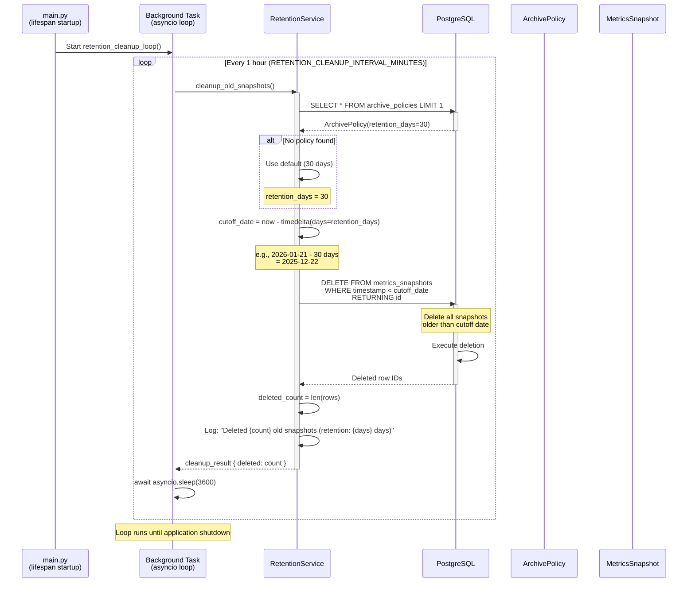
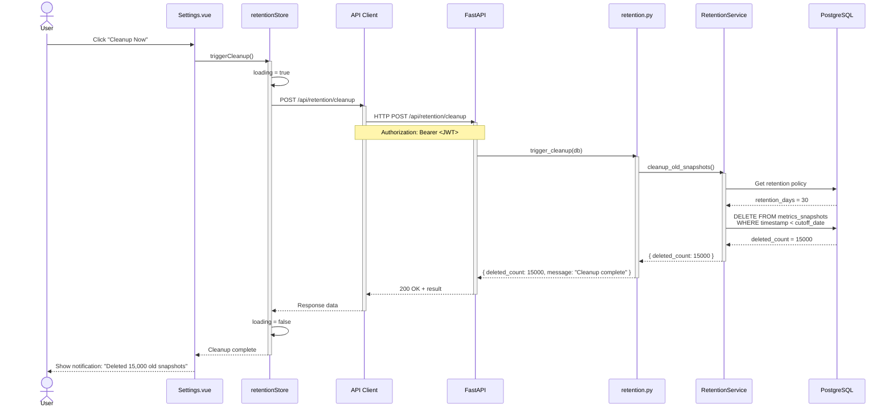
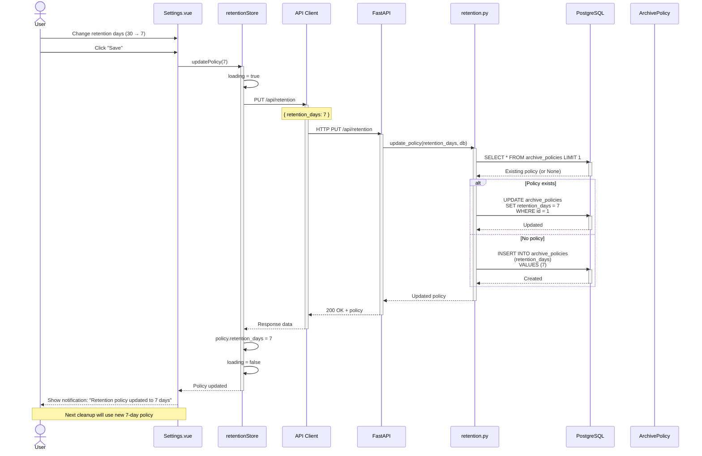
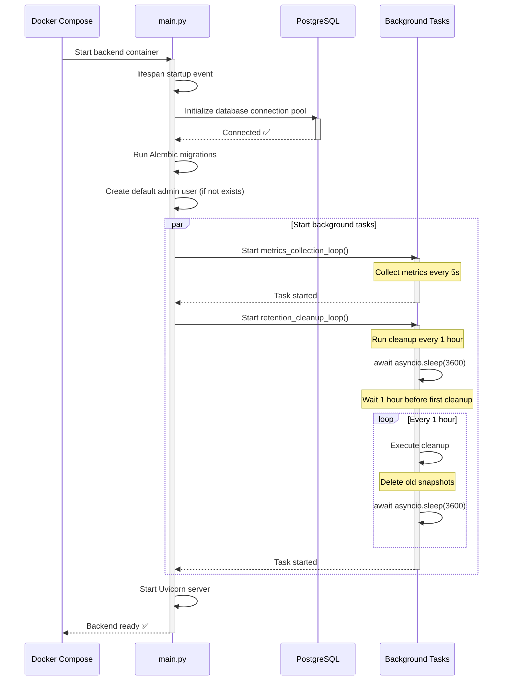

# Retention Cleanup Sequence Diagram

> **Background task for data retention policy enforcement**

This diagram shows how the retention cleanup background task automatically deletes old metrics snapshots based on configured retention policy.

---

## Retention Cleanup Loop



---

## Manual Cleanup Trigger



---

## Retention Policy Update



---

## Application Startup with Retention Cleanup



---

## Cleanup Strategy Details

### Deletion Query

```sql
-- Actual deletion query executed by RetentionService
DELETE FROM metrics_snapshots
WHERE timestamp < $1  -- cutoff_date (now - retention_days)
RETURNING id;
```

**Parameters:**
- `$1`: Cutoff timestamp (e.g., `2025-12-22 00:00:00` for 30-day retention)

**Example:**
- Today: 2026-01-21
- Retention: 30 days
- Cutoff: 2025-12-22
- Action: Delete all snapshots before 2025-12-22

---

### Retention Policy Storage

**Table: archive_policies**
```sql
CREATE TABLE archive_policies (
    id SERIAL PRIMARY KEY,
    retention_days INTEGER NOT NULL DEFAULT 30,
    downsample_interval INTEGER,  -- Future use
    created_at TIMESTAMP DEFAULT NOW(),
    updated_at TIMESTAMP DEFAULT NOW()
);
```

**Default Policy:**
- Retention: 30 days
- Created on first startup if not exists

---

### Cleanup Frequency

**Environment Variable:**
```bash
RETENTION_CLEANUP_INTERVAL_MINUTES=60  # Default: 1 hour
```

**Configurable via `.env`:**
```python
# backend/app/config.py
class Settings(BaseSettings):
    retention_cleanup_interval_minutes: int = 60
```

**Why 1 hour?**
- Balance between timely cleanup and system overhead
- 1 hour delay in deletion is acceptable (not real-time requirement)
- Reduces database write load

---

## Storage Impact Examples

### Metrics Storage Growth

**Assumptions:**
- 1 snapshot every 5 seconds
- ~10 KB per snapshot (JSONB)

**Growth Rate:**
- 720 snapshots/hour × 10 KB = 7.2 MB/hour
- 172.8 MB/day
- ~5 GB/month

**Retention Impact:**

| Retention Days | Total Snapshots | Storage Size |
|----------------|----------------|--------------|
| 7 days | 120,960 | ~1.2 GB |
| 14 days | 241,920 | ~2.4 GB |
| 30 days (default) | 518,400 | ~5 GB |
| 90 days | 1,555,200 | ~15 GB |
| 365 days | 6,307,200 | ~61 GB |

**Cleanup Impact:**
- 30-day retention: ~5 GB max storage
- Daily cleanup deletes: ~17,280 snapshots (~173 MB)
- Database VACUUM recommended monthly

---

### Database Maintenance

**Recommended Post-Cleanup:**
```sql
-- Reclaim disk space after large deletions
VACUUM FULL metrics_snapshots;

-- Update table statistics
ANALYZE metrics_snapshots;
```

**Automate with cron (optional):**
```bash
# Run daily at 3 AM
0 3 * * * docker compose exec db vacuumdb -U perfwatch -d perfwatch -z
```

---

## Performance Considerations

### Deletion Performance

**Deletion Speed:**
- 10,000 rows/second (typical)
- 1 day of data (~17,280 snapshots) = 1-2 seconds
- 30-day cleanup on first run = 10-20 seconds

**Blocking:**
- ❌ DELETE is blocking operation
- ✅ Runs in background task (doesn't block API)
- ✅ Transaction ensures atomicity

---

### Index Impact

**Affected Index:**
```sql
CREATE INDEX idx_metrics_timestamp ON metrics_snapshots(timestamp);
```

**Index Maintenance:**
- Index automatically updated during DELETE
- May become fragmented over time
- REINDEX recommended quarterly

```sql
REINDEX INDEX idx_metrics_timestamp;
```

---

## Error Handling

### Database Connection Lost

**Symptom:** Cleanup task can't connect to database
**Behavior:** Log error, skip this cleanup cycle, retry in 1 hour
**Impact:** Old data accumulates until connection restored

```python
# backend/app/services/retention.py
async def cleanup_old_snapshots(db: AsyncSession):
    try:
        # Cleanup logic
        await db.execute(delete_query)
        await db.commit()
    except Exception as e:
        logger.error(f"Retention cleanup failed: {e}")
        await db.rollback()
        # Don't raise - let task continue in next cycle
```

---

### Policy Not Found

**Symptom:** No row in `archive_policies` table
**Behavior:** Use default 30-day retention
**Resolution:** Create default policy on startup

```python
# backend/app/init_db.py
async def init_db():
    policy = await db.execute(select(ArchivePolicy).limit(1))
    if not policy.scalar_one_or_none():
        default_policy = ArchivePolicy(retention_days=30)
        db.add(default_policy)
        await db.commit()
```

---

### Cleanup Takes Too Long

**Symptom:** Cleanup exceeds 1-hour interval
**Behavior:** Next cleanup starts while previous still running (race condition)
**Mitigation:** Add lock mechanism

```python
# Future enhancement: Lock mechanism
cleanup_lock = asyncio.Lock()

async def retention_cleanup_loop():
    while True:
        async with cleanup_lock:  # Only one cleanup at a time
            await cleanup_old_snapshots()
        await asyncio.sleep(3600)
```

---

## Monitoring Retention Cleanup

### Log Messages

```python
# backend/app/services/retention.py
logger.info(f"Retention cleanup started (policy: {retention_days} days)")
logger.info(f"Deleted {deleted_count} snapshots older than {cutoff_date}")
logger.info(f"Retention cleanup completed in {elapsed_time:.2f}s")
```

**Example Logs:**
```
2026-01-21 10:00:00 INFO Retention cleanup started (policy: 30 days)
2026-01-21 10:00:02 INFO Deleted 17,280 snapshots older than 2025-12-22 00:00:00
2026-01-21 10:00:02 INFO Retention cleanup completed in 1.85s
```

---

### Metrics to Track

**Operational Metrics:**
- Cleanup execution time (seconds)
- Number of snapshots deleted per run
- Database storage size before/after cleanup
- Cleanup failure count

**Future Enhancement: Prometheus Metrics**
```python
# backend/app/services/retention.py
from prometheus_client import Counter, Histogram

retention_cleanup_duration = Histogram('retention_cleanup_duration_seconds', 'Time spent in cleanup')
retention_snapshots_deleted = Counter('retention_snapshots_deleted_total', 'Total snapshots deleted')

@retention_cleanup_duration.time()
async def cleanup_old_snapshots():
    # Cleanup logic
    retention_snapshots_deleted.inc(deleted_count)
```

---

## Testing Retention Cleanup

### Manual Testing

**1. Create Old Data:**
```sql
-- Create snapshot from 60 days ago
INSERT INTO metrics_snapshots (timestamp, metric_type, metric_data)
VALUES (NOW() - INTERVAL '60 days', 'aggregated', '{"cpu": {"usage_percent": 50}}');
```

**2. Trigger Cleanup:**
```bash
curl -X POST http://localhost:8000/api/retention/cleanup \
  -H "Authorization: Bearer <JWT>"
```

**3. Verify Deletion:**
```sql
SELECT COUNT(*) FROM metrics_snapshots WHERE timestamp < NOW() - INTERVAL '30 days';
-- Should return 0
```

---

### Automated Tests

```python
# backend/tests/test_retention.py
async def test_cleanup_old_snapshots(db_session):
    # Create old snapshot
    old_snapshot = MetricsSnapshot(
        timestamp=datetime.utcnow() - timedelta(days=60),
        metric_type="aggregated",
        metric_data={"cpu": {"usage_percent": 50}}
    )
    db_session.add(old_snapshot)

    # Create recent snapshot
    recent_snapshot = MetricsSnapshot(
        timestamp=datetime.utcnow(),
        metric_type="aggregated",
        metric_data={"cpu": {"usage_percent": 50}}
    )
    db_session.add(recent_snapshot)
    await db_session.commit()

    # Run cleanup (default 30-day retention)
    result = await cleanup_old_snapshots(db_session)

    # Verify old deleted, recent kept
    all_snapshots = await db_session.execute(select(MetricsSnapshot))
    remaining = all_snapshots.scalars().all()
    assert len(remaining) == 1
    assert remaining[0].id == recent_snapshot.id
    assert result["deleted_count"] == 1
```

---

**Navigation:**
- [← Previous: Historical Queries](./historical-query.md)
- [↑ Back to Developers](../README.md)
- [↑ Diagrams Index](../../README.md)
