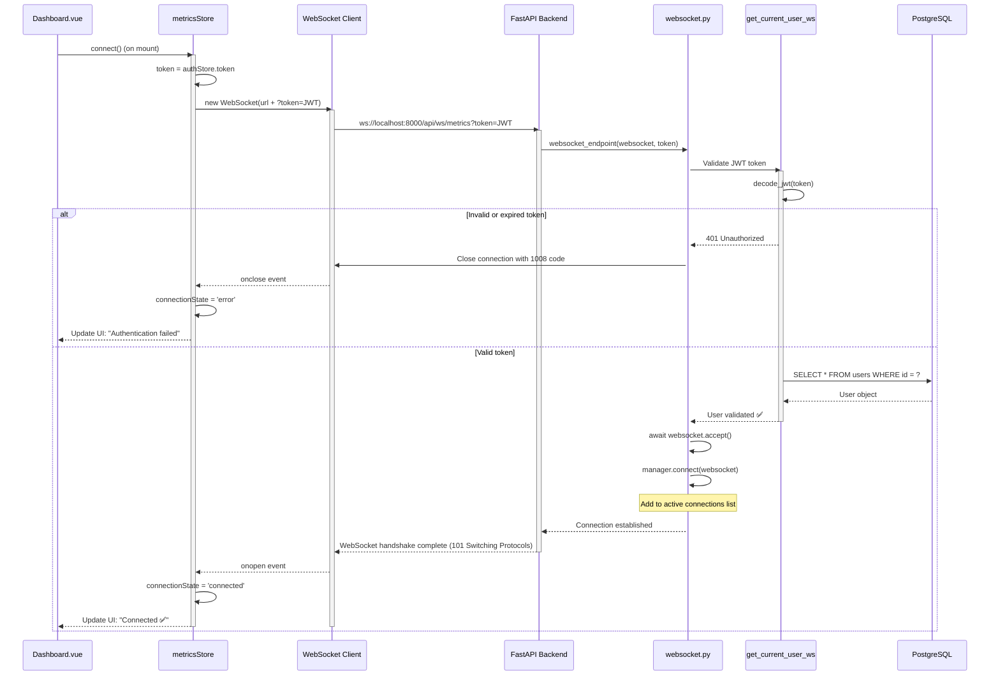
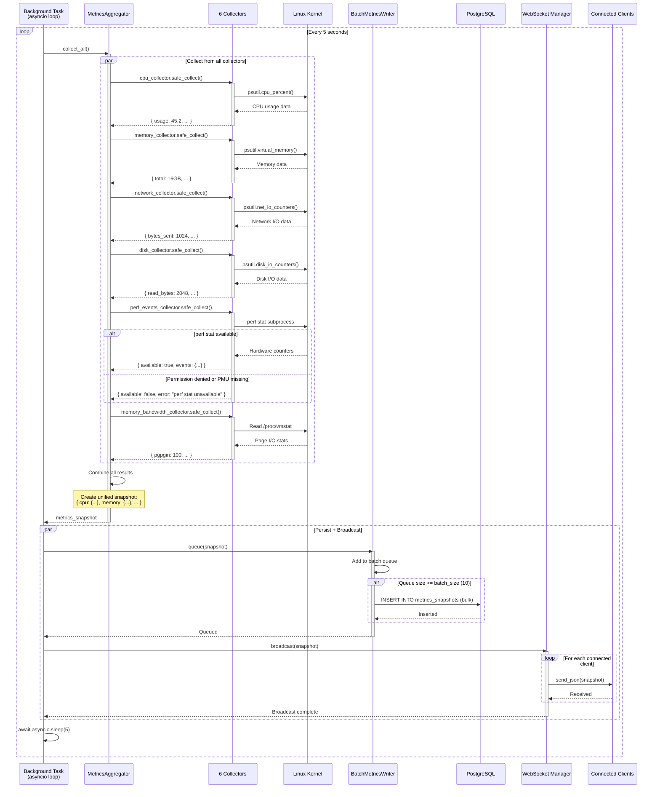
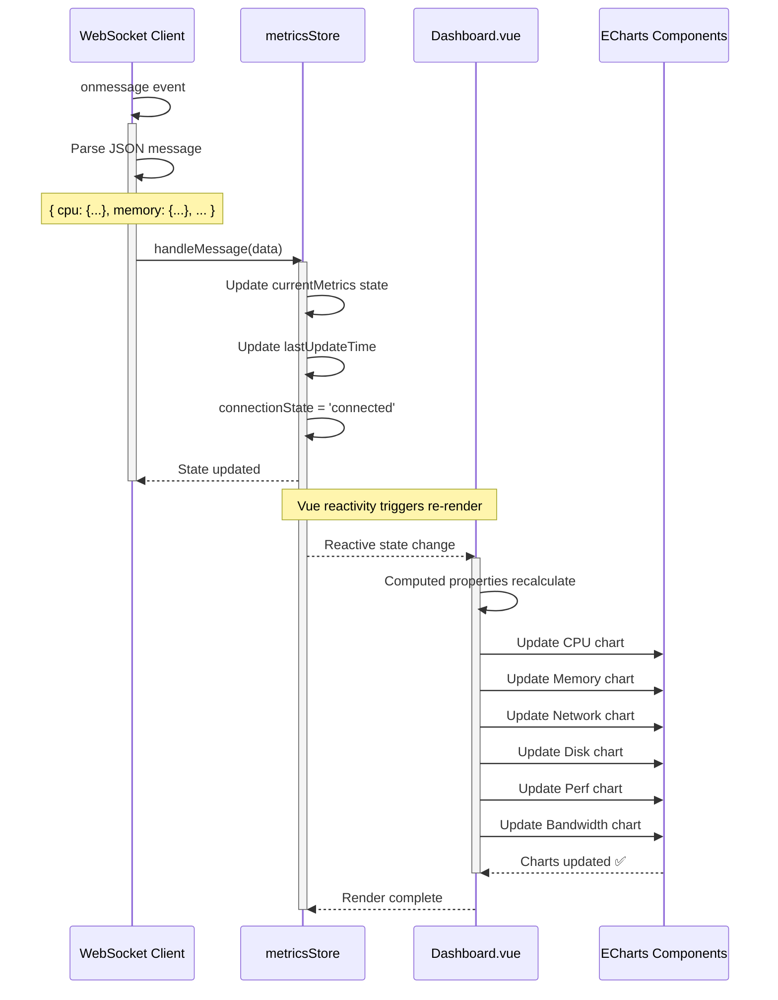
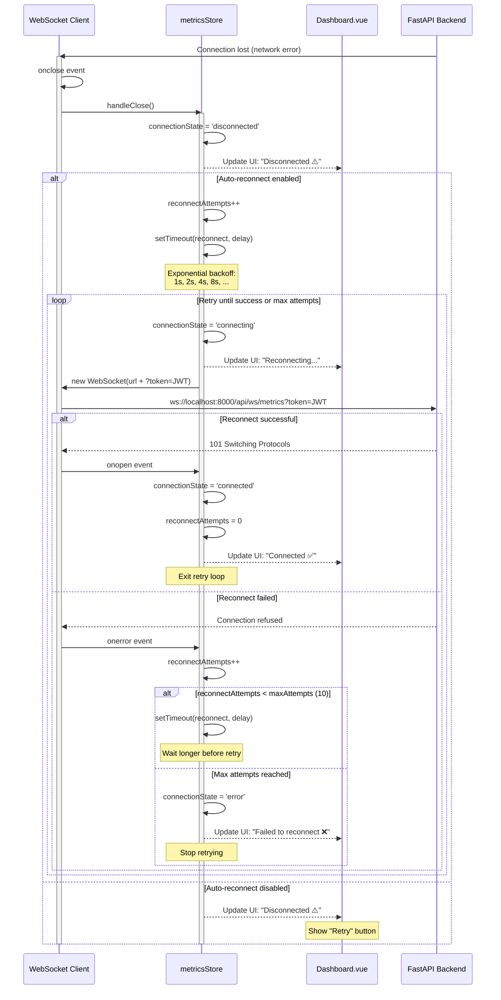
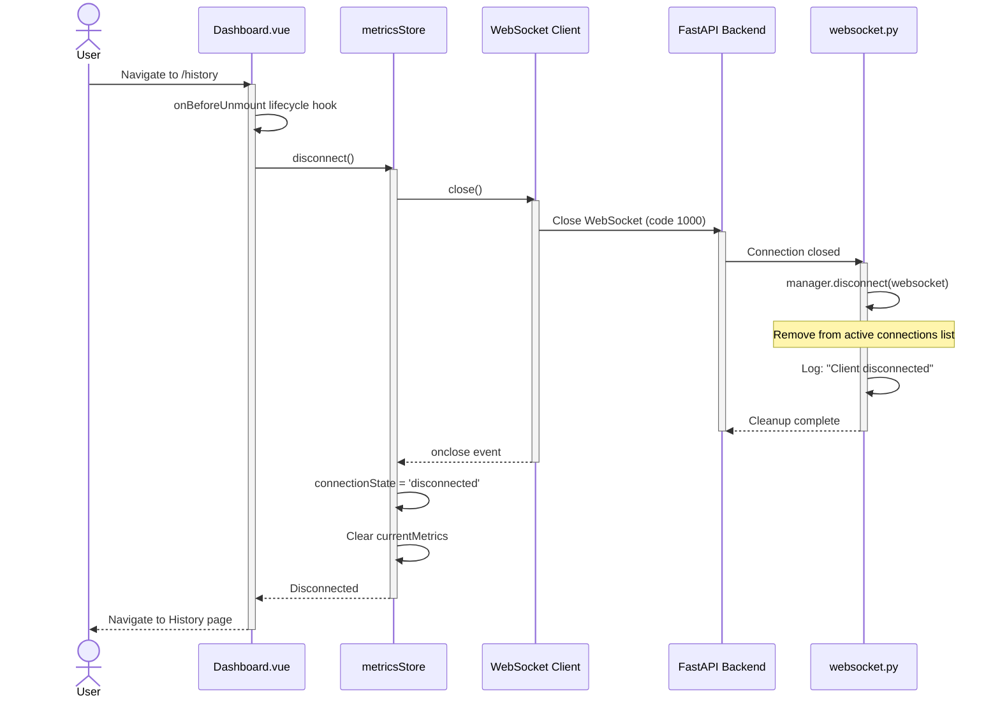
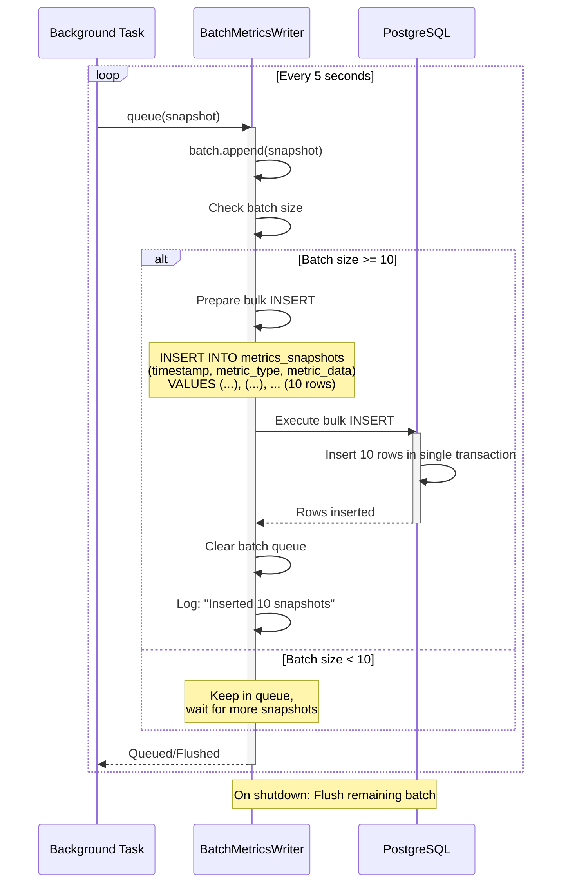

# WebSocket Metrics Flow Sequence Diagram

> **Real-time metrics streaming via WebSocket**

This diagram shows the complete WebSocket lifecycle from connection establishment to real-time metrics broadcasting.

---

## WebSocket Connection Establishment



---

## Background Metrics Collection Loop



---

## Client Receiving Metrics



---

## WebSocket Disconnection & Reconnection



---

## Client Disconnect (User Navigates Away)



---

## Batch Writer Flush



---

## WebSocket Manager Implementation

```python
# backend/app/api/websocket.py
from fastapi import WebSocket
from typing import List

class ConnectionManager:
    def __init__(self):
        self.active_connections: List[WebSocket] = []

    async def connect(self, websocket: WebSocket):
        await websocket.accept()
        self.active_connections.append(websocket)
        logger.info(f"Client connected. Total: {len(self.active_connections)}")

    def disconnect(self, websocket: WebSocket):
        self.active_connections.remove(websocket)
        logger.info(f"Client disconnected. Total: {len(self.active_connections)}")

    async def broadcast(self, message: dict):
        for connection in self.active_connections[:]:  # Copy to avoid modification during iteration
            try:
                await connection.send_json(message)
            except Exception as e:
                logger.error(f"Failed to send to client: {e}")
                self.disconnect(connection)

manager = ConnectionManager()
```

---

## WebSocket Endpoint Implementation

```python
# backend/app/api/websocket.py
from fastapi import WebSocket, Query, HTTPException
from app.api.deps import get_current_user_ws

@router.websocket("/ws/metrics")
async def websocket_endpoint(
    websocket: WebSocket,
    token: str = Query(...),  # JWT in query param (browsers can't set WS headers)
):
    # Validate token
    user = await get_current_user_ws(token)
    if not user:
        await websocket.close(code=1008)  # Policy violation (auth failed)
        return

    # Accept connection
    await manager.connect(websocket)

    try:
        # Keep connection alive, wait for client close
        while True:
            data = await websocket.receive_text()  # Ping/pong or client messages
            # Echo back or ignore (client doesn't send data in this design)
    except WebSocketDisconnect:
        manager.disconnect(websocket)
```

---

## Frontend WebSocket Client

```javascript
// frontend/src/stores/metrics.js
import { defineStore } from 'pinia'
import { useAuthStore } from './auth'

export const useMetricsStore = defineStore('metrics', {
  state: () => ({
    ws: null,
    currentMetrics: null,
    connectionState: 'disconnected',  // disconnected, connecting, connected, error
    reconnectAttempts: 0,
    maxReconnectAttempts: 10
  }),

  actions: {
    connect() {
      const authStore = useAuthStore()
      if (!authStore.token) {
        console.error('No auth token available')
        return
      }

      this.connectionState = 'connecting'
      const wsUrl = `ws://localhost:8000/api/ws/metrics?token=${authStore.token}`
      this.ws = new WebSocket(wsUrl)

      this.ws.onopen = () => {
        this.connectionState = 'connected'
        this.reconnectAttempts = 0
        console.log('WebSocket connected')
      }

      this.ws.onmessage = (event) => {
        const data = JSON.parse(event.data)
        this.currentMetrics = data
        this.lastUpdateTime = new Date()
      }

      this.ws.onerror = (error) => {
        console.error('WebSocket error:', error)
        this.connectionState = 'error'
      }

      this.ws.onclose = () => {
        this.connectionState = 'disconnected'
        console.log('WebSocket disconnected')
        this.attemptReconnect()
      }
    },

    disconnect() {
      if (this.ws) {
        this.ws.close()
        this.ws = null
      }
      this.connectionState = 'disconnected'
    },

    attemptReconnect() {
      if (this.reconnectAttempts >= this.maxReconnectAttempts) {
        this.connectionState = 'error'
        console.error('Max reconnect attempts reached')
        return
      }

      this.reconnectAttempts++
      const delay = Math.min(1000 * Math.pow(2, this.reconnectAttempts), 30000)  // Exponential backoff, max 30s
      console.log(`Reconnecting in ${delay}ms (attempt ${this.reconnectAttempts})`)

      setTimeout(() => {
        this.connect()
      }, delay)
    }
  }
})
```

---

## Performance Considerations

### Backend

**Collection Interval:**
- 5 seconds (configurable via `SAMPLING_INTERVAL_SECONDS`)
- Balance between real-time updates and system overhead
- Too fast: High CPU usage from collectors
- Too slow: Missed transient spikes

**Batch Writing:**
- Queue size: 10 snapshots (50 seconds of data)
- Reduces database write overhead by 90%
- Trade-off: 50s delay in database (WebSocket still real-time)

**Concurrent Connections:**
- Single user design: Max 1-2 concurrent connections
- Manager can handle 100+ connections if needed
- No broadcasting optimization (small message size)

---

### Frontend

**WebSocket Message Size:**
- ~2 KB per snapshot (JSON)
- 5-second interval = 0.4 KB/s bandwidth
- Negligible network overhead

**ECharts Updates:**
- Vue reactivity triggers chart updates
- ECharts efficiently handles incremental data
- 60 FPS rendering (no noticeable lag)

**Reconnection Strategy:**
- Exponential backoff: 1s, 2s, 4s, 8s, ... up to 30s
- Max 10 attempts before giving up
- Prevents connection spam on backend

---

## Error Scenarios

### Backend Crashes

**Symptom:** All WebSocket connections close
**Client Behavior:** Auto-reconnect after backend restarts
**Data Loss:** Metrics during downtime not collected

### Database Unavailable

**Symptom:** Metrics collection continues, but writes fail
**Client Behavior:** WebSocket still delivers real-time data
**Data Loss:** Metrics not persisted (no historical data)

### Invalid JWT Token

**Symptom:** WebSocket connection rejected with 1008 code
**Client Behavior:** Redirect to login, clear token
**User Action:** Re-authenticate

### Collector Failure

**Symptom:** perf_events returns `available: false` (perf stat permission denied)
**Client Behavior:** UI shows "Hardware Performance Counters Unavailable"
**System Behavior:** Other collectors continue normally (graceful degradation)

---

## Testing WebSocket Flow

### Manual Testing with wscat

```bash
# Install wscat
npm install -g wscat

# Connect to WebSocket (replace with valid JWT)
wscat -c "ws://localhost:8000/api/ws/metrics?token=eyJhbGciOiJIUzI1NiIsInR5cCI6IkpXVCJ9..."

# Should receive JSON metrics every 5 seconds
```

---

### Automated Tests

```python
# backend/tests/test_websocket.py
async def test_websocket_connection(client, auth_headers):
    token = auth_headers["Authorization"].split(" ")[1]
    async with client.websocket_connect(f"/api/ws/metrics?token={token}") as ws:
        data = await ws.receive_json()
        assert "cpu" in data
        assert "memory" in data
        assert "timestamp" in data

async def test_websocket_invalid_token(client):
    with pytest.raises(WebSocketDisconnect):
        async with client.websocket_connect("/api/ws/metrics?token=invalid"):
            pass
```

---

**Navigation:**
- [← Previous: Authentication](./authentication.md)
- [Next: Historical Queries →](./historical-query.md)
- [↑ Diagrams Index](../../README.md)
