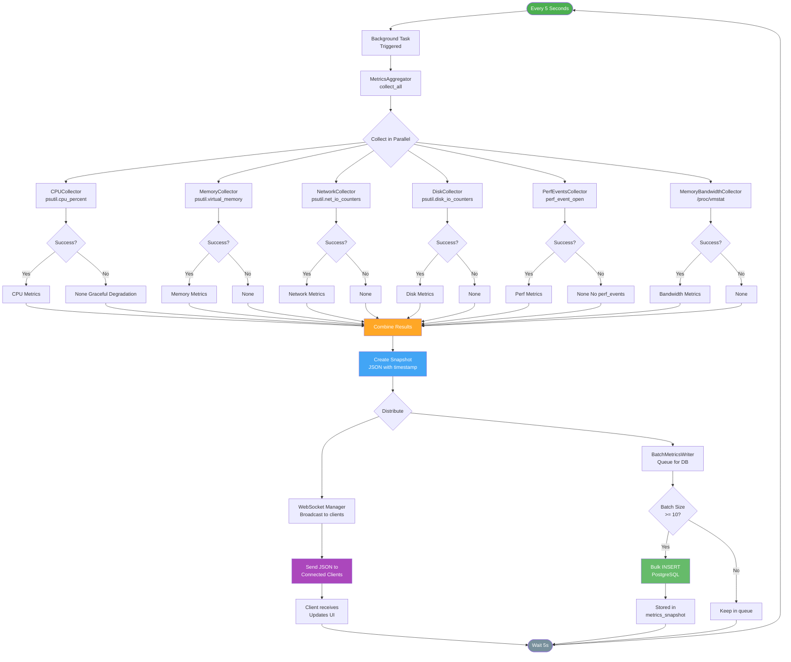
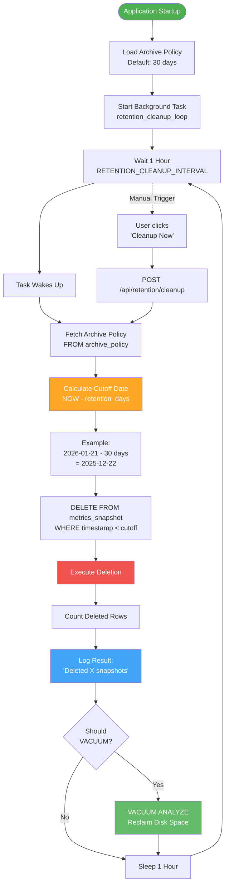
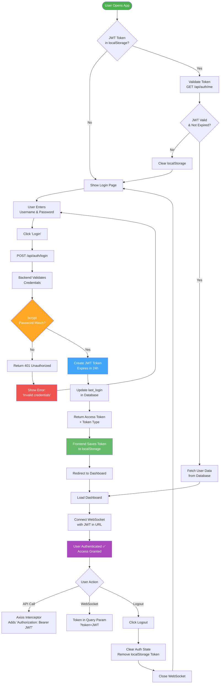
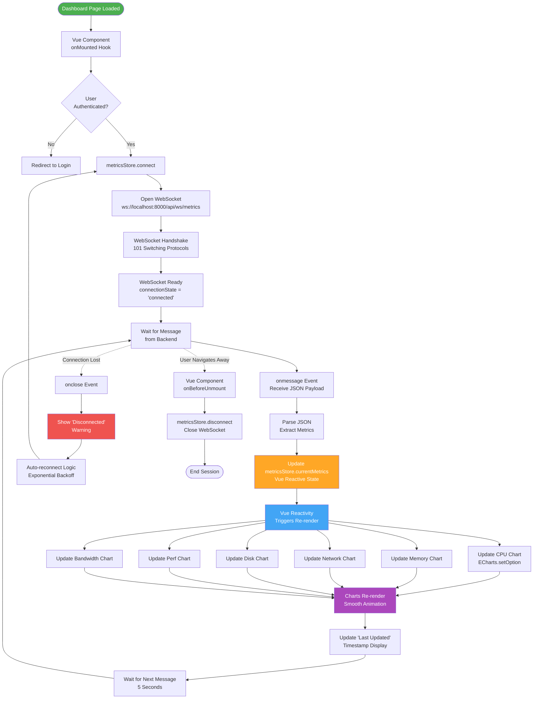

# Feature Flows

> **Key feature pipelines and system workflows**

This document shows the end-to-end flow of major features in PerfWatch.

---

## Metrics Collection Pipeline



---

## Data Retention Lifecycle



---

## Historical Comparison Workflow

```mermaid
flowchart TD
    Start([User on History Page]) --> EnableCompare[Enable Comparison Mode<br/>Toggle Switch]

    EnableCompare --> ChooseMode{Choose<br/>Comparison Mode}

    ChooseMode -->|Relative| SelectPeriod[Select Period:<br/>hour, day, week]
    SelectPeriod --> SelectCompareTo[Select Compare To:<br/>yesterday, last_week]
    SelectCompareTo --> ValidateRelative{Inputs<br/>Valid?}

    ChooseMode -->|Custom Range| SelectP1[Select Period 1<br/>Date Range]
    SelectP1 --> SelectP2[Select Period 2<br/>Date Range]
    SelectP2 --> ValidateCustom{Periods<br/>Same Duration?}

    ValidateRelative -->|No| ShowRelativeError[Show Validation Error]
    ValidateCustom -->|No| ShowCustomError[Show Error:<br/>'Periods must be same duration']
    ShowRelativeError --> SelectPeriod
    ShowCustomError --> SelectP2

    ValidateRelative -->|Yes| ClickCompare[Click 'Compare' Button]
    ValidateCustom -->|Yes| ClickCompare

    ClickCompare --> SendRequest[GET /api/history/compare<br/>with mode-specific params]

    SendRequest --> BackendReceive[Backend Receives Request]
    BackendReceive --> QueryP1[Query Period 1<br/>SELECT * FROM metrics_snapshots<br/>WHERE timestamp BETWEEN...]
    BackendReceive --> QueryP2[Query Period 2<br/>SELECT * FROM metrics_snapshots<br/>WHERE timestamp BETWEEN...]

    QueryP1 --> Agg1[Process Period 1:<br/>Extract data_points]
    QueryP2 --> Agg2[Process Period 2:<br/>Extract data_points]

    Agg1 --> CalcSummary[Calculate Summary Stats:<br/>current_avg, comparison_avg]
    Agg2 --> CalcSummary

    CalcSummary --> CalcPercent[Calculate Change %:<br/>(comparison - current) / current * 100]

    CalcPercent --> BuildResponse[Build Response JSON:<br/>current, comparison, summary]

    BuildResponse --> SendResponse[Send 200 OK<br/>with Comparison Data]

    SendResponse --> FrontendReceive[Frontend Receives Response]
    FrontendReceive --> RenderCharts[Render Comparison Charts:<br/>Overlay Time Series]

    RenderCharts --> ShowSummary[Display Summary Stats]
    ShowSummary --> HighlightPos[Highlight Improvements<br/>Green]
    ShowSummary --> HighlightNeg[Highlight Degradations<br/>Red]

    HighlightPos --> Display[Display to User]
    HighlightNeg --> Display

    Display --> UserAnalyze[User Analyzes Differences<br/>Identifies Trends]

    UserAnalyze --> NewCompare{New<br/>Comparison?}
    NewCompare -->|Yes| ChooseMode
    NewCompare -->|No| End([Exit Comparison Mode])

    style Start fill:#42A5F5,color:#fff
    style CalcSummary fill:#FFA726,color:#fff
    style HighlightPos fill:#66BB6A,color:#fff
    style HighlightNeg fill:#EF5350,color:#fff
    style Display fill:#AB47BC,color:#fff
```

---

## Authentication & Authorization Flow



---

## Real-Time Dashboard Update Flow



---

## Feature Summary

### Metrics Collection

**Frequency:** Every 5 seconds
**Collectors:** 6 parallel collectors (CPU, memory, network, disk, perf_events, memory_bandwidth)
**Output:** Single JSON snapshot
**Distribution:** WebSocket broadcast (real-time) + Database persistence (historical)
**Graceful Degradation:** Missing collectors return None, frontend shows "N/A"

---

### Data Retention

**Trigger:** Every 1 hour (configurable)
**Policy:** Delete snapshots older than N days (default: 30)
**Execution:** Single DELETE query with timestamp filter
**Cleanup:** Optional VACUUM to reclaim disk space
**Manual:** User can trigger immediate cleanup via Settings

---

### Historical Comparison

**Input:** Two time periods (start/end dates)
**Query:** Two aggregate queries (AVG metrics per period)
**Calculation:** Difference and percentage change
**Output:** Side-by-side comparison table
**UI:** Color-coded improvements (green) and regressions (red)

---

### Authentication

**Method:** JWT (JSON Web Token)
**Storage:** localStorage (frontend persistent)
**Expiry:** 24 hours
**Refresh:** Manual re-login (no automatic refresh)
**Security:** bcrypt password hashing (cost factor 12)

---

### Real-Time Dashboard

**Transport:** WebSocket (persistent connection)
**Frequency:** Metrics pushed every 5 seconds
**Reactivity:** Vue.js reactive state updates
**Visualization:** ECharts library (6 charts)
**Reconnection:** Automatic with exponential backoff

---

## Performance Characteristics

### Metrics Collection
- **Latency:** 10-50ms per collector
- **Total Time:** ~100ms (parallel collection)
- **CPU Overhead:** ~2% (100ms every 5s)
- **Memory:** ~50 KB state storage

### Database Operations
- **Insertion:** Batch write (10 snapshots → 50s)
- **Query (1 hour):** ~10ms (with index)
- **Query (24 hours):** ~50ms (with index)
- **Deletion (1 day):** ~1-2 seconds

### WebSocket Performance
- **Connection Time:** < 1 second
- **Message Size:** ~2 KB per snapshot
- **Bandwidth:** 0.4 KB/s per client
- **Concurrent Clients:** 100+ supported

---

**Navigation:**
- [← Previous: WebSocket States](./websocket-states.md)
- [↑ Back to Product Managers](./README.md)
- [↑ Diagrams Index](../README.md)
