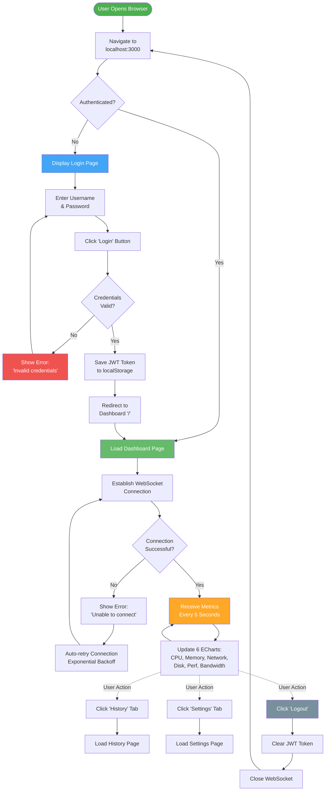
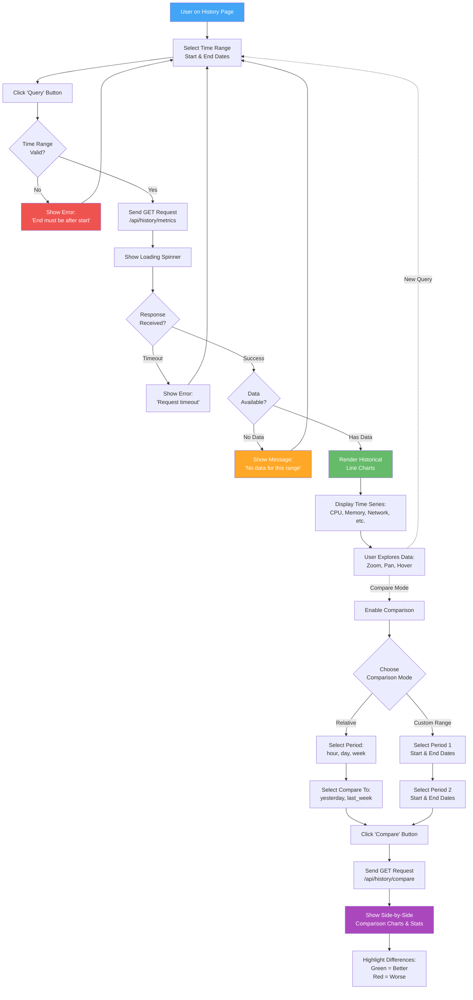
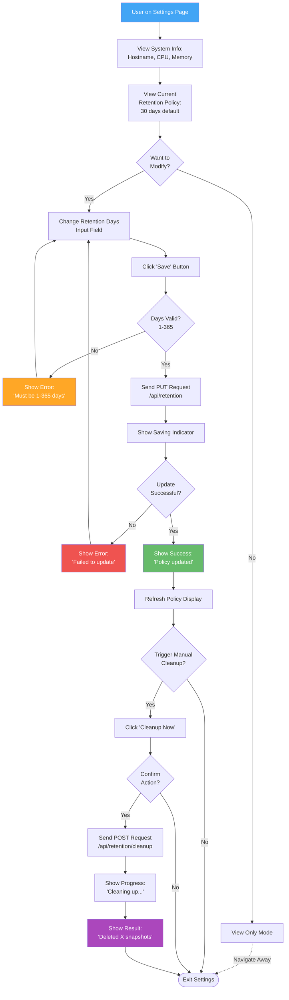

# User Flows

> **End-to-end user journeys in PerfWatch**

This diagram shows the complete user experience from login to viewing real-time metrics and exploring historical data.

---

## Primary User Flow: Login to Dashboard

---

## Historical Data Query Flow

---

## Settings Configuration Flow

---

## User Personas

### Primary User: System Administrator

**Profile:**
- Name: Alex (System Admin)
- Goal: Monitor Linux server performance in real-time
- Pain Points: Need quick visibility into system health, detect performance degradation
- Technical Level: High (comfortable with terminal, metrics)

**Use Cases:**
1. **Daily Health Check:**
   - Login → View dashboard → Check CPU/memory spikes → Logout
   - Time: 2 minutes

2. **Performance Investigation:**
   - Login → Notice high CPU → View history → Compare with yesterday → Identify issue
   - Time: 10 minutes

3. **Capacity Planning:**
   - Login → View history → Query last 30 days → Analyze trends → Export data (future)
   - Time: 30 minutes

4. **Cleanup Management:**
   - Login → Settings → Change retention to 7 days → Trigger cleanup → Verify space freed
   - Time: 5 minutes

---

## User Journey Touchpoints

### Login Experience

**First Time User:**
1. Open http://localhost:3000
2. See login form (clean, minimal)
3. Enter default credentials (admin/admin123)
4. Redirect to dashboard immediately

**Returning User:**
1. Open http://localhost:3000
2. Auto-login (JWT in localStorage)
3. Dashboard loads with live metrics

**Error State:**
- Invalid credentials → Red error message → Stay on login page
- Backend down → "Unable to connect" → Retry button

---

### Dashboard Experience

**On Load:**
- 6 charts appear (CPU, memory, network, disk, perf, bandwidth)
- "Connecting..." indicator while WebSocket establishes
- "Connected ✅" when live stream starts

**Live Updates:**
- Charts update every 5 seconds automatically
- No page refresh needed
- Current values displayed prominently

**Connection Loss:**
- "Disconnected ⚠️" warning appears
- Auto-reconnect attempts (exponential backoff)
- Charts freeze at last known values

**Navigation:**
- Sidebar: Dashboard, History, Settings
- Logout button in header
- Current time displayed

---

### History Experience

**Query Mode:**
- Date/time range picker (intuitive UI)
- "Query" button (disabled if range invalid)
- Loading spinner during fetch
- Charts render with historical data

**Comparison Mode:**
- Toggle "Compare" switch
- Two date range pickers (Period 1, Period 2)
- "Compare" button
- Side-by-side table with differences
- Color coding: Green (improvement), Red (regression)

**No Data State:**
- Friendly message: "No data available for this time range"
- Suggestion: "Try a different time range"

---

### Settings Experience

**System Info:**
- Read-only display (hostname, CPU count, total memory)
- Informational, no actions needed

**Retention Policy:**
- Current setting displayed prominently
- Input field for changing days
- Save button (validates 1-365)
- Success/error feedback

**Manual Cleanup:**
- "Cleanup Now" button
- Confirmation dialog: "Delete snapshots older than X days?"
- Progress indicator
- Result: "Deleted 15,000 snapshots, freed 150 MB"

---

## Edge Cases & Error Handling

### Authentication Errors

| Scenario | User Action | System Response |
|----------|-------------|-----------------|
| Wrong password | Enter credentials | "Invalid username or password" |
| JWT expired | Access protected page | Auto-logout, redirect to login |
| Backend down | Try to login | "Unable to connect to server. Please try again." |

---

### WebSocket Errors

| Scenario | User Action | System Response |
|----------|-------------|-----------------|
| Connection refused | Dashboard loads | "Connecting..." → "Failed to connect" → Retry |
| Connection lost | Viewing metrics | "Disconnected ⚠️" → Auto-reconnect → "Connected ✅" |
| Max retries reached | Wait 5 minutes | "Connection failed. Please refresh the page." |

---

### Query Errors

| Scenario | User Action | System Response |
|----------|-------------|-----------------|
| End before start | Click "Query" | "End time must be after start time" (validation) |
| No data in range | Query empty period | "No data available for this time range" |
| Query timeout | Large time range | "Request timeout. Try a shorter time range." |

---

### Settings Errors

| Scenario | User Action | System Response |
|----------|-------------|-----------------|
| Invalid retention days | Enter "0" or "1000" | "Retention must be between 1 and 365 days" |
| Update fails | Click "Save" | "Failed to update policy. Please try again." |
| Cleanup fails | Click "Cleanup Now" | "Cleanup failed. Please check logs." |

---

## Success Metrics

**User Engagement:**
- Average session duration: 5-10 minutes
- Login frequency: Daily (for active users)
- Feature usage: 80% dashboard, 15% history, 5% settings

**Performance:**
- Login to dashboard: < 2 seconds
- WebSocket connection: < 1 second
- Historical query: < 5 seconds (for 24h range)

**Reliability:**
- Uptime: 99.9%
- WebSocket reconnection success: > 95%
- Data freshness: 5-second interval consistently met

---

## Future Enhancements

**User-Requested Features:**
1. Export historical data (CSV, JSON)
2. Alerts on threshold violations
3. Custom dashboard layouts
4. Multi-server monitoring
5. Mobile app

**Priority:**
- P0: None (MVP complete)
- P1: Export data, alerts
- P2: Custom layouts
- P3: Multi-server, mobile

---

**Navigation:**
- [Next: WebSocket States →](./websocket-states.md)
- [↑ Back to Product Managers](./README.md)
- [↑ Diagrams Index](../README.md)
