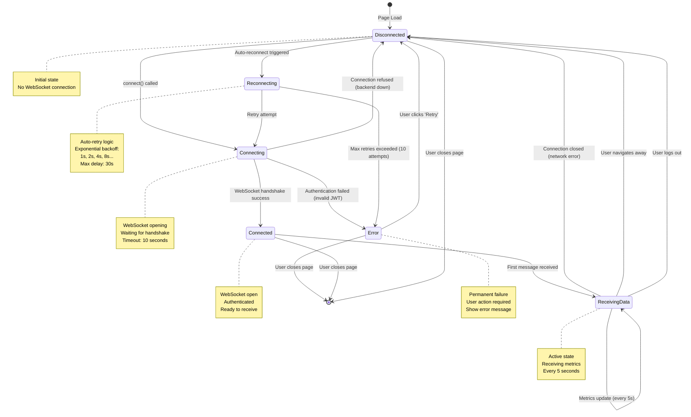

# WebSocket Connection States

> **Connection state machine and transitions**

This diagram shows the WebSocket connection lifecycle and state transitions.

---

## State Machine Diagram



---

## State Details

### Disconnected

**Description:** No active WebSocket connection

**Entry Conditions:**
- Page first loads
- Connection closed by server
- User navigates away from dashboard
- User logs out
- Network error

**UI Indicators:**
- Status badge: "Disconnected ⚠️" (orange)
- Charts frozen at last known values
- Retry button visible (if error occurred)

**Auto Actions:**
- If not error state: Auto-trigger reconnect after 1 second
- If error state: Wait for user action

**Exit Conditions:**
- User calls `connect()` → Transition to **Connecting**
- Auto-reconnect triggers → Transition to **Reconnecting**

---

### Connecting

**Description:** WebSocket handshake in progress

**Entry Conditions:**
- `metricsStore.connect()` called
- Reconnection attempt initiated

**Process:**
1. Create WebSocket instance: `new WebSocket(url)`
2. Attach event handlers (onopen, onmessage, onerror, onclose)
3. Send connection request with JWT in query param
4. Wait for server response (timeout: 10 seconds)

**UI Indicators:**
- Status badge: "Connecting..." (blue, animated spinner)
- Charts show loading state

**Exit Conditions:**
- Handshake success (101 Switching Protocols) → **Connected**
- Authentication failure (1008 Policy Violation) → **Error**
- Connection refused / timeout → **Disconnected**

---

### Connected

**Description:** WebSocket open, authenticated, not yet receiving data

**Entry Conditions:**
- WebSocket `onopen` event fired
- Server accepted connection

**Duration:** Typically < 100ms (until first message)

**UI Indicators:**
- Status badge: "Connected ✅" (green)
- Charts ready to display data

**Exit Conditions:**
- First metrics message received → **ReceivingData**
- Connection closed → **Disconnected**

---

### ReceivingData

**Description:** Active state, receiving real-time metrics

**Entry Conditions:**
- First metrics message received from server

**Behavior:**
- `onmessage` handler processes incoming JSON
- Update `currentMetrics` state
- Trigger Vue reactivity → Charts re-render
- Update `lastUpdateTime` timestamp

**Message Frequency:** Every 5 seconds

**UI Indicators:**
- Status badge: "Live" (green, pulsing indicator)
- Charts updating in real-time
- Timestamp shows "Last updated: 2s ago"

**Exit Conditions:**
- Connection closed (network error, server shutdown) → **Disconnected**
- User navigates away → **Disconnected**
- User logs out → **Disconnected**
- Page closed → **[*]** (end state)

---

### Reconnecting

**Description:** Auto-retry after connection loss

**Entry Conditions:**
- Connection lost while in **ReceivingData** or **Connected**
- `attemptReconnect()` called

**Retry Strategy:**
```javascript
reconnectAttempts++
const delay = Math.min(1000 * Math.pow(2, reconnectAttempts), 30000)
setTimeout(() => { this.connect() }, delay)
```

**Backoff Schedule:**
- Attempt 1: 1 second delay
- Attempt 2: 2 seconds delay
- Attempt 3: 4 seconds delay
- Attempt 4: 8 seconds delay
- Attempt 5: 16 seconds delay
- Attempt 6-10: 30 seconds delay (max)

**Max Attempts:** 10

**UI Indicators:**
- Status badge: "Reconnecting... (attempt 3/10)" (orange)
- Progress indicator
- Charts frozen at last values

**Exit Conditions:**
- Reconnect successful → **Connecting** → **Connected**
- Max retries exceeded (10) → **Error**

---

### Error

**Description:** Permanent connection failure, user action required

**Entry Conditions:**
- Authentication failed (invalid/expired JWT)
- Max reconnect attempts exceeded
- Explicit error from server

**Error Types:**

| Error Type | Cause | User Action |
|------------|-------|-------------|
| **Auth Failed** | Invalid or expired JWT | Logout & re-login |
| **Connection Refused** | Backend down | Wait & retry, or contact admin |
| **Max Retries** | Persistent network issue | Refresh page or check connection |

**UI Indicators:**
- Status badge: "Connection Failed ❌" (red)
- Error message: "Unable to connect. [Retry]"
- Retry button prominent
- Charts show "No Data" state

**Exit Conditions:**
- User clicks "Retry" → **Disconnected** → **Connecting**
- User logs out → **Disconnected**
- Page closed → **[*]** (end state)

---

## State Transition Table

| From | Event | To | Action |
|------|-------|-----|--------|
| Disconnected | `connect()` | Connecting | Create WebSocket, start handshake |
| Connecting | `onopen` | Connected | Mark as connected, reset retry count |
| Connecting | `onerror (auth)` | Error | Show auth error message |
| Connecting | `onerror (refused)` | Disconnected | Trigger auto-reconnect |
| Connected | `onmessage (first)` | ReceivingData | Process first metrics update |
| ReceivingData | `onmessage` | ReceivingData | Update charts with new data |
| ReceivingData | `onclose` | Disconnected | Trigger auto-reconnect |
| Disconnected | Auto-reconnect | Reconnecting | Start retry loop with backoff |
| Reconnecting | Retry attempt | Connecting | Attempt connection |
| Reconnecting | Max retries | Error | Stop retrying, show error |
| Error | User clicks "Retry" | Disconnected | Reset state, allow reconnect |
| Any | User logout | Disconnected | Close WebSocket, clear state |
| Any | Page close | [*] | Cleanup, end session |

---

## Implementation

### Frontend (Pinia Store)

```javascript
// frontend/src/stores/metrics.js
export const useMetricsStore = defineStore('metrics', {
  state: () => ({
    ws: null,
    connectionState: 'disconnected',  // States
    currentMetrics: null,
    reconnectAttempts: 0,
    maxReconnectAttempts: 10
  }),

  actions: {
    connect() {
      this.connectionState = 'connecting'
      const authStore = useAuthStore()

      this.ws = new WebSocket(`ws://localhost:8000/api/ws/metrics?token=${authStore.token}`)

      this.ws.onopen = () => {
        this.connectionState = 'connected'
        this.reconnectAttempts = 0
      }

      this.ws.onmessage = (event) => {
        if (this.connectionState === 'connected') {
          this.connectionState = 'receiving_data'
        }
        this.currentMetrics = JSON.parse(event.data)
        this.lastUpdateTime = new Date()
      }

      this.ws.onerror = (error) => {
        console.error('WebSocket error:', error)
      }

      this.ws.onclose = (event) => {
        if (event.code === 1008) {  // Policy violation (auth failed)
          this.connectionState = 'error'
          this.errorMessage = 'Authentication failed'
        } else {
          this.connectionState = 'disconnected'
          this.attemptReconnect()
        }
      }
    },

    disconnect() {
      if (this.ws) {
        this.ws.close()
        this.ws = null
      }
      this.connectionState = 'disconnected'
      this.currentMetrics = null
    },

    attemptReconnect() {
      if (this.reconnectAttempts >= this.maxReconnectAttempts) {
        this.connectionState = 'error'
        this.errorMessage = 'Max reconnection attempts exceeded'
        return
      }

      this.connectionState = 'reconnecting'
      this.reconnectAttempts++

      const delay = Math.min(1000 * Math.pow(2, this.reconnectAttempts), 30000)

      setTimeout(() => {
        if (this.connectionState === 'reconnecting') {
          this.connect()
        }
      }, delay)
    }
  }
})
```

---

### Backend (WebSocket Handler)

```python
# backend/app/api/websocket.py
@router.websocket("/ws/metrics")
async def websocket_endpoint(websocket: WebSocket, token: str = Query(...)):
    # Validate JWT
    user = await get_current_user_ws(token)
    if not user:
        await websocket.close(code=1008)  # Policy violation (auth failed)
        return

    # Accept connection
    await manager.connect(websocket)

    try:
        # Keep connection open, send metrics in background task
        while True:
            # Wait for client messages (ping/pong)
            data = await websocket.receive_text()
    except WebSocketDisconnect:
        manager.disconnect(websocket)
```

---

## Monitoring & Debugging

### Connection State Logging

```javascript
// Add logging in store
watch(() => metricsStore.connectionState, (newState, oldState) => {
  console.log(`WebSocket state: ${oldState} → ${newState}`)
  if (newState === 'error') {
    console.error('Connection error:', metricsStore.errorMessage)
  }
})
```

---

### Connection Metrics

**Track in Production:**
- Connection success rate: `connected / (connected + error)`
- Average reconnection time
- Max reconnection attempts reached count
- Disconnection causes (network vs. auth vs. user action)

---

### Debug Tools

**Chrome DevTools:**
1. Network tab → Filter: WS (WebSocket)
2. Click WebSocket connection
3. View frames (messages sent/received)
4. Check close code (1000 = normal, 1008 = policy violation)

**Vue DevTools:**
1. Pinia tab → metricsStore
2. View `connectionState` in real-time
3. View `currentMetrics` updates
4. Track `reconnectAttempts`

---

## User Experience Guidelines

### State-Specific UI

**Disconnected:**
- Clear indicator: "Not connected"
- Action button: "Connect" (if manual connection)
- Muted chart colors

**Connecting:**
- Animated spinner
- Text: "Connecting..."
- Disable user interactions

**Connected / ReceivingData:**
- Green checkmark: "Live"
- Vibrant chart colors
- Show last update timestamp

**Reconnecting:**
- Orange indicator: "Reconnecting..."
- Show attempt count: "(3/10)"
- Charts frozen but visible

**Error:**
- Red X: "Connection Failed"
- Clear error message
- Prominent "Retry" button

---

**Navigation:**
- [← Previous: User Flows](./user-flows.md)
- [Next: Feature Flows →](./feature-flows.md)
- [↑ Back to Product Managers](./README.md)
- [↑ Diagrams Index](../README.md)
